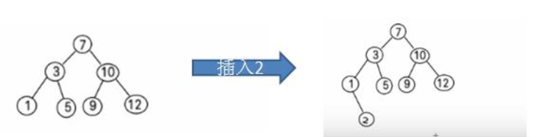
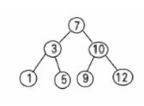

#   二叉排序树的基本介绍与Java实现
+ date: 2020-05-05 08:33:12
+ description: 二叉排序树的基本介绍与Java实现
+ categories:
  - 数据结构与算法
+ tags:
  - 数据结构与算法(Java实现)
---
#   先看一个需求
##  需求
给你一个数列 (7, 3, 10, 12, 5, 1, 9)， 要求能够高效的完成对数据的查询和添加

##  解决方案分析
1.  使用数组
数组未排序， 优点： 直接在数组尾添加， 速度快。 缺点： 查找速度慢.
数组排序， 优点： 可以使用二分查找， 查找速度快， 缺点： 为了保证数组有序， 在添加新数据时， 找到插入位
置后， 后面的数据需整体移动， 速度慢。

2.  使用链式存储-链表
不管链表是否有序， 查找速度都慢， 添加数据速度比数组快， 不需要数据整体移动。

3.  使用二叉排序树

#   二叉排序树介绍
+   二叉排序树： BST: (Binary Sort(Search) Tree), 对于二叉排序树的任何一个非叶子节点， 要求左子节点的值比当前节点的值小， 右子节点的值比当前节点的值大。
+   特别说明： 如果有相同的值， 可以将该节点放在左子节点或右子节点
+   比如针对前面的数据 (7, 3, 10, 12, 5, 1, 9) ， 对应的二叉排序树为：




#   二叉排序树创建和遍历
一个数组创建成对应的二叉排序树， 并使用中序遍历二叉排序树， 比如: 数组为 Array(7, 3, 10, 12, 5, 1, 9) ， 创建成对应的二叉排序树为:




##  代码实现
###     创建结点
```JAVA
package com.zjinc36.tree.binarysorttree;

/**
 * 二叉排序树结点
 */
class Node {
    int value;
    Node left;
    Node right;

    public Node(int value) {
        this.value = value;
    }

    @Override
    public String toString() {
        return "Node [value=" + value + "]";
    }

    /**
     * 添加结点方法 递归的形式添加结点,注意需要满足二叉排序树的要求
     * 
     * @param node 要添加的结点
     */
    public void add(Node node) {
        if (node == null) {
            return;
        }

        // 判断传入结点的值和当前子树的根结点的值的关系
        if (node.value < this.value) {
            // 如果当前结点左子树结点为null
            if (this.left == null) {
                this.left = node;
            } else {
                // 递归向左子树添加
                this.left.add(node);
            }
        } else { // 添加的结点的值大于当前结点的值
            if (this.right == null) {
                this.right = node;
            } else {
                // 递归向右子树添加
                this.right.add(node);
            }
        }
    }

    /**
     * 中序遍历
     */
    public void infixOrder() {
        if (this.left != null) {
            this.left.infixOrder();
        }
        System.out.println(this);
        if (this.right != null) {
            this.right.infixOrder();
        }
    }
}
```

###     二叉排序树--创建和遍历
```JAVA
package com.zjinc36.tree.binarysorttree;

/**
 * 二叉排序树
 */
public class BinarySortTree {
    private Node root;
    
    /**
     * 添加结点的方法
     * @param node 要添加的结点
     */
    public void add(Node node) {
        if (root == null) {
            root = node;    // 如果root为空则直接让root指向node
        } else {
            root.add(node);
        }
    }
    
    /**
     * 中序遍历
     */
    public void infixOrder() {
        if (root != null) {
            root.infixOrder();
        } else {
            System.out.println("二叉排序树为空,不能遍历");
        }
    }
}
```

###     测试
```JAVA
package com.zjinc36.tree.binarysorttree;

import static org.junit.Assert.*;

import org.junit.Before;
import org.junit.Test;

public class BinarySortTreeTest {

    @Before
    public void setUp() throws Exception {
    }

    @Test
    public void test() {
        int[] arr = {7, 3, 10, 12, 5, 1, 9};
        BinarySortTree binarySortTree = new BinarySortTree();
        // 循环添加结点到二叉树
        for (int i = 0; i < arr.length; i++) {
            binarySortTree.add(new Node(arr[i]));
        }
        
        // 中序遍历二叉排序树
        System.out.println("中序遍历二叉排序树");
        binarySortTree.infixOrder();    // 1,3,5,7,9,10,12
    }
}

```

#   二叉排序树的删除
##  操作的思路分析
###     分三种情况考虑
+   要删除结点的子结点有0棵子树(即叶子结点)(比如： 2, 5, 9, 12)
+   要删除结点的子结点有1棵子树(比如： 1)
+   要删除结点的子结点有2棵子树(比如： 7, 3， 10 )

###     对删除结点的各种情况思路分析

1.  要删除结点的子结点有0棵子树(即叶子结点)(比如： 2, 5, 9, 12)
    1.  需求先去找到要删除的结点 targetNode
    2.  找到 targetNode 的 父结点 parent
    3.  确定 targetNode 是 parent 的左子结点还是右子结点
    4.  根据前面的情况来对应删除
```
    ==> 左子结点 parent.left = null
    ==> 右子结点 parent.right = null
```

2.  删除只有一颗子树的节点 比如 1
    1.  需求先去找到要删除的结点 targetNode
    2.  找到 targetNode 的 父结点 parent
    3.  确定 targetNode 的子结点是左子结点还是右子结点
    4.  targetNode 是 parent 的左子结点还是右子结点
    5.  如果 targetNode 有左子结点
```
    ==> 5. 1 如果 targetNode 是 parent 的左子结点
            parent.left = targetNode.left;
    ==> 5.2 如果 targetNode 是 parent 的右子结点
            parent.right = targetNode.left;
```
    6.  如果 targetNode 有右子结点
```
    ==> 6.1 如果 targetNode 是 parent 的左子结点
            parent.left = targetNode.right;
    ==> 6.2 如果 targetNode 是 parent 的右子结点
            parent.right = targetNode.right
```

3.  删除有两颗子树的节点. (比如： 7, 3， 10 )
    1.  需求先去找到要删除的结点 targetNode
    2.  找到 targetNode 的 父结点 parent
    3.  从 targetNode 的右子树找到最小的结点(也可以是左子树找最大的结点)
    4.  用一个临时变量， 将最小结点的值保存 temp = 11
    5.  删除该最小结点
    6.  targetNode.value = temp

###     小结
+   要删除的节点正好是叶子节点，直接删除就 OK 了；
+   只有左孩子或者右孩子，直接把这个孩子上移放到要删除的位置就好了；
+   有两个孩子，就需要选一个合适的孩子节点作为新的根节点，该节点称为 继承节点。

##  代码实现
###     结点--添加删除结点需要的方法
```JAVA
package com.zjinc36.tree.binarysorttree;

/**
 * 二叉排序树结点
 */
class Node {
    int value;
    Node left;
    Node right;

    public Node(int value) {
        this.value = value;
    }

    @Override
    public String toString() {
        return "Node [value=" + value + "]";
    }

////////////////////////////////////////////////////////////////////////////////
///删除结点////////////////////////////////////////////////////////////////////
////////////////////////////////////////////////////////////////////////////////

    /**
     * 查找要删除的结点
     * @param value 希望删除的结点的值
     * @return  如果找到则返回该结点,否则返回null
     */
    public Node search(int value) {
        if (value == this.value) {  // 找到该结点
            return this;
        } else if (value < this.value) {    // 如果查找的值小于当前结点,则向左子树递归查找
            // 如果左子结点为空
            if (this.left == null) {
                return null;
            }
            return this.left.search(value);
        } else {    // 如果查找的值不小于当前结点,向右子树递归查找
            if (this.right == null) {
                return null;
            }
            return this.right.search(value);
        }
    }
    
    /**
     * 查找要删除结点的父结点
     * @param value 要找到的结点的值
     * @return 返回的是要删除的结点的父结点,如果没有就返回null
     */
    public Node searchParent(int value) {
        // 如果当前结点就是要删除的结点的父结点,就返回
        if ((this.left != null && this.left.value == value) || (this.right != null && this.right.value == value)) {
            return this;
        } else {
            // 如果查找的值小于当前结点,并且当前结点的左子结点不为空
            if (value < this.value && this.left != null) {
                return this.left.searchParent(value);   // 向左子树递归查找
            } else if (value >= this.value && this.right != null) {
                return this.right.searchParent(value);  // 向右子树递归查找
            } else {
                return null;    //没有找到父结点
            } 
        }
    }

////////////////////////////////////////////////////////////////////////////////
///添加结点////////////////////////////////////////////////////////////////////
////////////////////////////////////////////////////////////////////////////////

    /**
     * 添加结点方法 递归的形式添加结点,注意需要满足二叉排序树的要求
     * 
     * @param node 要添加的结点
     */
    public void add(Node node) {
        if (node == null) {
            return;
        }

        // 判断传入结点的值和当前子树的根结点的值的关系
        if (node.value < this.value) {
            // 如果当前结点左子树结点为null
            if (this.left == null) {
                this.left = node;
            } else {
                // 递归向左子树添加
                this.left.add(node);
            }
        } else { // 添加的结点的值大于当前结点的值
            if (this.right == null) {
                this.right = node;
            } else {
                // 递归向右子树添加
                this.right.add(node);
            }
        }
    }

    /**
     * 中序遍历
     */
    public void infixOrder() {
        if (this.left != null) {
            this.left.infixOrder();
        }
        System.out.println(this);
        if (this.right != null) {
            this.right.infixOrder();
        }
    }
}
```

###     二叉排序树--添加删除方法
```JAVA
package com.zjinc36.tree.binarysorttree;

/**
 * 二叉排序树
 */
public class BinarySortTree {
    private Node root;

////////////////////////////////////////////////////////////////////////////////
///添加结点////////////////////////////////////////////////////////////////////
////////////////////////////////////////////////////////////////////////////////
    
    /**
     * 添加结点的方法
     * @param node 要添加的结点
     */
    public void add(Node node) {
        if (root == null) {
            root = node;    // 如果root为空则直接让root指向node
        } else {
            root.add(node);
        }
    }

////////////////////////////////////////////////////////////////////////////////
///删除结点////////////////////////////////////////////////////////////////////
////////////////////////////////////////////////////////////////////////////////
    
    /**
     * 查找要删除的结点
     */
    public Node search(int value) {
        if (root == null) {
             return null;
        } else {
            return root.search(value);
        }
    }
    
    /**
     * 查找父结点
     * @param value
     * @return
     */
    public Node searchParent(int value) {
        if (root == null) {
            return null;
        } else {
            return root.searchParent(value);
        }
    }
    
    /**
     * 1. 返回的以node为根结点的二叉排序树的最小结点的值
     * 2. 删除node为根结点的二叉排序树的最小结点
     * @param node 传入的结点(当作二叉排序树的根结点)
     * @return 返回以node为根结点的二叉排序树的最小结点的值
     */

    /**
     * 删除结点
     * @param value 
     */
    public void delNode(int value) {
        if (root == null) {
            return;
        } else {
            // 1. 需求先去找到要删除的结点 targetNode
            Node targetNode = search(value);
            // 如果没有找到要删除的结点
            if (targetNode == null) {
                return;
            }
            // 如果当我们发现当前这棵二叉排序树只有一个结点
            if (root.left == null && root.right == null) {
                root = null;
                return;
            }
            
            // 2. 去找 targetNode 的父结点
            Node parent = searchParent(value);

            // 3. 判断要删除的结点的类型
            // ==> 3.1 要删除的结点有0棵子树(即叶子结点)
            // ==> ==> 基本思路:找到targetNode,删除
            if (targetNode.left == null && targetNode.right == null) {
                // 判断 targetNode 是父结点的左子结点还是右子结点
                if (parent.left != null && parent.left.value == value) {    // 是左子结点
                    parent.left = null;
                } else if (parent.right != null && parent.right.value == value) {   // 是右子结点
                    parent.right = null;
                }
            } else if (targetNode.left != null && targetNode != null) {
                // ==> 3.2 要删除的结点有2棵子树
                // ==> ==> 基本思路:targetNode要删除,删除后用targetNode的右子树的最小值进行填充
                Node target = targetNode.right;
                // 循环查找左子结点,就会找到最小值
                while (target.left != null) {
                    target = target.left;
                }
                // 这时target就指向了最小结点
                // 删除这个最小结点
                delNode(target.value);
                targetNode.value = target.value;
            } else {
                // ==> 3.3 要删除的结点有1棵子树 
                // ==> ==> 基本思路:因为只有一棵子树,所以用子树填充删除的结点的位置
                if (targetNode.left != null) {
                    // 如果要删除的结点有左子结点
                    if (parent != null) {
                        // 如果 targetNode 是parent的左子结点
                        if (parent.left.value == value) {
                            parent.left = targetNode.left;
                        } else { // targetNode 是 parent 的右子结点
                            parent.right = targetNode.left;
                        }
                    } else {
                        root = targetNode.left;
                    }
                } else {    // 如果删除的结点有右子结点
                    if (parent != null) {
                        // 如果 targetNode 是 parent 的左子结点
                        if (parent.left.value == value) {
                            parent.left = targetNode.right;
                        } else {    // 如果targetNode是parent右子结点
                            parent.right = targetNode.right;
                        }
                    } else {
                        root = targetNode.right;
                    }
                }
            }
        }
    }
    
    
    /**
     * 中序遍历
     */
    public void infixOrder() {
        if (root != null) {
            root.infixOrder();
        } else {
            System.out.println("二叉排序树为空,不能遍历");
        }
    }
}
```

###     测试
```JAVA
package com.zjinc36.tree.binarysorttree;

import static org.junit.Assert.*;

import org.junit.Before;
import org.junit.Test;

public class BinarySortTreeTest {

    @Before
    public void setUp() throws Exception {
    }

    @Test
    public void test() {
        int[] arr = {7, 3, 10, 12, 5, 1, 9, 2};
        BinarySortTree binarySortTree = new BinarySortTree();
        // 循环添加结点到二叉树
        for (int i = 0; i < arr.length; i++) {
            binarySortTree.add(new Node(arr[i]));
        }
        
        // 中序遍历二叉排序树
        System.out.println("中序遍历二叉排序树");
        binarySortTree.infixOrder();    // 1,3,5,7,9,10,12
        
        // 测试一下删除结点
//      binarySortTree.delNode(2);
        binarySortTree.delNode(10);
        System.out.println("删除结点后");
        binarySortTree.infixOrder();
    }
}
```


