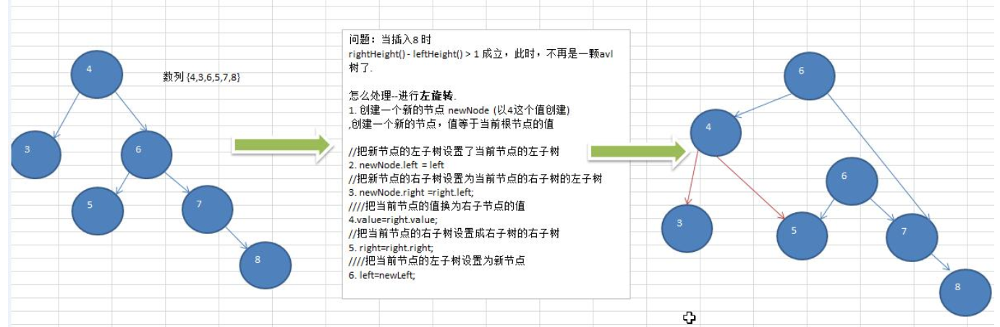
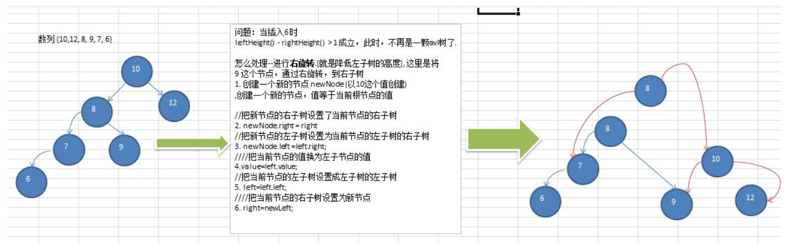
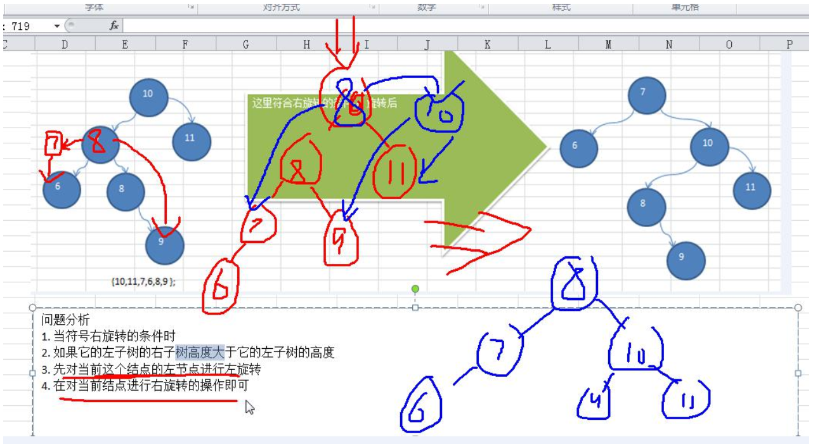

# 平衡二叉搜索树之AVL树

---

平衡二叉搜索树（Self-balancing binary search tree） ，指所有能通过自身机制维持 “相对平衡” 的二叉搜索树（左子树节点值＜父节点值＜右子树节点值），目的是避免普通二叉搜索树退化成链表，保证查询 / 修改效率。

平衡二叉树的常用实现方法有红黑树、AVL、替罪羊树、Treap、伸展树等

# AVL树的定义

- 它是一棵二叉搜索树（左子树节点值＜父节点值＜右子树节点值）；  
- 空树或**左右子树的高度差（平衡因子）的绝对值≤1**；  
- 左右子树本身也必须是AVL树。  

# 下面哪些 AVL 树,为什么?

（注：平衡因子=左子树高度-右子树高度）  

## 例1：符合AVL树的例子  

```  
    3  
   / \  
  2   4  
 /  
1  
```  
- 计算每个节点的平衡因子：  
  - 节点1：左右子树为空（高度0），平衡因子0；  
  - 节点2：左子树高度1（节点1），右子树高度0，平衡因子1-0=1（绝对值≤1）；  
  - 节点4：左右子树为空，平衡因子0；  
  - 根节点3：左子树高度2（节点2→节点1），右子树高度1（节点4），平衡因子2-1=1（绝对值≤1）。  
- 所有节点的平衡因子绝对值≤1，且左右子树都是AVL树，**因此是AVL树**。  


## 例2：不符合AVL树的例子  

```  
    3  
   /  
  2  
 /  
1  
```  
- 计算根节点3的平衡因子：左子树高度2（节点2→节点1），右子树高度0，平衡因子2-0=2（绝对值＞1）。  
- 违反“左右子树高度差绝对值≤1”的规则，**不是AVL树**。  


## 例3：看似平衡但不符合的例子（非二叉搜索树）  

```  
    3  
   / \  
  5   4  
```  
- 虽然左右子树高度都是1，平衡因子0，但左子树节点值5＞父节点值3，**不是二叉搜索树**（违反左小右大规则），因此**不是AVL树**（AVL树首先得是二叉搜索树）。  


# 单旋转

单旋转和双旋转是 AVL 树在插入或删除节点后，为了保持平衡（左右子树高度差不超过 1）而进行的两种调整操作。这两种操作通过改变树的结构来恢复平衡。

## 左旋转

- 什么时候用：当某个节点的右子树比左子树高 2 层，且右子树的右子树更高（右右情况）。
- 作用：把右子树的根节点提上来，原根节点变成它的左子树，原右子树的左子树变成原根节点的右子树。
- 效果：降低右子树的高度，增加左子树的高度。

```
    3 (失衡点)                   5
     \                         / \
      5            →左旋→      3   6
       \
        6
```

节点 3 的右子树高度 2，左子树高度 0，高度差 2，触发左旋。
把右子树的根节点 5 提上来当新根，原根节点 3 变成 5 的左子树，5 原来的左子树（空）变成 3 的右子树。

代码实现：

要求: 给你一个数列， 创建出对应的平衡二叉树.数列 {4, 3, 6, 5, 7, 8}

思路分析(示意图)



代码实现
  
```java
/**
 * 左旋转
 */
private void leftRotate() {
    // 创建新的结点， 以当前根结点的值
    Node newNode = new Node(value);
    // 把新的结点的左子树设置成当前结点的左子树
    newNode.left = left;
    // 把新的结点的右子树设置成带你过去结点的右子树的左子树
    newNode.right = right.left;
    // 把当前结点的值替换成右子结点的值
    value = right.value;
    // 把当前结点的右子树设置成当前结点右子树的右子树
    right = right.right;
    // 把当前结点的左子树(左子结点)设置成新的结点
    left = newNode;
}
```

##  右旋转

- 什么时候用：当某个节点的左子树比右子树高 2 层，且左子树的左子树更高（左左情况）。
- 作用：把左子树的根节点提上来，原根节点变成它的右子树，原左子树的右子树变成原根节点的左子树。
- 效果：降低左子树的高度，增加右子树的高度。

```
    5 (失衡点)                  3
   /                          / \
  3              →右旋→       2   5
 /
2
```

节点 5 的左子树高度 2，右子树高度 0，高度差 2，触发右旋。
把左子树的根节点 3 提上来当新根，原根节点 5 变成 3 的右子树，3 原来的右子树（空）变成 5 的左子树。

代码实现：

要求: 给你一个数列， 创建出对应的平衡二叉树.数列 {10, 12, 8, 9, 7, 6}

思路分析(示意图)



代码实现：

```java
/**
 * 右旋转
 */
private void rightRotate() {
    Node newNode = new Node(value);
    newNode.right = right;
    newNode.left = left.right;
    value = left.value;
    left = left.left;
    right = newNode;
}
```

#   双旋转（先左旋后右旋 / 先右旋后左旋）

## 先左旋后右旋（Left-Right Rotation）

- 什么时候用：当某个节点的左子树比右子树高 2 层，但左子树的右子树更高（左右情况）。
- 做法：先对左子树做左旋，再对原节点做右旋。
- 效果：通过两次旋转调整高度差。

```
    5 (失衡点)           5              4
   /                   /              / \
  3      →左→         4      →右→     3   5
   \                 /
    4               3
```

节点 5 的左子树高度 2（3→4），右子树高度 0，高度差 2，且左子树的右子树更高（4）。
先对左子树 3 做左旋，把 4 提上来；再对原节点 5 做右旋，把 4 提上来当新根。

## 先右旋后左旋（Right-Left Rotation）

- 什么时候用：当某个节点的右子树比左子树高 2 层，但右子树的左子树更高（右左情况）。
- 做法：先对右子树做右旋，再对原节点做左旋。
- 效果：通过两次旋转调整高度差。

```
    3 (失衡点)           3              4
     \                   \            / \
      5      →右→          4      →左→ 3   5
     /                     \
    4                       5
```

节点 3 的右子树高度 2（5→4），左子树高度 0，高度差 2，且右子树的左子树更高（4）。
先对右子树 5 做右旋，把 4 提上来；再对原节点 3 做左旋，把 4 提上来当新根。


## 举例说明

前面的两个数列， 进行单旋转(即一次旋转)就可以将非平衡二叉树转成平衡二叉树,但是在某些情况下，单旋转不能完成平衡二叉树的转换。 比如数列
+ int[] arr = { 10, 11, 7, 6, 8, 9 }; 运行原来的代码可以看到， 并没有转成 AVL 树.
+ int[] arr = {2,1,6,5,7,3}; // 运行原来的代码可以看到， 并没有转成 AVL 树

### 问题分析




### 解决思路分析

- 当符合右旋转的条件时
- 如果它的左子树的右子树高度大于它的左子树的高度
- 先对当前这个结点的左子树进行左旋转
- 在对当前结点进行右旋转的操作即可

### 代码实现[AVL 树的汇总代码(完整代码)]

结点

```java
package com.zjinc36.tree.avltree;

/**
 * 二叉排序树结点
 */
class Node {
    int value;
    Node left;
    Node right;

    public Node(int value) {
        this.value = value;
    }

    @Override
    public String toString() {
        return "Node [value=" + value + "]";
    }
////////////////////////////////////////////////////////////////////////////////
///旋转///////////////////////////////////////////////////////////////////////
////////////////////////////////////////////////////////////////////////////////
    /**
     * 左旋转
     */
    private void leftRotate() {
        // 创建新的结点， 以当前根结点的值
        Node newNode = new Node(value);
        // 把新的结点的左子树设置成当前结点的左子树
        newNode.left = left;
        // 把新的结点的右子树设置成带你过去结点的右子树的左子树
        newNode.right = right.left;
        // 把当前结点的值替换成右子结点的值
        value = right.value;
        // 把当前结点的右子树设置成当前结点右子树的右子树
        right = right.right;
        // 把当前结点的左子树(左子结点)设置成新的结点
        left = newNode;
    }
    
    /**
     * 右旋转
     */
    private void rightRotate() {
        Node newNode = new Node(value);
        newNode.right = right;
        newNode.left = left.right;
        value = left.value;
        left = left.left;
        right = newNode;
    }
    
    /**
     * 返回左子树的高度
     */
    public int leftHeight() {
        if (left == null) {
            return 0;
        }
        return left.height();
    }
    
    /**
     * 返回右子树的高度
     */
    public int rightHeight() {
        if (right == null) {
            return 0;
        }
        return right.height();
    }
    
    /**
     * 返回以该结点为根结点的树的高度
     */
    public int height() {
        return Math.max(left == null ? 0 : left.height(), right == null ? 0 : right.height()) + 1;
    }

////////////////////////////////////////////////////////////////////////////////
///删除结点////////////////////////////////////////////////////////////////////
////////////////////////////////////////////////////////////////////////////////

    /**
     * 查找要删除的结点
     * @param value 希望删除的结点的值
     * @return  如果找到则返回该结点,否则返回null
     */
    public Node search(int value) {
        if (value == this.value) {  // 找到该结点
            return this;
        } else if (value < this.value) {    // 如果查找的值小于当前结点,则向左子树递归查找
            // 如果左子结点为空
            if (this.left == null) {
                return null;
            }
            return this.left.search(value);
        } else {    // 如果查找的值不小于当前结点,向右子树递归查找
            if (this.right == null) {
                return null;
            }
            return this.right.search(value);
        }
    }
    
    /**
     * 查找要删除结点的父结点
     * @param value 要找到的结点的值
     * @return 返回的是要删除的结点的父结点,如果没有就返回null
     */
    public Node searchParent(int value) {
        // 如果当前结点就是要删除的结点的父结点,就返回
        if ((this.left != null && this.left.value == value) || (this.right != null && this.right.value == value)) {
            return this;
        } else {
            // 如果查找的值小于当前结点,并且当前结点的左子结点不为空
            if (value < this.value && this.left != null) {
                return this.left.searchParent(value);   // 向左子树递归查找
            } else if (value >= this.value && this.right != null) {
                return this.right.searchParent(value);  // 向右子树递归查找
            } else {
                return null;    //没有找到父结点
            } 
        }
    }

////////////////////////////////////////////////////////////////////////////////
///添加结点////////////////////////////////////////////////////////////////////
////////////////////////////////////////////////////////////////////////////////

    /**
     * 添加结点方法 递归的形式添加结点,注意需要满足二叉排序树的要求
     * 
     * @param node 要添加的结点
     */
    public void add(Node node) {
        if (node == null) {
            return;
        }

        // 判断传入结点的值和当前子树的根结点的值的关系
        if (node.value < this.value) {
            // 如果当前结点左子树结点为null
            if (this.left == null) {
                this.left = node;
            } else {
                // 递归向左子树添加
                this.left.add(node);
            }
        } else { // 添加的结点的值大于当前结点的值
            if (this.right == null) {
                this.right = node;
            } else {
                // 递归向右子树添加
                this.right.add(node);
            }
        }
        
        ///////////////////////////////////////////////
        ///旋转////////////////////////////////////////
        //////////////////////////////////////////////
     
        // 当添加完一个结点后， 如果: (右子树的高度-左子树的高度) > 1 , 左旋转
        if (rightHeight() - leftHeight() > 1) {
            // 如果它的右子树的左子树的高度大于它的右子树的右子树的高度
            if (right != null && right.leftHeight() > right.rightHeight()) {
                // 先对右子结点进行右旋转
                right.rightRotate();
                // 然后在对当前结点进行左旋转
                leftRotate(); // 左旋转..
            } else {
                // 直接进行左旋转即可
                leftRotate();
            }
            return; // 必须要!!!
        }
        // 当添加完一个结点后， 如果 (左子树的高度 - 右子树的高度) > 1, 右旋转
        if (leftHeight() - rightHeight() > 1) {
            // 如果它的左子树的右子树高度大于它的左子树的高度
            if (left != null && left.rightHeight() > left.leftHeight()) {
                // 先对当前结点的左结点(左子树)->左旋转
                left.leftRotate();
                // 再对当前结点进行右旋转
                rightRotate();
            } else {
                // 直接进行右旋转即可
                rightRotate();
            }
        }
    }

    /**
     * 中序遍历
     */
    public void infixOrder() {
        if (this.left != null) {
            this.left.infixOrder();
        }
        System.out.println(this);
        if (this.right != null) {
            this.right.infixOrder();
        }
    }
}
```

AVLTree

```java
package com.zjinc36.tree.avltree;

/**
 * 二叉排序树
 */
public class AVLTree {
    private Node root;

    public Node getRoot() {
        return root;
    }
////////////////////////////////////////////////////////////////////////////////
///添加结点////////////////////////////////////////////////////////////////////
////////////////////////////////////////////////////////////////////////////////
    
    /**
     * 添加结点的方法
     * @param node 要添加的结点
     */
    public void add(Node node) {
        if (root == null) {
            root = node;    // 如果root为空则直接让root指向node
        } else {
            root.add(node);
        }
    }

////////////////////////////////////////////////////////////////////////////////
///删除结点////////////////////////////////////////////////////////////////////
////////////////////////////////////////////////////////////////////////////////
    
    /**
     * 查找要删除的结点
     */
    public Node search(int value) {
        if (root == null) {
             return null;
        } else {
            return root.search(value);
        }
    }
    
    /**
     * 查找父结点
     * @param value
     * @return
     */
    public Node searchParent(int value) {
        if (root == null) {
            return null;
        } else {
            return root.searchParent(value);
        }
    }
    
    /**
     * 1. 返回的以node为根结点的二叉排序树的最小结点的值
     * 2. 删除node为根结点的二叉排序树的最小结点
     * @param node 传入的结点(当作二叉排序树的根结点)
     * @return 返回以node为根结点的二叉排序树的最小结点的值
     */

    /**
     * 删除结点
     * @param value 
     */
    public void delNode(int value) {
        if (root == null) {
            return;
        } else {
            // 1. 需求先去找到要删除的结点 targetNode
            Node targetNode = search(value);
            // 如果没有找到要删除的结点
            if (targetNode == null) {
                return;
            }
            // 如果当我们发现当前这棵二叉排序树只有一个结点
            if (root.left == null && root.right == null) {
                root = null;
                return;
            }
            
            // 2. 去找 targetNode 的父结点
            Node parent = searchParent(value);

            // 3. 判断要删除的结点的类型
            // ==> 3.1 要删除的结点有0棵子树(即叶子结点)
            // ==> ==> 基本思路:找到targetNode,删除
            if (targetNode.left == null && targetNode.right == null) {
                // 判断 targetNode 是父结点的左子结点还是右子结点
                if (parent.left != null && parent.left.value == value) {    // 是左子结点
                    parent.left = null;
                } else if (parent.right != null && parent.right.value == value) {   // 是右子结点
                    parent.right = null;
                }
            } else if (targetNode.left != null && targetNode != null) {
                // ==> 3.2 要删除的结点有2棵子树
                // ==> ==> 基本思路:targetNode要删除,删除后用targetNode的右子树的最小值进行填充
                Node target = targetNode.right;
                // 循环查找左子结点,就会找到最小值
                while (target.left != null) {
                    target = target.left;
                }
                // 这时target就指向了最小结点
                // 删除这个最小结点
                delNode(target.value);
                targetNode.value = target.value;
            } else {
                // ==> 3.3 要删除的结点有1棵子树 
                // ==> ==> 基本思路:因为只有一棵子树,所以用子树填充删除的结点的位置
                if (targetNode.left != null) {
                    // 如果要删除的结点有左子结点
                    if (parent != null) {
                        // 如果 targetNode 是parent的左子结点
                        if (parent.left.value == value) {
                            parent.left = targetNode.left;
                        } else { // targetNode 是 parent 的右子结点
                            parent.right = targetNode.left;
                        }
                    } else {
                        root = targetNode.left;
                    }
                } else {    // 如果删除的结点有右子结点
                    if (parent != null) {
                        // 如果 targetNode 是 parent 的左子结点
                        if (parent.left.value == value) {
                            parent.left = targetNode.right;
                        } else {    // 如果targetNode是parent右子结点
                            parent.right = targetNode.right;
                        }
                    } else {
                        root = targetNode.right;
                    }
                }
            }
        }
    }
    
    
    /**
     * 中序遍历
     */
    public void infixOrder() {
        if (root != null) {
            root.infixOrder();
        } else {
            System.out.println("二叉排序树为空,不能遍历");
        }
    }
}
```

测试

```java
package com.zjinc36.tree.avltree;

import org.junit.Before;
import org.junit.Test;

public class AVLTreeTest {

    @Before
    public void setUp() throws Exception {
    }

    @Test
    public void test() {
        // int[] arr = {4,3,6,5,7,8};
        // int[] arr = { 10, 12, 8, 9, 7, 6 };
        int[] arr = { 10, 11, 7, 6, 8, 9 };
        // 创建一个 AVLTree 对象
        AVLTree avlTree = new AVLTree();
        // 添加结点
        for (int i = 0; i < arr.length; i++) {
            avlTree.add(new Node(arr[i]));
        }
        // 遍历
        System.out.println("中序遍历");
        avlTree.infixOrder();
        System.out.println("在平衡处理~~");
        System.out.println("树的高度=" + avlTree.getRoot().height()); // 3
        System.out.println("树的左子树高度=" + avlTree.getRoot().leftHeight()); // 2
        System.out.println("树的右子树高度=" + avlTree.getRoot().rightHeight()); // 2
        System.out.println("当前的根结点=" + avlTree.getRoot());// 8
    }

}
```


# 总结
| 情况       | 调整方式     | 步骤                         |
| ---------- | ------------ | ---------------------------- |
| 左左（LL） | 单右旋       | 提左子树的根节点             |
| 右右（RR） | 单左旋       | 提右子树的根节点             |
| 左右（LR） | 先左旋后右旋 | 先提左子树的右节点，再提新根 |
| 右左（RL） | 先右旋后左旋 | 先提右子树的左节点，再提新根 |

**核心逻辑**：通过旋转调整树的结构，让高度差重新≤1，同时保持二叉搜索树的特性（左小右大）。