#   红黑树的插入和删除与Java实现

---

# 为什么需要红黑树？


普通的二叉查找树在极端情况下可退化成链表，此时的增删查效率都会比较低下。

想象一下：有一堆数字（比如 1、3、5、7、9），想把它们排成一个 “树” 的样子方便查找。
最简单的二叉树是这样排的：每个节点左边放比它小的数，右边放比它大的数。
比如先放 5 当根节点，3 放左边，7 放右边，1 放 3 的左边，9 放 7 的右边 —— 这时候树是 “矮胖” 的，找任何数最多查 3 次（比如找 9：5→7→9），很快。

但如果数字是按顺序来的（比如 1、2、3、4、5），麻烦就来了：
按二叉树规则，2 得放 1 的右边，3 放 2 的右边，4 放 3 的右边…… 最后树会变成 “细长条”（像一根筷子）。这时候找 5 就得从 1 开始，一个个往下查（1→2→3→4→5），查 5 次才能找到。如果数字再多，比如 1 到 10000，那查最后一个数得查 10000 次，效率太低了！

类似下图：

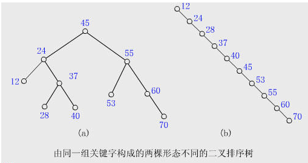


为了避免这种情况，就出现了一些自平衡的查找树，比如 AVL，红黑树等。这些自平衡的查找树通过定义一些性质，将任意节点的左右子树高度差控制在规定范围内，以达到平衡状态。

# 什么是红黑树

+ 红黑树本质上是一种二叉查找树，但它在二叉查找树的基础上额外添加了一个标记（颜色），同时具有一定的规则。
+ 这些规则使红黑树保证了一种平衡，插入、删除、查找的最坏时间复杂度都为 O(logn)。
+ 它的统计性能要好于平衡二叉树（AVL树），因此，红黑树在很多地方都有应用。比如在 Java 集合框架中，很多部分(HashMap, TreeMap, TreeSet 等)都有红黑树的应用，这些集合均提供了很好的性能。

##  红黑树的 5 个特性

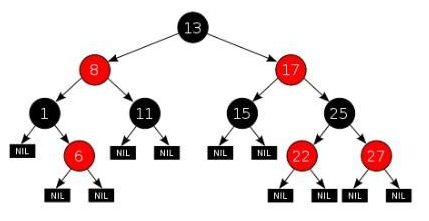

1. 每个节点要么是红色，要么是黑色；
2. 根节点永远是黑色的；
3. 所有的叶子节点都是是黑色的（注意这里说叶子节点其实是上图中的 NIL 节点）；
4. 每个红色节点的两个子节点一定都是黑色；（从每个叶子到根的所有路径上不能有两个连续的红色节点,黑色结点是可以连续的）
5. 从任一节点到其每个叶子的所有路径都包含相同数目的黑色节点（简称黑高）

注意：
+ 性质 3 中指定红黑树的每个叶子节点都是空节点，而且并叶子节点都是黑色。但 Java 实现的红黑树将使用 null 来代表空节点，因此遍历红黑树时将看不到黑色的叶子节点，反而看到每个叶子节点都是红色的。
+ 性质 4 的意思是：从每个根到节点的路径上不会有两个连续的红色节点，但黑色节点是可以连续的。因此若给定黑色节点的个数 N，最短路径的情况是连续的 N 个黑色，树的高度为 N - 1;最长路径的情况为节点红黑相间，树的高度为 2(N - 1) 。
+ 性质 5 是成为红黑树最主要的条件，后序的插入、删除操作都是为了遵守这个规定。

红黑树并不是标准平衡二叉树，它以性质 5 作为一种平衡方法，使自己的性能得到了提升。

`这几条规矩更大白话一点就是：`
- 根节点必须是黑色（就像树的 “地基” 得稳）。
- 红色节点不能有红色的孩子（红爸爸不能生红儿子，避免红色扎堆）。
- 从任何一个节点往下走，到最底下的 “空叶子”，经过的黑色节点数量必须一样多（保证每条路的 “黑节点数” 相同，不会有一条路特别长）。

# 红黑树的左旋右旋

具体在[平衡二叉树的基本介绍与Java实现](/2020/20200505-平衡二叉树的基本介绍与Java实现.md)有具体说明,不再赘述

## 左旋

```JAVA
private void rotateLeft(Entry p) {
    if (p != null) {
        Entry r = p.right; 
        p.right = r.left;
        if (r.left != null)         
            r.left.parent = p;
        r.parent = p.parent;
        if (p.parent == null)
            root = r;
        else if (p.parent.left == p)
            p.parent.left = r;
        else
            p.parent.right = r;
        r.left = p; 
        p.parent = r;
    }
}
```

## 右旋

```JAVA
private void rotateRight(Entry p) {
    if (p != null) {
        Entry l = p.left;
        p.left = l.right;
        if (l.right != null) l.right.parent = p;
        l.parent = p.parent;
        if (p.parent == null)
            root = l;
        else if (p.parent.right == p)
            p.parent.right = l;
        else p.parent.left = l;
        l.right = p;
        p.parent = l;
    }
}
```

# 红黑树的平衡插入

## 要插入的结点是红色还是黑色?

+ 要插入的结点是红色
+ 如果插入的节点是黑色，那么这个节点所在路径比其他路径多出一个黑色节点，这个调整起来会比较麻烦（参考红黑树的删除操作，就知道为啥多一个或少一个黑色节点时，调整起来这么麻烦了）。
+ 如果插入的节点是红色，此时所有路径上的黑色节点数量不变，仅可能会出现两个连续的红色节点的情况。这种情况下，通过变色和旋转进行调整即可，比之前的简单多了。

## 将染红的结点插入后的调整有 2 种情况

### 情况1.父亲节点和叔叔节点都是红色

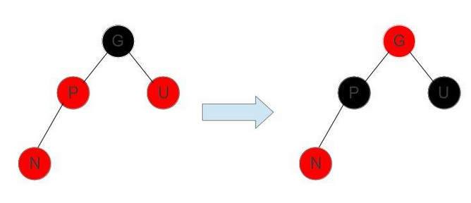

+   假设插入的结点是 N,看图可知,此时父结点 P 和叔叔结点 U 都是红色,爷爷结点 G 一定是黑色
+   由性质4可知,红色结点不能连续,所以图中的情况需要调整
+   调整:只需要将不管 N 是 P 的左孩子还是右孩子，只要同时把 P 和 U 染成黑色，G 染成红色即可,此时经过 G 的路径上的黑色节点数量不变，性质5仍然满足。
+   需要注意的是 G 被染成红色后，可能会和它的父节点形成连续的红色节点，此时需要递归向上调整。

简记: 叔叔结点为红色,则`变色`

###     情况2.父亲节点为红色，叔叔节点为黑色(N 在父亲节点 P 的左孩子位置)

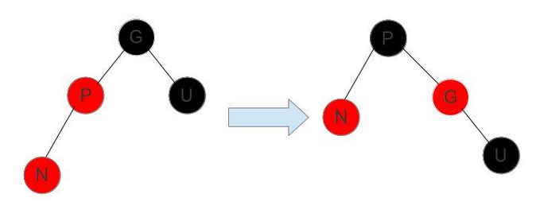

+   假设插入的是节点 N，由图可知,这时父亲节点 P 是红色，叔叔节点 U 是黑色，爷爷节点 G 一定是黑色
+   红色节点的孩子不能是红色，但是直接把父亲节点 P 涂成黑色也不行，这条路径多了个黑色节点。
+   可以使用右旋，通过把 爷爷节点 G 右旋，P 变成了这个子树的根节点，G 变成了 P 的右子树。
+   右旋后 G 跑到了右子树上，这时把 P 变成黑的，多了一个黑节点，再把 G 变成红的，就平衡了
+   此时性质4,红色结点不能有红色子结点得到满足
+   且没有破坏原本的黑高,原本的黑高从左边看是1,右边看是2,调整后左边的黑高仍旧是1,右边的黑高仍旧是2

简记: 叔叔结点为黑色,N 在父结点 P 的左孩子,则`右旋 => 变色`

###     情况3.父亲节点为红色，叔叔节点为黑色(N 在父亲节点 P 的右孩子位置)
上面讲的是插入节点 N 在父亲节点 P 的左孩子位置，如果 N 是 P 的右孩子，就需要多进行一次左旋，把情况化解成上述情况。

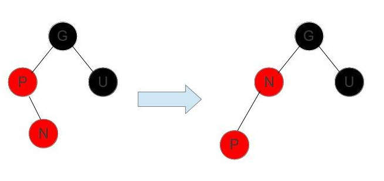


简记: 叔叔结点为黑色,N 在父结点 P 的右孩子,则`左旋 => 右旋 => 变色`

###     插入总结
三种情况的区别在于叔叔节点的颜色，如果叔叔节点为红色，直接变色即可。如果叔叔节点为黑色，则需要选选择，再交换颜色。当把这三种情况的图画在一起就区别就比较容易观察了，如下图

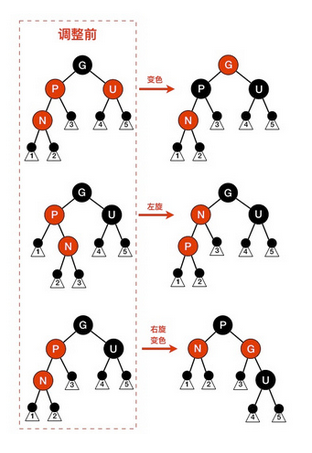


##  验证: Java 中的 TreeMap 源码
下面是 TreeMap 在插入后进行调整的代码，可以看出来跟我们分析的一致。
```JAVA
private void fixAfterInsertion(Entry x) {
    x.color = RED;  //直接染成红色，少点麻烦

    //这里分析的都是父亲节点为红色的情况，不是红色就不用调整了
    while (x != null && x != root && x.parent.color == RED) {
        if (parentOf(x) == leftOf(parentOf(parentOf(x)))) { // 插入节点 x 的父亲节点位于左孩子    
            Entry y = rightOf(parentOf(parentOf(x)));  // y 是 x 的叔叔节点
            if (colorOf(y) == RED) {    //如果 y 也是红色，只要把父亲节点和 y 都变成黑色，爷爷节点变成红的，就 Ok 了
                setColor(parentOf(x), BLACK);
                setColor(y, BLACK);
                setColor(parentOf(parentOf(x)), RED);
                x = parentOf(parentOf(x));
            } else {    //如果叔叔节点 y 不是红色，就需要右旋，让父亲节点变成根节点，爷爷节点去右子树去，然后把父亲节点变成黑色、爷爷节点变成红色
                    //特殊情况：x 是父亲节点的右孩子，需要对父亲节点进行左旋，把 x 移动到左子树
                if (x == rightOf(parentOf(x))) {
                    x = parentOf(x);
                    rotateLeft(x);
                }
                setColor(parentOf(x), BLACK);
                setColor(parentOf(parentOf(x)), RED);
                rotateRight(parentOf(parentOf(x)));
            }
        } else {    //和上面对称的操作
            Entry y = leftOf(parentOf(parentOf(x)));
            if (colorOf(y) == RED) {
                setColor(parentOf(x), BLACK);
                setColor(y, BLACK);
                setColor(parentOf(parentOf(x)), RED);
                x = parentOf(parentOf(x));
            } else {
                if (x == leftOf(parentOf(x))) {
                    x = parentOf(x);
                    rotateRight(x);
                }
                setColor(parentOf(x), BLACK);
                setColor(parentOf(parentOf(x)), RED);
                rotateLeft(parentOf(parentOf(x)));
            }
        }
    }
    root.color = BLACK;
}
```

#   红黑树的平衡删除
红黑树的删除也是分两步

1.  二叉查找树的删除([查看:二叉排序树的删除](/2020/05/05/二叉排序树的基本介绍与Java实现/#二叉排序树的删除))
2.  结构调整

##  如何进行调整
+   删除修复操作是针对删除黑色节点才有的
+   当黑色节点被删除后会让整个树不符合RBTree的定义的第四条(第四条:每个叶子到根的所有路径上不能有两个连续的红色节点)。
+   需要做的处理是从兄弟节点上借调黑色的节点过来，如果兄弟节点没有黑节点可以借调的话，就只能往上追溯，将每一级的黑节点数减去一个，使得整棵树符合红黑树的定义

###     总体思想
+   删除操作的总体思想是从兄弟节点借调黑色节点使树保持局部的平衡
+   如果局部的平衡达到了，就看整体的树是否是平衡的，如果不平衡就接着向上追溯调整

###     删除修复操作分为四种情况(删除黑节点后)：
1.  待删除的节点的兄弟节点是红色的节点。
2.  待删除的节点的兄弟节点是黑色的节点，且兄弟节点的子节点都是黑色的。
3.  待调整的节点的兄弟节点是黑色的节点，且兄弟节点的左子节点是红色的，右节点是黑色的(兄弟节点在右边)，如果兄弟节点在左边的话，就是兄弟节点的右子节点是红色的，左节点是黑色的。
4.  待调整的节点的兄弟节点是黑色的节点，且右子节点是是红色的(兄弟节点在右边)，如果兄弟节点在左边，则就是对应的就是左节点是红色的。

####    case1:待删除的节点的兄弟节点是红色的节点
+   由于兄弟节点是红色节点的时候，无法借调黑节点，所以需要将兄弟节点提升到父节点，由于兄弟节点是红色的，根据RBTree的定义，兄弟节点的子节点是黑色的，就可以从它的子节点借调了。
+   case 1这样转换之后就会变成后面的case 2，case 3，或者case 4进行处理了。
+   上升操作需要对C做一个左旋操作(如果是镜像结构的树只需要做对应的右旋操作即可)
+   之所以要做case 1操作是因为兄弟节点是红色的，无法借到一个黑节点来填补删除的黑节点。

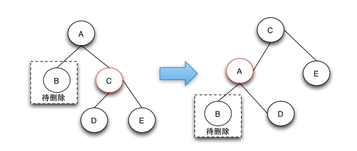


####    case2:待删除的节点的兄弟节点是黑色的节点，且兄弟节点的子节点都是黑色的
+   case 2的删除操作是由于兄弟节点可以消除一个黑色节点，因为兄弟节点和兄弟节点的子节点都是黑色的，所以可以将兄弟节点变红，这样就可以保证树的局部的颜色符合定义了。这个时候需要将父节点A变成新的节点，继续向上调整，直到整颗树的颜色符合RBTree的定义为止。
+   case 2这种情况下之所以要将兄弟节点变红，是因为如果把兄弟节点借调过来，会导致兄弟的结构不符合RBTree的定义，这样的情况下只能是将兄弟节点也变成红色来达到颜色的平衡。当将兄弟节点也变红之后，达到了局部的平衡了，但是对于祖父节点来说是不符合定义4的。这样就需要回溯到父节点，接着进行修复操作。

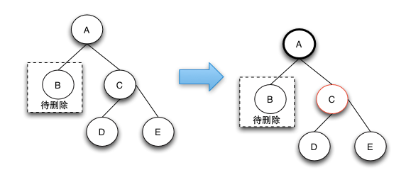


####    case3:待调整的节点的兄弟节点是黑色的节点，且兄弟节点的左子节点是红色的，右节点是黑色的
+   case 3的删除操作是一个中间步骤，它的目的是将左边的红色节点借调过来，这样就可以转换成case 4状态了，在case 4状态下可以将D，E节点都阶段过来，通过将两个节点变成黑色来保证红黑树的整体平衡。
+   之所以说case-3是一个中间状态，是因为根据红黑树的定义来说，下图并不是平衡的，他是通过case 2操作完后向上回溯出现的状态。之所以会出现case 3和后面的case 4的情况，是因为可以通过借用侄子节点的红色，变成黑色来符合红黑树定义4.

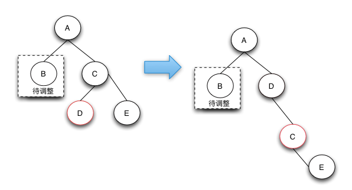


####    case4:待调整的节点的兄弟节点是黑色的节点，且右子节点是是红色的
+   Case 4的操作是真正的节点借调操作，通过将兄弟节点以及兄弟节点的右节点借调过来，并将兄弟节点的右子节点变成红色来达到借调两个黑节点的目的，这样的话，整棵树还是符合RBTree的定义的。
+   Case 4这种情况的发生只有在待删除的节点的兄弟节点为黑，且子节点不全部为黑，才有可能借调到两个节点来做黑节点使用，从而保持整棵树都符合红黑树的定义。

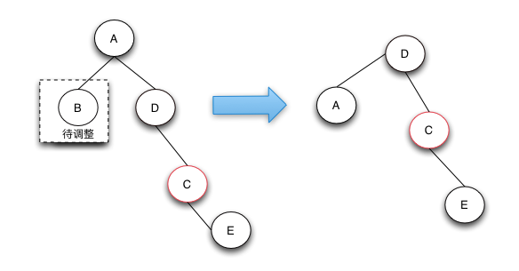


##  删除后调整的全部逻辑流程图
红黑树的删除操作是最复杂的操作，复杂的地方就在于当删除了黑色节点的时候，如何从兄弟节点去借调节点，以保证树的颜色符合定义。由于红色的兄弟节点是没法借调出黑节点的，这样只能通过选择操作让他上升到父节点，而由于它是红节点，所以它的子节点就是黑的，可以借调。

对于兄弟节点是黑色节点的可以分成3种情况来处理，当所以的兄弟节点的子节点都是黑色节点时，可以直接将兄弟节点变红，这样局部的红黑树颜色是符合定义的。但是整颗树不一定是符合红黑树定义的，需要往上追溯继续调整。

对于兄弟节点的子节点为左红右黑或者 (全部为红，右红左黑)这两种情况，可以先将前面的情况通过选择转换为后一种情况，在后一种情况下，因为兄弟节点为黑，兄弟节点的右节点为红，可以借调出两个节点出来做黑节点，这样就可以保证删除了黑节点，整棵树还是符合红黑树的定义的，因为黑色节点的个数没有改变。

红黑树的删除操作是遇到删除的节点为红色，或者追溯调整到了root节点，这时删除的修复操作完毕。

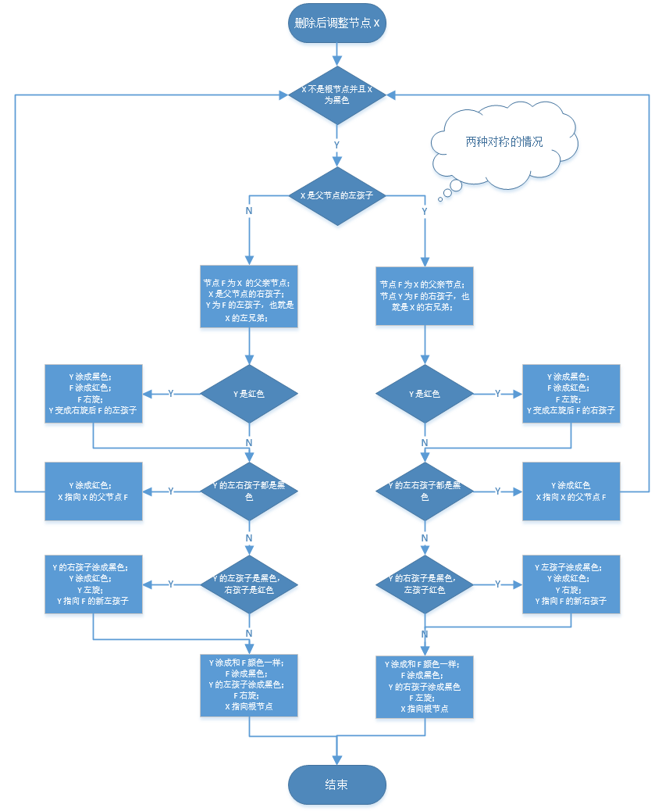


##  java 中 TreeMap 的源码
```JAVA
private void fixAfterDeletion(Entry x) {
    while (x != root && colorOf(x) == BLACK) {
        if (x == leftOf(parentOf(x))) {
            Entry sib = rightOf(parentOf(x));

            //左旋，把黑色节点移到左边一个
            if (colorOf(sib) == RED) {
                setColor(sib, BLACK);
                setColor(parentOf(x), RED);
                rotateLeft(parentOf(x));
                sib = rightOf(parentOf(x));
            }

            if (colorOf(leftOf(sib))  == BLACK &&
                colorOf(rightOf(sib)) == BLACK) {
                setColor(sib, RED);
                x = parentOf(x);
            } else {
                if (colorOf(rightOf(sib)) == BLACK) {
                    setColor(leftOf(sib), BLACK);
                    setColor(sib, RED);
                    rotateRight(sib);
                    sib = rightOf(parentOf(x));
                }
                setColor(sib, colorOf(parentOf(x)));
                setColor(parentOf(x), BLACK);
                setColor(rightOf(sib), BLACK);
                rotateLeft(parentOf(x));
                x = root;
            }
        } else { //处理的节点在 右边，相同逻辑，只不过旋转的方向相反
            Entry sib = leftOf(parentOf(x));

            if (colorOf(sib) == RED) {
                setColor(sib, BLACK);
                setColor(parentOf(x), RED);
                rotateRight(parentOf(x));
                sib = leftOf(parentOf(x));
            }

            if (colorOf(rightOf(sib)) == BLACK &&
                colorOf(leftOf(sib)) == BLACK) {
                setColor(sib, RED);
                x = parentOf(x);
            } else {
                if (colorOf(leftOf(sib)) == BLACK) {
                    setColor(rightOf(sib), BLACK);
                    setColor(sib, RED);
                    rotateLeft(sib);
                    sib = leftOf(parentOf(x));
                }
                setColor(sib, colorOf(parentOf(x)));
                setColor(parentOf(x), BLACK);
                setColor(leftOf(sib), BLACK);
                rotateRight(parentOf(x));
                x = root;
            }
        }
    }

    setColor(x, BLACK);
}
```

#   红黑树的Java实现
```JAVA
public class RBTreeNode<T extends Comparable<T>> {
    private T value;//node value
    private RBTreeNode<T> left;//left child pointer
    private RBTreeNode<T> right;//right child pointer
    private RBTreeNode<T> parent;//parent pointer
    private boolean red;//color is red or not red

    public RBTreeNode(){}
    public RBTreeNode(T value){this.value=value;}
    public RBTreeNode(T value,boolean isRed){this.value=value;this.red = isRed;}

    public T getValue() {
        return value;
    }
    void setValue(T value) {
        this.value = value;
    }
    RBTreeNode<T> getLeft() {
        return left;
    }
    void setLeft(RBTreeNode<T> left) {
        this.left = left;
    }
    RBTreeNode<T> getRight() {
        return right;
    }
    void setRight(RBTreeNode<T> right) {
        this.right = right;
    }
    RBTreeNode<T> getParent() {
        return parent;
    }
    void setParent(RBTreeNode<T> parent) {
        this.parent = parent;
    }
    boolean isRed() {
        return red;
    }
    boolean isBlack(){
        return !red;
    }
    /**
    * is leaf node
    **/
    boolean isLeaf(){
        return left==null && right==null;
    }

    void setRed(boolean red) {
        this.red = red;
    }

    void makeRed(){
        red=true;
    }
    void makeBlack(){
        red=false;
    }
    @Override
    public String toString(){
        return value.toString();
    }
}


public class RBTree<T extends Comparable<T>> {
    private final RBTreeNode<T> root;
    //node number
    private java.util.concurrent.atomic.AtomicLong size = 
                    new java.util.concurrent.atomic.AtomicLong(0);

    //in overwrite mode,all node's value can not  has same    value
    //in non-overwrite mode,node can have same value, suggest don't use non-overwrite mode.
    private volatile boolean overrideMode=true;

    public RBTree(){
        this.root = new RBTreeNode<T>();
    }

    public RBTree(boolean overrideMode){
        this();
        this.overrideMode=overrideMode;
    }


    public boolean isOverrideMode() {
        return overrideMode;
    }

    public void setOverrideMode(boolean overrideMode) {
        this.overrideMode = overrideMode;
    }

    /**
     * number of tree number
     * @return
     */
    public long getSize() {
        return size.get();
    }
    /**
     * get the root node
     * @return
     */
    private RBTreeNode<T> getRoot(){
        return root.getLeft();
    }

    /**
     * add value to a new node,if this value exist in this tree,
     * if value exist,it will return the exist value.otherwise return null
     * if override mode is true,if value exist in the tree,
     * it will override the old value in the tree
     * 
     * @param value
     * @return
     */
    public T addNode(T value){
        RBTreeNode<T> t = new RBTreeNode<T>(value);
        return addNode(t);
    }
    /**
     * find the value by give value(include key,key used for search,
     * other field is not used,@see compare method).if this value not exist return null
     * @param value
     * @return
     */
    public T find(T value){
        RBTreeNode<T> dataRoot = getRoot();
        while(dataRoot!=null){
            int cmp = dataRoot.getValue().compareTo(value);
            if(cmp<0){
                dataRoot = dataRoot.getRight();
            }else if(cmp>0){
                dataRoot = dataRoot.getLeft();
            }else{
                return dataRoot.getValue();
            }
        }
        return null;
    }
    /**
     * remove the node by give value,if this value not exists in tree return null
     * @param value include search key
     * @return the value contain in the removed node
     */
    public T remove(T value){
        RBTreeNode<T> dataRoot = getRoot();
        RBTreeNode<T> parent = root;

        while(dataRoot!=null){
            int cmp = dataRoot.getValue().compareTo(value);
            if(cmp<0){
                parent = dataRoot;
                dataRoot = dataRoot.getRight();
            }else if(cmp>0){
                parent = dataRoot;
                dataRoot = dataRoot.getLeft();
            }else{
                if(dataRoot.getRight()!=null){
                    RBTreeNode<T> min = removeMin(dataRoot.getRight());
                    //x used for fix color balance
                    RBTreeNode<T> x = min.getRight()==null ? min.getParent() : min.getRight();
                    boolean isParent = min.getRight()==null;

                    min.setLeft(dataRoot.getLeft());
                    setParent(dataRoot.getLeft(),min);
                    if(parent.getLeft()==dataRoot){
                        parent.setLeft(min);
                    }else{
                        parent.setRight(min);
                    }
                    setParent(min,parent);

                    boolean curMinIsBlack = min.isBlack();
                    //inherit dataRoot's color
                    min.setRed(dataRoot.isRed());

                    if(min!=dataRoot.getRight()){
                        min.setRight(dataRoot.getRight());
                        setParent(dataRoot.getRight(),min);
                    }
                    //remove a black node,need fix color
                    if(curMinIsBlack){
                        if(min!=dataRoot.getRight()){
                            fixRemove(x,isParent);
                        }else if(min.getRight()!=null){
                            fixRemove(min.getRight(),false);
                        }else{
                            fixRemove(min,true);
                        }
                    }
                }else{
                    setParent(dataRoot.getLeft(),parent);
                    if(parent.getLeft()==dataRoot){
                        parent.setLeft(dataRoot.getLeft());
                    }else{
                        parent.setRight(dataRoot.getLeft());
                    }
                    //current node is black and tree is not empty
                    if(dataRoot.isBlack() && !(root.getLeft()==null)){
                        RBTreeNode<T> x = dataRoot.getLeft()==null 
                                            ? parent :dataRoot.getLeft();
                        boolean isParent = dataRoot.getLeft()==null;
                        fixRemove(x,isParent);
                    }
                }
                setParent(dataRoot,null);
                dataRoot.setLeft(null);
                dataRoot.setRight(null);
                if(getRoot()!=null){
                    getRoot().setRed(false);
                    getRoot().setParent(null);
                }
                size.decrementAndGet();
                return dataRoot.getValue();
            }
        }
        return null;
    }
    /**
     * fix remove action
     * @param node
     * @param isParent
     */
    private void fixRemove(RBTreeNode<T> node,boolean isParent){
        RBTreeNode<T> cur = isParent ? null : node;
        boolean isRed = isParent ? false : node.isRed();
        RBTreeNode<T> parent = isParent ? node : node.getParent();

        while(!isRed && !isRoot(cur)){
            RBTreeNode<T> sibling = getSibling(cur,parent);
            //sibling is not null,due to before remove tree color is balance

            //if cur is a left node
            boolean isLeft = parent.getRight()==sibling;
            if(sibling.isRed() && !isLeft){//case 1
                //cur in right
                parent.makeRed();
                sibling.makeBlack();
                rotateRight(parent);
            }else if(sibling.isRed() && isLeft){
                //cur in left
                parent.makeRed();
                sibling.makeBlack();
                rotateLeft(parent);
            }else if(isBlack(sibling.getLeft()) && isBlack(sibling.getRight())){//case 2
                sibling.makeRed();
                cur = parent;
                isRed = cur.isRed();
                parent=parent.getParent();
            }else if(isLeft && !isBlack(sibling.getLeft()) 
                                    && isBlack(sibling.getRight())){//case 3
                sibling.makeRed();
                sibling.getLeft().makeBlack();
                rotateRight(sibling);
            }else if(!isLeft && !isBlack(sibling.getRight()) 
                                            && isBlack(sibling.getLeft()) ){
                sibling.makeRed();
                sibling.getRight().makeBlack();
                rotateLeft(sibling);
            }else if(isLeft && !isBlack(sibling.getRight())){//case 4
                sibling.setRed(parent.isRed());
                parent.makeBlack();
                sibling.getRight().makeBlack();
                rotateLeft(parent);
                cur=getRoot();
            }else if(!isLeft && !isBlack(sibling.getLeft())){
                sibling.setRed(parent.isRed());
                parent.makeBlack();
                sibling.getLeft().makeBlack();
                rotateRight(parent);
                cur=getRoot();
            }
        }
        if(isRed){
            cur.makeBlack();
        }
        if(getRoot()!=null){
            getRoot().setRed(false);
            getRoot().setParent(null);
        }

    }
    //get sibling node
    private RBTreeNode<T> getSibling(RBTreeNode<T> node,RBTreeNode<T> parent){
        parent = node==null ? parent : node.getParent();
        if(node==null){
            return parent.getLeft()==null ? parent.getRight() : parent.getLeft();
        }
        if(node==parent.getLeft()){
            return parent.getRight();
        }else{
            return parent.getLeft();
        }
    }

    private boolean isBlack(RBTreeNode<T> node){
        return node==null || node.isBlack();
    }
    private boolean isRoot(RBTreeNode<T> node){
        return root.getLeft() == node && node.getParent()==null;
    }
    /**
     * find the successor node
     * @param node current node's right node
     * @return
     */
    private RBTreeNode<T> removeMin(RBTreeNode<T> node){
        //find the min node
        RBTreeNode<T> parent = node;
        while(node!=null && node.getLeft()!=null){
            parent = node;
            node = node.getLeft();
        }
        //remove min node
        if(parent==node){
            return node;
        }

        parent.setLeft(node.getRight());
        setParent(node.getRight(),parent);

        //don't remove right pointer,it is used for fixed color balance
        //node.setRight(null);
        return node;
    }


    private T addNode(RBTreeNode<T> node){
        node.setLeft(null);
        node.setRight(null);
        node.setRed(true);
        setParent(node,null);
        if(root.getLeft()==null){
            root.setLeft(node);
            //root node is black
            node.setRed(false);
            size.incrementAndGet();
        }else{
            RBTreeNode<T> x = findParentNode(node);
            int cmp = x.getValue().compareTo(node.getValue());

            if(this.overrideMode && cmp==0){
                T v = x.getValue();
                x.setValue(node.getValue());
                return v;
            }else if(cmp==0){
                //value exists,ignore this node
                return x.getValue();
            }

            setParent(node,x);

            if(cmp>0){
                x.setLeft(node);
            }else{
                x.setRight(node);
            }

            fixInsert(node);
            size.incrementAndGet();
        }
        return null;
    }

    /**
     * find the parent node to hold node x,if parent value equals x.value return parent.
     * @param x
     * @return
     */
    private RBTreeNode<T> findParentNode(RBTreeNode<T> x){
        RBTreeNode<T> dataRoot = getRoot();
        RBTreeNode<T> child = dataRoot;

        while(child!=null){
            int cmp = child.getValue().compareTo(x.getValue());
            if(cmp==0){
                return child;
            }
            if(cmp>0){
                dataRoot = child;
                child = child.getLeft();
            }else if(cmp<0){
                dataRoot = child;
                child = child.getRight();
            }
        }
        return dataRoot;
    }

    /**
     * red black tree insert fix.
     * @param x
     */
    private void fixInsert(RBTreeNode<T> x){
        RBTreeNode<T> parent = x.getParent();

        while(parent!=null && parent.isRed()){
            RBTreeNode<T> uncle = getUncle(x);
            if(uncle==null){//need to rotate
                RBTreeNode<T> ancestor = parent.getParent();
                //ancestor is not null due to before before add,tree color is balance
                if(parent == ancestor.getLeft()){
                    boolean isRight = x == parent.getRight();
                    if(isRight){
                        rotateLeft(parent);
                    }
                    rotateRight(ancestor);

                    if(isRight){
                        x.setRed(false);
                        parent=null;//end loop
                    }else{
                        parent.setRed(false);
                    }
                    ancestor.setRed(true);
                }else{
                    boolean isLeft = x == parent.getLeft();
                    if(isLeft){
                        rotateRight(parent);
                    }
                    rotateLeft(ancestor);

                    if(isLeft){
                        x.setRed(false);
                        parent=null;//end loop
                    }else{
                        parent.setRed(false);
                    }
                    ancestor.setRed(true);
                }
            }else{//uncle is red
                parent.setRed(false);
                uncle.setRed(false);
                parent.getParent().setRed(true);
                x=parent.getParent();
                parent = x.getParent();
            }
        }
        getRoot().makeBlack();
        getRoot().setParent(null);
    }
    /**
     * get uncle node
     * @param node
     * @return
     */
    private RBTreeNode<T> getUncle(RBTreeNode<T> node){
        RBTreeNode<T> parent = node.getParent();
        RBTreeNode<T> ancestor = parent.getParent();
        if(ancestor==null){
            return null;
        }
        if(parent == ancestor.getLeft()){
            return ancestor.getRight();
        }else{
            return ancestor.getLeft();
        }
    }

    private void rotateLeft(RBTreeNode<T> node){
        RBTreeNode<T> right = node.getRight();
        if(right==null){
            throw new java.lang.IllegalStateException("right node is null");
        }
        RBTreeNode<T> parent = node.getParent();
        node.setRight(right.getLeft());
        setParent(right.getLeft(),node);

        right.setLeft(node);
        setParent(node,right);

        if(parent==null){//node pointer to root
            //right  raise to root node
            root.setLeft(right);
            setParent(right,null);
        }else{
            if(parent.getLeft()==node){
                parent.setLeft(right);
            }else{
                parent.setRight(right);
            }
            //right.setParent(parent);
            setParent(right,parent);
        }
    }

    private void rotateRight(RBTreeNode<T> node){
        RBTreeNode<T> left = node.getLeft();
        if(left==null){
            throw new java.lang.IllegalStateException("left node is null");
        }
        RBTreeNode<T> parent = node.getParent();
        node.setLeft(left.getRight());
        setParent(left.getRight(),node);

        left.setRight(node);
        setParent(node,left);

        if(parent==null){
            root.setLeft(left);
            setParent(left,null);
        }else{
            if(parent.getLeft()==node){
                parent.setLeft(left);
            }else{
                parent.setRight(left);
            }
            setParent(left,parent);
        }
    }


    private void setParent(RBTreeNode<T> node,RBTreeNode<T> parent){
        if(node!=null){
            node.setParent(parent);
            if(parent==root){
                node.setParent(null);
            }
        }
    }
    /**
     * debug method,it used print the given node and its children nodes,
     * every layer output in one line
     * @param root
     */
    public void printTree(RBTreeNode<T> root){
        java.util.LinkedList<RBTreeNode<T>> queue =new java.util.LinkedList<RBTreeNode<T>>();
        java.util.LinkedList<RBTreeNode<T>> queue2 =new java.util.LinkedList<RBTreeNode<T>>();
        if(root==null){
            return ;
        }
        queue.add(root);
        boolean firstQueue = true;

        while(!queue.isEmpty() || !queue2.isEmpty()){
            java.util.LinkedList<RBTreeNode<T>> q = firstQueue ? queue : queue2;
            RBTreeNode<T> n = q.poll();

            if(n!=null){
                String pos = n.getParent()==null ? "" : ( n == n.getParent().getLeft() 
                                                                        ? " LE" : " RI");
                String pstr = n.getParent()==null ? "" : n.getParent().toString();
                String cstr = n.isRed()?"R":"B";
                cstr = n.getParent()==null ? cstr : cstr+" ";
                System.out.print(n+"("+(cstr)+pstr+(pos)+")"+"\t");
                if(n.getLeft()!=null){
                    (firstQueue ? queue2 : queue).add(n.getLeft());
                }
                if(n.getRight()!=null){
                    (firstQueue ? queue2 : queue).add(n.getRight());
                }
            }else{
                System.out.println();
                firstQueue = !firstQueue;
            }
        }
    }


    public static void main(String[] args) {
        RBTree<String> bst = new RBTree<String>();
        bst.addNode("d");
        bst.addNode("d");
        bst.addNode("c");
        bst.addNode("c");
        bst.addNode("b");
        bst.addNode("f");

        bst.addNode("a");
        bst.addNode("e");

        bst.addNode("g");
        bst.addNode("h");


        bst.remove("c");

        bst.printTree(bst.getRoot());
    }
}
```
代码调试的时候，printTree输出格式如下:
d(B)
b(B d LE) g(R d RI)
a(R b LE) e(B g LE) h(B g RI)
f(R e RI)

括号左边表示元素的内容。括号内的第一个元素表示颜色，B表示black，R表示red；第二个元素表示父元素的值；第三个元素表示左右，LE表示在父元素的左边。RI表示在父元素的右边。

第一个元素d是root节点，由于它没有父节点，所以括号内只有一个元素。

#   总结

作为平衡二叉查找树里面众多的实现之一，红黑树无疑是最简洁、实现最为简单的。

**核心就是：用颜色和规矩防止树长成长条，保证查数据、改数据的速度始终很快**。

红黑树就像个 “强迫症”，通过给节点染色和定规矩，强迫自己保持 “差不多平衡” 的身材，不管存多少数据，找起来、改起来都不会太慢。
它不用做到绝对完美的平衡（那样调整起来太麻烦），但能保证 “不会太失衡”，所以在电脑里存数据、查数据时特别常用。

作为平衡二叉查找树，旋转是一个必不可少的操作。通过旋转可以降低树的高度，在红黑树里面还可以转换颜色。

红黑树里面的插入和删除的操作比较难理解，这时要注意记住一点：操作之前红黑树是平衡的，颜色是符合定义的。在操作的时候就需要向兄弟节点、父节点、侄子节点借调和互换颜色，要达到这个目的，就需要不断的进行旋转。所以红黑树的插入删除操作需要不停的旋转，一旦借调了别的节点，删除和插入的节点就会达到局部的平衡（局部符合红黑树的定义），但是被借调的节点就不会平衡了，这时就需要以被借调的节点为起点继续进行调整，直到整棵树都是平衡的。在整个修复的过程中，插入具体的分为3种情况，删除分为4种情况。

整个红黑树的查找，插入和删除都是O(logN)的，原因就是整个红黑树的高度是logN，查找从根到叶，走过的路径是树的高度，删除和插入操作是从叶到根的，所以经过的路径都是logN。

#   参考
+   [面试旧敌之红黑树（直白介绍深入理解）](https://juejin.im/entry/6844903454767317005#%E9%BB%91%E8%89%B2%E9%AB%98%E5%BA%A6)
+   [红黑树详细分析，看了都说好](https://segmentfault.com/a/1190000012728513)
+   [红黑树深入剖析及Java实现](https://zhuanlan.zhihu.com/p/24367771)
