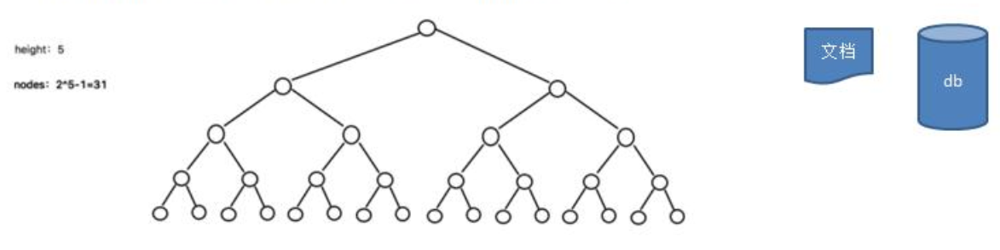
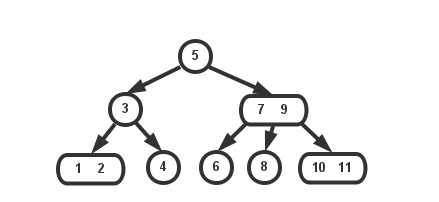
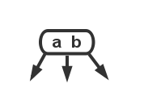
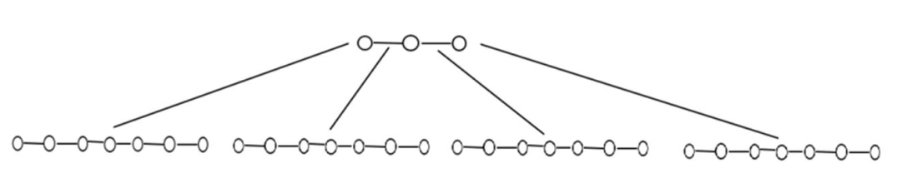
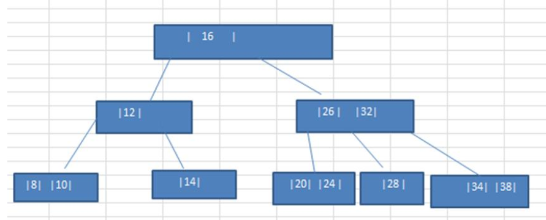
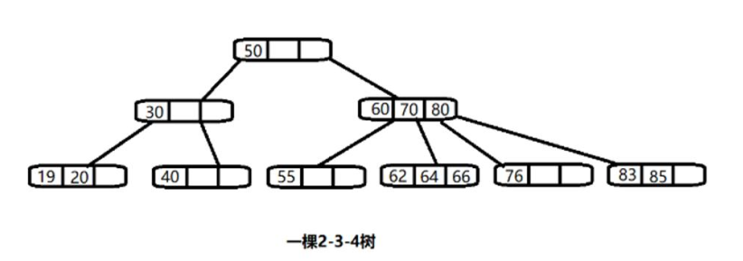
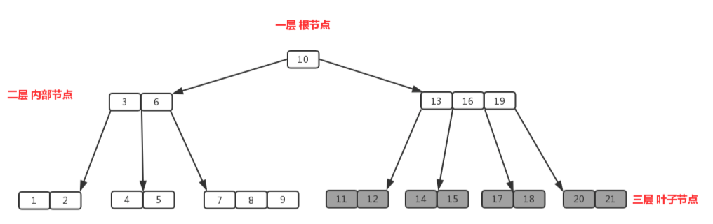
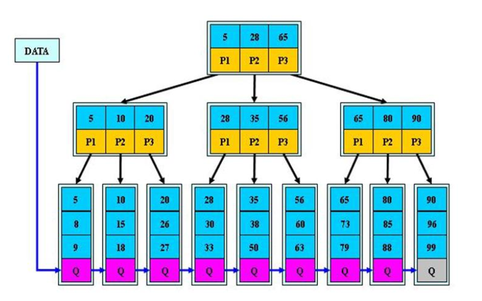
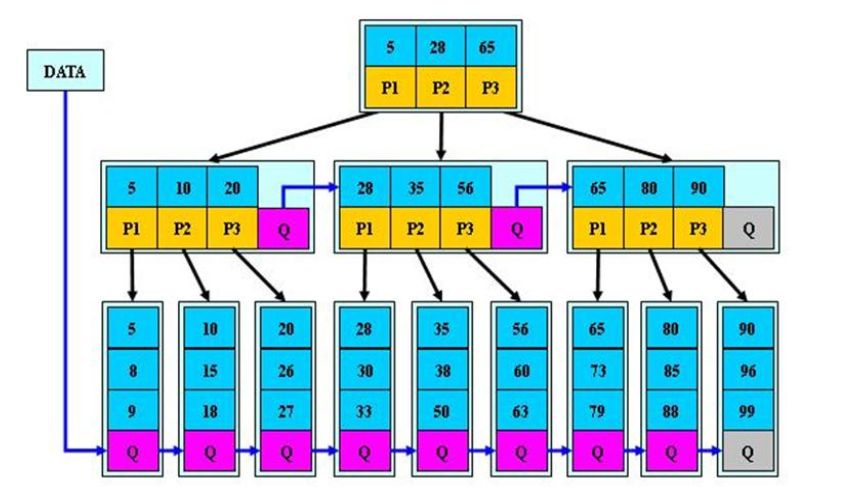

# 多路查找树

---

# B树的引出

## 二叉树的问题分析

二叉树的操作效率较高，但是也存在问题,请看下面的二叉树



+ 二叉树需要加载到内存的，如果二叉树的节点少，没有什么问题，但是如果二叉树的节点很多(比如 1 亿)，就存在如下问题:
  + 问题 1：在构建二叉树时，需要多次进行 i/o 操作(海量数据存在数据库或文件中)，节点海量，构建二叉树时，速度有影响
  + 问题 2：节点海量，也会造成二叉树的高度很大，会降低操作速度

`大白话：节点很多的时候，二叉树会“瘦高”`

## 多叉树

为什么需要多叉树？`大白话：目的是将“瘦高”的二叉树，变成“矮胖”的多叉树`
+ 在二叉树中，每个节点有数据项，最多有两个子节点。如果允许每个节点可以有更多的数据项和更多的子节点，就是多叉树（multiway tree）
+ 后面我们讲解的 2-3 树， 2-3-4 树就是多叉树，多叉树通过重新组织节点，减少树的高度，能对二叉树进行优化。
+ 举例说明(下面 2-3 树就是一颗多叉树)



2节点


3节点



## 引出B树

B树通过重新组织节点，降低树的高度，并且减少 i/o 读写次数来提升效率。



+ 如图，B树通过重新组织节点，降低了树的高度
+ 文件系统及数据库系统的设计者利用了磁盘预读原理，将一个节点的大小设为等于一个页(页得大小通常为 4k)，这样每个节点只需要一次 I/O 就可以完全载入
+ 将树的度 M 设置为 1024，在 600 亿个元素中最多只需要 4 次 I/O 操作就可以读取到想要的元素, B 树(B+)广泛应用于文件存储系统以及数据库系统中


# 2-3树

2-3树是最简单的B树结构,具有如下特点:

- 2-3 树的所有叶子节点都在同一层.(只要是 B 树都满足这个条件)
- 有两个子节点的节点叫二节点，二节点要么没有子节点，要么有两个子节点.
- 有三个子节点的节点叫三节点，三节点要么没有子节点，要么有三个子节点.
- 2-3 树是由二节点和三节点构成的树

## 2-3树应用案例

将数列{16, 24, 12, 32, 14, 26, 34, 10, 8, 28, 38, 20}构建成 2-3 树，并保证数据插入的大小顺序。 (演示一下构建 2-3树的过程.)



插入规则:

- 2-3 树的所有叶子节点都在同一层(只要是 B 树都满足这个条件)
- 有两个子节点的节点叫二节点，二节点要么没有子节点，要么有两个子节点.
- 有三个子节点的节点叫三节点，三节点要么没有子节点，要么有三个子节点
- 当按照规则插入一个数到某个节点时，不能满足上面三个要求，就需要拆，先向上拆，如果上层满，则拆本层，拆后仍然需要满足上面 3 个条件。
- 对于三节点的子树的值大小仍然遵守(BST 二叉排序树)的规则

## 其它说明

除了 2-3 树，还有 2-34-树等，概念和 23-树类似，也是一种 B 树。如图



# B树

拿 “查字典” 来举例吧，B 树就像一本 “优化版字典”，专门解决 “字典太厚，翻起来费劲” 的问题

## 先看普通字典的麻烦（类似二叉树的问题）

我们平时用的字典，查字步骤大概是：
- 先看首字母（比如查 “张”，首字母 Z）；
- 翻到 Z 开头的部分，再看第二个字母（“张” 的拼音是 zhang，第二个是 h）；
- 翻到 Zh 开头的部分，再看第三个字母 a……
- 一步步缩小范围，直到找到 “张” 字。

但如果字典里的字特别多（比如包含全世界所有语言的文字），首字母可能有 100 个，每个首字母下面又分 100 个次字母，那你可能要翻 10 次才能找到目标字，每次翻页就像 “读磁盘”，很慢。

## B 树版字典：一页多放几个 “索引”，少翻几次页

B 树的核心就是：`让每一页（节点）多放几个 “关键索引”，这样不用翻太多页就能找到目标`。

比如一本 B 树版字典：

- 第一页（根节点）不直接放字，而是放几个 “大分类索引”：
  - 比如 “A-K”“L-T”“U-Z”，每个索引后面标着下一页的页码（子节点地址）。
- 你查 “张”（Z），第一页就知道该翻到 “U-Z” 对应的第 10 页。
- 第 10 页（中间节点）也不放字，放更细的索引：
  - 比如 “U-W”“X-Z”，并标着下一页页码。
  - 你看到 “Z” 属于 “X-Z”，翻到对应的第 50 页。
- 第 50 页（叶子节点）直接放着 X-Z 开头的所有字，包括 “张”，找到为止。

整个过程只翻了 3 页（树高 3），比普通字典翻 10 页快多了。

## B 树的 “规矩”

- 每页索引按顺序排：比如第一页的 “A-K”“L-T”“U-Z” 必须按字母顺序排，这样你不用乱翻，直接按顺序找索引。
- 所有字都在最后一页：不管查什么字，最终都要翻到最底层的 “叶子页”（和 B + 树不同，B 树的中间页也能放字，但核心逻辑类似）。
- 每页厚度差不多：所有叶子页都在同一 “厚度”（树的同一高度），保证查任何字翻的页数一样多，不会有的字翻 3 页，有的翻 10 页。
- 一页满了就 “分家”：如果第 50 页放满了 X-Z 的字，再新增字时，就把这一页分成两页（比如 X-V 和 W-Z），并把中间的索引（比如 “W”）提到上一页（第 10 页），这样每页始终不会太挤，翻起来依然方便。

大白话看完，再看一下严肃表达

### 定义

#### 节点的 “容量规则”（限制每个节点存多少数据）

- 一个 m 阶 B 树（m 是预先设定的整数，比如 3 阶、5 阶）中，每个节点（除根节点外）必须满足：
  - 最少存 ⌈m/2⌉ - 1 个数据（键值），最多存 m - 1 个数据。
    - ⌈m/2⌉ 表示向上取整
    - 注意[元素和子节点的区别](#元素和子节点的区别)
  - 比如 3 阶 B 树，每个节点最少存 1 个数据，最多存 2 个数据
- 每个节点的 “子节点指针数量” = 该节点的 “数据数量 + 1”。
  - 比如存 2 个数据的节点，有 3 个子节点指针，分别指向 “比第一个数据小”“两个数据之间”“比第二个数据大” 的子树

#### 数据的 “有序性规则”（保证快速定位）

- 每个节点中的所有数据（键值）必须 按从小到大的顺序排列（比如 [10, 20, 30]）。
- 子节点指针对应的范围严格匹配父节点数据：
  - 假设父节点数据是 [a, b]，那么 3 个子节点指针分别指向：
    - 所有数据 < a 的子树；
    - 所有数据在 a~b 之间的子树；
    - 所有数据 > b 的子树。

#### 树的 “平衡性规则”（保证查询效率稳定）

- 所有 叶子节点（最底层节点）必须在同一深度（高度相同）
  - 比如根节点在第 1 层，叶子节点都在第 3 层，查任何数据最多走 3 层，不会有的走 3 层、有的走 5 层
- 整棵树是 “平衡的”：不会出现某一侧子树特别深，另一侧特别浅的情况

#### 插入 / 删除的 “分裂与合并规则”（保证节点不超容、不空转）

- 插入数据时，如果节点满了（存满 m-1 个数据），必须分裂：
  - 把节点从中间劈开，中间的数据 “上浮” 到父节点，剩下的左右两部分成为两个新子节点
  - 比如 3 阶 B 树节点存满 2 个数据 [10,20]，插入 30 后，分裂成 [10] 和 [30]，中间的 20 上浮到父节点
- 删除数据时，如果节点数据太少（少于⌈m/2⌉ - 1），必须合并或借数据：
  - 先尝试向相邻的兄弟节点 “借” 一个数据；如果借不到，就和兄弟节点、父节点中对应的中间数据合并成一个新节点
  - 比如 3 阶 B 树节点只剩 0 个数据，就和兄弟节点合并，同时父节点对应的数据下沉到合并后的节点

### 举例说明



- 阶
  - 所有节点中，节点【13,16,19】拥有的子节点数目最多，四个子节点（灰色节点），所以可以定义上面的图片为4阶B树
- 内部节点
  - 节点【13,16,19】、节点【3,6】都为内部节点
  - 内部节点是除叶子节点和根节点之外的所有节点，拥有父节点和子节点
- 根节点
  - 节点【10】即为根节点
  - 根节点拥有的子节点数量的上限和内部节点相同，如果根节点不是树中唯一节点的话，至少有俩个子节点（不然就变成单支了）
- 叶子节点
  - 节点【1,2】、节点【11,12】等最后一层都为叶子节点
  - 叶子节点对元素的数量有相同的限制，但是没有子节点，也没有指向子节点的指针
- 节点容量
  - 4阶B树，最少有`⌈4/2⌉ - 1 = 1`个元素，最多有`4 - 1 = 3`个元素
  - 节点有`数据数量 + 1`个子节点。所以，
    - 【13,16,19】有`3 + 1 = 4`个子节点
    - 【3,6】有`2 + 1 = 3`个子节点
    - 【10】有`1 + 1 =2`个子节点


# B + 树的介绍

B + 树可以理解成 B 树的 “升级版”，它在 B 树的基础上做了一些关键改动，让查询效率更稳定、范围查询更方便，所以在数据库索引、文件系统（比如 Windows 的 NTFS）里用得特别多

B + 树是 B 树的变体，也是一种多路搜索树。

## 先记住 B + 树的核心特点

`数据只在叶子节点，非叶子节点只当路标`

和 B 树最大的区别是：所有真实数据都只存在最底层的 “叶子节点” 里，上层的非叶子节点只存 “索引（路标）”，不存真实数据。

## B + 树的 “规矩”（对比 B 树）

- 数据位置：
  - B 树：非叶子节点和叶子节点都可能存真实数据（比如上层节点既当路标又放书）。
  - B + 树：只有叶子节点存真实数据，非叶子节点只存索引（只当路标，不放书）。
- 叶子节点的连接：
  - B 树：`叶子节点之间是孤立的`，查范围数据（比如找 100-500 号书）得一层层翻。
  - B + 树：`叶子节点像 “链表” 一样串起来`（比如《100 个故事》→《200 个故事》→…），范围查询时直接顺着链条找，不用回退上层节点，效率极高。
- 节点的 “分叉” 和 “数据量”：
  - 和 B 树类似，阶数为 n 的 B + 树，每个节点最多有 n 个子节点（分叉），所以最多存 n-1 个索引（路标）。
  - 比如 3 阶 B + 树，每个节点最多 3 个子节点，最多存 2 个索引（和 B 树一样），但这些索引只是路标，不是真实数据。



对上图的说明:

- B+树的搜索与 B 树也基本相同，区别是 B+树只有达到叶子结点才命中（B 树可以在非叶子结点命中），其性能也等价于在关键字全集做一次二分查找
- 所有关键字都出现在叶子结点的链表中（即数据只能在叶子节点【也叫稠密索引】），且链表中的关键字(数据)恰好是有序的。
- 不可能在非叶子结点命中
- `非叶子结点相当于是叶子结点的索引`（稀疏索引），`叶子结点相当于是存储（关键字）数据的数据层`
- 更适合文件索引系统
- B 树和 B+树各有自己的应用场景，不能说 B+树完全比 B 树好，反之亦然.

### （题外话）稀疏索引与稠密索引说明

- 稠密索引
  - 定义：它是由键值和指针(指向记录本身地址)组成的一系列存储块，该存储块的键值与文件的逻辑顺序一致
  - 特性：每个存储块的每一个键对应的指针都指向每个数据块每一条记录，当要查找指定键K时，采用二分查找即可找到键K对应的记录，复杂度为log2n。
- 稀疏索引
  - 定义：它是由键值和指针(指向记录本身地址)组成的一系列存储块，该存储块的键值与文件的逻辑顺序单调性一致。
  - 特性：每个存储块的每一个键对应的指针都指向每个数据块的第一条记录，当要查找指定建K时，先采用二分查找找到<=K的键S，如果S=K，则命中记录，如果`S<K`，则顺序查找=K的键，复杂度大于log2n，小于n。
- 比较：
  - 稀疏索引占用的索引存储空间比较小，但是查找时间较长；
  - 稠密索引查找时间较短，索引存储空间较大。

## 举个 3 阶 B + 树的例子

假设存的数据是 [10, 20, 30, 40, 50, 60, 70]，结构如下：

```
          顶层节点（路标）
            [30, 60]
           /   |   \
          /    |    \
中层节点（路标）  中层节点（路标）  中层节点（路标）
   [10, 20]      [40, 50]        [70]
    /   |   \     /   |   \       /  \
叶子节点（真实数据）...
[10] → [20] → [30] → [40] → [50] → [60] → [70]  （叶子节点串成链表）
```

- 查单条数据（比如找 40）：
  - 从顶层 `[30,60]` 判断，40 在 30-60 之间，走中间子节点→中层 `[40,50]`，判断 40 是第一个元素，走左子节点→找到叶子节点的 40。
- 查范围数据（比如找 20-50）：
  - 先找到 20 的叶子节点，然后顺着叶子节点的链表直接往后撸：20→30→40→50，一步到位，不用回上层节点。

## B + 树为啥比 B 树更适合数据库？

- 查询更稳定：
  - 不管查啥数据，都必须走到叶子节点（因为只有叶子节点有真实数据），所以 “查任何数据的次数基本一样”（比如都查 3 层），而 B 树可能在非叶子节点就找到数据，导致不同数据查询次数差异大。
- 范围查询无敌：
  - 叶子节点的链表结构太适合 “找连续数据” 了（比如查 “成绩在 60-80 分的学生”），这是数据库最常用的操作之一，B 树做不到这么高效。
- 空间利用率更高：
  - 非叶子节点只存索引（可以更紧凑），同样的磁盘空间能存更多路标，树的高度更低，查数据时 “翻磁盘的次数更少”（磁盘 IO 是数据库性能瓶颈，越少越好）。

## 小结

B + 树是 “把所有真实数据藏在叶子节点，并用链表串起来，上层只留路标” 的树。它牺牲了 “非叶子节点存数据” 的小便利，换来了更稳定的查询效率和更高效的范围查询，因此成了数据库索引的 “标配”。

# B*树

`B*`树是B+树的“升级版”，主要优化了空间利用率和插入删除效率，`特别适合高并发写入的场景`（比如数据库日志、文件系统）。

## B * 树和 B + 树的核心区别：节点满了怎么处理？

特点：`B * 树 “不轻易拆分、优先共享空间” `

- **B+树**：节点存满数据后，直接分裂成两个新节点（各占一半数据），比如节点 `[10,20,30]` 分裂成 `[10,20]` 和 `[30]`，中间的20上浮到父节点。  
  这种方式简单，但可能导致节点“太空”（比如分裂后的 `[30]` 只存了1个数据，浪费空间）。  

- `B*树`：节点存满后，**先尝试找兄弟节点借空间**，如果兄弟节点也满了，再一起分裂成三个节点（而不是两个）。  
  比如节点 `[10,20,30]` 存满了，先问兄弟节点 `[40,50]` 能不能借一个（比如把40移过来，自己变成 `[40,50,60]`），这样原节点变成 `[10,20,30,40]`，再分裂成 `[10,20]`、`[30]`、`[40]` 三个节点，空间利用率更高。  


## B*树的“规矩”（对比B+树）
| 特性               | B+树                                                      | B*树                                                                       |
| ------------------ | --------------------------------------------------------- | -------------------------------------------------------------------------- |
| **节点分裂规则**   | 节点满了直接分裂成两个（各占一半数据）。                  | 节点满了先找兄弟节点借空间，借不到再分裂成三个（更紧凑）。                 |
| **节点最少数据量** | 非根节点最少存 `⌈m/2⌉-1` 个数据（比如3阶B+树最少存1个）。 | 非根节点最少存 `⌈2m/3⌉-1` 个数据（比如3阶B*树最少存1个，但实际通常更满）。 |
| **空间利用率**     | 约50%（分裂后节点可能半空）。                             | 约66%（分裂后节点更紧凑）。                                                |
| **适合场景**       | 读多写少（如MySQL索引）。                                 | 写多（如数据库日志、文件系统）。                                           |


`B*`树是 B+树的变体，在 B+树的非根和非叶子结点再增加指向兄弟的指针



`B*`树的说明:
- `B*`树定义了非叶子结点关键字个数至少为`(2/3)*M`，即块的最低使用率为 2/3，而 B+树的块的最低使用率为的1/2。
- 从第 1 个特点我们可以看出， `B*`树分配新结点的概率比 B+树要低，空间使用率更高


## 举个3阶B*树的例子

见：[B*树插入和删除数据举例](#B树插入和删除数据举例)

## B*树的优势：为啥写操作更快？
1. **减少分裂次数**：  
   节点满了先借空间，实在不行才分裂，所以插入数据时“分裂操作”更少（比如100次插入，B+树可能分裂10次，B*树可能只分裂3次），写入性能更高。  

2. **空间利用率更高**：  
   分裂后节点更紧凑（`B*`树约66%，B+树约50%），同样数量的数据占用的节点更少，树的高度更低，查数据时磁盘IO次数也会减少。  

3. **节点合并更难触发**：  
   删除数据时，B*树节点需要“更空”才会触发合并（比如3阶`B*`树节点要少于 `⌈2*3/3⌉-1=1` 个数据才合并），而B+树只要少于 `⌈3/2⌉-1=0` 个就合并。这意味着B*树在频繁删除时更稳定，不会频繁调整树结构。  


## 小结

`B*`树是“更懂节约空间、减少折腾”的B+树：节点满了先借空间再分裂，节点空了也不急着合并，让数据在节点里排得更紧凑，树的层数更少，特别适合需要“高并发写入+快速读取”的场景（比如数据库的日志写入、文件系统的频繁更新）。

# 参考
+   [稀疏索引与稠密索引](https://www.cnblogs.com/lihao7/p/9259740.html)
+   [2-3树与红黑树](https://riteme.site/blog/2016-3-12/2-3-tree-and-red-black-tree.html)
+   

# 附录

## 元素和子节点的区别

在B树里，“元素”和“子节点”是两个核心概念，咱们用“图书馆书架”的例子再通俗解释一遍：

### 1. 元素（也叫“键值”）：就是节点里存的“具体数据”
可以理解成书架上贴的“分类标签”，比如“小说类”“科技类”“历史类”。  
- 这些标签是**排好顺序的**（比如按拼音/数字从小到大），用来帮你快速定位数据范围。  
- 比如一个B树节点里存着 `[10, 20]`，这两个数字就是“元素”，它们像标签一样划分了数据的范围：比10小的、10到20之间的、比20大的。  


### 2. 子节点：就是“下层的小书架”
每个节点下面挂着的“子节点”，相当于这个节点的“细分小书架”，专门存对应范围的数据。  
- 子节点的数量**永远比元素多1个**（核心规律！）。  
  比如节点里有2个元素 `[10, 20]`，就一定有3个子节点：  
  - 第一个子节点：只存“比10小”的数据（比如1、2、…、9）；  
  - 第二个子节点：只存“10到20之间”的数据（比如11、12、…、19）；  
  - 第三个子节点：只存“比20大”的数据（比如21、22、…）。  


### 两者的关系：元素是“路标”，子节点是“通往对应区域的门”
比如你要找一本编号为15的书：  
1. 先看根节点的元素 `[10, 20]`，发现15在“10到20之间”；  
2. 就从第二个“子节点”门进去找；  
3. 这个子节点里可能也有元素（比如 `[13, 17]`），继续根据元素判断下一个子节点门，直到找到15。  


### 总结
- **元素**：节点里的“路标”，按顺序排好，用来划分数据范围。  
- **子节点**：节点下面挂着的“小节点”，每个子节点对应一个元素划分的范围，里面存着更具体的数据或下一层子节点。  

两者配合，让B树能像“多级分类目录”一样，快速定位到目标数据。


## B*树插入和删除数据举例

B*树是B+树的一种变体，主要目标是**提高节点的空间利用率**，从而减少树的高度和磁盘I/O次数。它的核心特点在于：

1.  **节点填充率要求更高：** 除了根节点和叶节点外，**每个节点必须至少包含 `ceil(2m/3)` 个关键字**（而B+树是 `ceil(m/2)`），其中 `m` 是树的阶（一个节点最多可容纳的关键字数）。
2.  **分裂策略不同：** 当一个节点满（有 `m` 个关键字）时，B*树**不立即分裂**，而是**优先尝试将部分关键字“借给”或“转移”到相邻的兄弟节点**（如果兄弟节点未满）。只有当两个相邻兄弟节点都满时，才进行**“三节点分裂”**：将当前节点、它的一个兄弟节点以及新插入的关键字**合并并分裂成三个节点**。

**示例设定：**

*   阶数 `m = 3` (节点最多容纳 3 个关键字和 4 个子节点/指针)。
*   **节点最小关键字数 (除根/叶)：** `ceil(2*3/3) = ceil(6/3) = ceil(2) = 2`。这意味着每个内部节点和叶节点必须至少有 2 个关键字（根节点除外）。
*   **节点分裂条件：** 当一个节点达到 `m=3` 个关键字时，尝试重分配；如果两个兄弟都满（各有3个关键字），则进行三节点分裂。

### 第一部分：B*树插入

我们从一个空树开始，依次插入关键字：`5, 10, 15, 20, 25, 30, 17, 12, 8`。

1.  **插入 5：**
    *   树为空，创建一个新的根节点（也是叶节点）。
    *   **根节点：** `[5]`

2.  **插入 10：**
    *   根节点有空间，直接插入。
    *   **根节点 (叶节点)：** `[5, 10]`

3.  **插入 15：**
    *   根节点有空间，直接插入。现在节点满（3个关键字）。
    *   **根节点 (叶节点)：** `[5, 10, 15]` (满)

4.  **插入 20：**
    *   根节点（叶节点）已满（3个关键字）。尝试分裂。
    *   **关键点：** B*树优先尝试重分配。但这是根节点，也是唯一的节点，没有兄弟节点可借。**只能分裂。**
    *   分裂根节点（叶节点）：
        *   原节点：`[5, 10, 15]`
        *   新节点：`[20]` (20 比 15 大，新节点在右边)
        *   创建新的根节点，包含分裂后第一个节点的最大关键字（15）和指向两个叶节点的指针。
    *   **新根节点：** `[15]` (指向 `[5, 10]` 和 `[20]`)
        *   **左叶节点：** `[5, 10]` (关键字 15 提升到根，不再保留在叶节点副本)
        *   **右叶节点：** `[15, 20]` (注意：分裂后，新叶节点包含了原最大关键字15和新插入的20)
    *   *修正：* 标准的B+树/B*树分裂，叶节点分裂后，原节点保留左半部分（较小关键字），新节点包含右半部分（较大关键字）**和原最大关键字的副本**（用于父节点索引）。但**父节点索引只用分裂点（原最大关键字）的值，这个值在叶节点的新节点中保留一个副本**。
        *   更准确的分裂结果：
            *   **左叶节点：** `[5, 10]` (原左半部分)
            *   **右叶节点：** `[15, 20]` (原右半部分，包含原最大关键字15和新插入的20)
            *   **根节点：** `[15]` (指向左叶和右叶，15是左叶的最大值，也是右叶的最小值索引)

5.  **插入 25：**
    *   查找路径：根 `[15]` -> 右叶 `[15, 20]` (25 > 15, 走右边)。
    *   右叶节点有空间（2个关键字，可容纳3个），直接插入。
    *   **右叶节点：** `[15, 20, 25]` (满)

6.  **插入 30：**
    *   查找路径：根 `[15]` -> 右叶 `[15, 20, 25]` (满)。
    *   节点满，尝试重分配。检查兄弟节点（左叶 `[5, 10]`）。
    *   左叶有空间（2个关键字 < 3），**可以进行重分配！** 这是B*树的关键。
    *   **重分配过程：**
        *   当前节点：`[15, 20, 25]` (满)
        *   左兄弟节点：`[5, 10]` (有空位)
        *   父节点：`[15]`
        *   目标：将当前节点的一个较小关键字移动到左兄弟节点，并更新父节点索引。
        *   **将当前节点最小的关键字** `15` 移动到左兄弟节点的末尾。
        *   左兄弟节点变为：`[5, 10, 15]`
        *   当前节点移除 `15` 后变为：`[20, 25]`，然后插入新关键字 `30`，变为 `[20, 25, 30]`
        *   更新父节点（根）的关键字：原来指向左叶的最大值是 `10`？不对，左叶现在最大值是 `15`，指向右叶的最小值是 `20`。父节点关键字需要更新为左子树（左叶）的最大值 `15`。
    *   **结果：**
        *   **根节点：** `[15]` (更新后，值仍是15，但含义是左叶的最大值)
        *   **左叶节点：** `[5, 10, 15]`
        *   **右叶节点：** `[20, 25, 30]`
    *   *关键点：* 通过重分配，避免了分裂，两个兄弟节点都达到满状态（3个关键字），空间利用率100%。

7.  **插入 17：**
    *   查找路径：根 `[15]` -> 比较17：17 > 15 -> 右叶 `[20, 25, 30]` (满)。
    *   节点满，尝试重分配。检查兄弟节点（左叶 `[5, 10, 15]`）。
    *   左叶也满（3个关键字）。**无法重分配！**
    *   **进行“三节点分裂”：** 这是B*树的核心策略。
    *   **三节点分裂过程：**
        *   **参与者：** 当前满节点（右叶 `[20, 25, 30]`）、它的一个兄弟节点（左叶 `[5, 10, 15]`）、以及要插入的新关键字 `17`。
        *   **合并排序：** 将左叶的所有关键字 (`5, 10, 15`)、新关键字 (`17`)、右叶的所有关键字 (`20, 25, 30`) 合并排序：`[5, 10, 15, 17, 20, 25, 30]`。总共 `3 + 1 + 3 = 7` 个关键字。
        *   **分裂成三个节点：** 将这7个关键字尽量均等地分成三个节点。
            *   节点1 (新左叶)：`[5, 10]` (2个关键字)
            *   节点2 (新中叶)：`[15, 17]` (2个关键字)
            *   节点3 (新右叶)：`[20, 25, 30]` (3个关键字)
        *   **更新父节点：** 原来的父节点（根 `[15]`）现在需要指向三个子节点。父节点需要增加一个关键字。
            *   新父节点关键字：取新左叶的最大值 `10` 和 新中叶的最大值 `17` 作为索引。
            *   **新根节点：** `[10, 17]` (指向：`[5, 10]` / `[15, 17]` / `[20, 25, 30]`)
    *   **结果：**
        *   **根节点：** `[10, 17]`
        *   **左叶节点：** `[5, 10]`
        *   **中叶节点：** `[15, 17]`
        *   **右叶节点：** `[20, 25, 30]`
    *   *关键点：* 三节点分裂后，创建了三个新节点（替换原来的两个节点）。新节点的关键字数为 `2, 2, 3`，均满足最小要求 `>=2`。空间利用率 `(2+2+3)/(3*3)=7/9≈77.8%`，高于B+树分裂后50%的利用率。

8.  **插入 12：**
    *   查找路径：根 `[10, 17]` -> 比较12：10 < 12 < 17 -> 中叶 `[15, 17]`。
    *   中叶节点有空间（2个关键字 < 3），直接插入。
    *   **中叶节点：** `[12, 15, 17]` (满)

9.  **插入 8：**
    *   查找路径：根 `[10, 17]` -> 比较8：8 < 10 -> 左叶 `[5, 10]`。
    *   左叶节点有空间（2个关键字 < 3），直接插入。
    *   **左叶节点：** `[5, 8, 10]` (满)

**最终插入后的B*树结构：**

```
          [根] [10, 17]
          /     |      \
[叶][5, 8, 10]  [叶][12, 15, 17]  [叶][20, 25, 30]
```

*   所有叶节点都满（3个关键字）。
*   根节点有2个关键字（满足要求）。
*   树的高度为2。

---

### 第二部分：B*树删除

B*树删除的总体流程与B+树类似，但关键区别在于**触发合并的阈值更高**（要求节点关键字数**低于 `ceil(2m/3)`** 时才考虑合并）和**优先使用重分配**。

**删除步骤：**

1.  **定位并删除：** 找到关键字所在的叶节点，删除该关键字（以及关联的数据指针）。
2.  **检查下溢：** 删除后，检查该叶节点的关键字数 `k` 是否 **小于 `ceil(2m/3)`** (对于 `m=3`, `ceil(2*3/3)=ceil(2)=2`)。
    *   如果 `k >= ceil(2m/3)` (即 `k >= 2`)，删除完成。
    *   如果 `k < ceil(2m/3)` (即 `k < 2`, 对于 `m=3` 就是 `k=1` 或 `k=0`)，则节点发生**下溢**，需要调整。
3.  **处理下溢 - 尝试重分配：**
    *   优先检查**相邻兄弟节点**（通常是左右兄弟）是否**富余**（关键字数 `> ceil(2m/3)`，即 `>2`）。
    *   如果找到富余的兄弟节点（例如左兄弟）：
        *   从富余兄弟节点借一个关键字（通常是最大或最小值）。
        *   将这个借来的关键字移动到父节点中分隔这两个兄弟节点的索引关键字位置。
        *   将父节点中原索引关键字移动到发生下溢的节点中（通常是作为新最小或最大值）。
        *   调整指针（如果需要）。
        *   *效果：* 下溢节点关键字数+1，富余兄弟节点关键字数-1，父节点关键字不变。问题解决。
    *   如果找不到富余的兄弟节点（两个相邻兄弟节点都刚好只有 `ceil(2m/3)` 个关键字，即 `2` 个）：
        *   将下溢节点、它的一个兄弟节点（例如左兄弟）以及父节点中分隔它们的关键字**合并**成一个节点。
        *   从父节点中删除那个分隔关键字。
        *   合并后的节点关键字数应为 `(下溢节点数) + (兄弟节点数) + 1 (父节点关键字)`。对于 `m=3`，`1 (下溢) + 2 (兄弟) + 1 (父) = 4`，大于 `m=3`？ 不对。初始状态：下溢节点有 `1` 个关键字，兄弟节点有 `2` 个关键字，父节点分隔关键字 `1` 个。合并后 `1 + 2 + 1 = 4` 个关键字，超过了节点容量 `m=3`。这是B*树合并的一个特点，合并后的节点可能会暂时超容，但它会立即触发父节点中分隔关键字的删除，可能导致父节点下溢。合并操作本身是递归的起点。
4.  **处理父节点下溢：** 步骤3中的合并操作导致父节点减少了一个关键字。需要**递归地**检查父节点是否发生下溢（关键字数 `< ceil(2m/3)`）。如果发生，则回到步骤3处理父节点的下溢问题。这个过程可能一直递归到根节点。
5.  **处理根节点：**
    *   如果根节点只剩下一个关键字，并且它有子节点，那么这个关键字和子节点可以合并形成新的根节点（树的高度降低）。
    *   如果根节点没有关键字（在删除最后一个关键字后），树变为空。

**删除示例 (基于前面插入最终得到的树)：**

删除关键字 `10`。

```
初始状态：
          [根] [10, 17]
          /     |      \
[叶][5, 8, 10]  [叶][12, 15, 17]  [叶][20, 25, 30]
```

1.  **定位并删除：** `10` 存在于左叶节点 `[5, 8, 10]`。删除 `10`。
    *   左叶节点变为：`[5, 8]`
2.  **检查下溢：** `m=3`, `ceil(2m/3)=2`。删除后左叶节点有 `2` 个关键字 `(>=2)`。**没有下溢！** 删除完成。

**最终删除后的树：**

```
          [根] [10, 17]     // 注意：根节点索引关键字10仍然存在，即使叶节点中10已被删除。
          /     |      \
[叶][5, 8]      [叶][12, 15, 17]  [叶][20, 25, 30]
```

*   左叶节点 `[5, 8]` 有2个关键字，满足最小要求 `>=2`。
*   *重要说明：* 父节点（根）中的索引关键字 `10` 仍然保留，它代表了左子树（`[5, 8]`）中所有关键字都 `<=10`（虽然实际最大值是8），并且小于右子树（`[12, 15, 17]`）的最小值 `12`。索引关键字不一定需要是子节点中实际存在的值，它只是一个分隔值。

**再删除一个关键字 (演示下溢重分配)：** 现在删除 `8`。

1.  **定位并删除：** `8` 存在于左叶节点 `[5, 8]`。删除 `8`。
    *   左叶节点变为：`[5]`
2.  **检查下溢：** `m=3`, `ceil(2m/3)=2`。删除后左叶节点有 `1` 个关键字 `(<2)`。**发生下溢！**
3.  **处理下溢 - 尝试重分配：**
    *   检查相邻兄弟节点：
        *   右兄弟节点：中叶 `[12, 15, 17]` (有 `3` 个关键字 `>2`，**富余！**)
    *   **进行重分配：**
        *   **目标：** 从左叶 `[5]` (下溢) 和中叶 `[12, 15, 17]` (富余)，通过父节点索引 `10` 进行重分配。
        *   从富余兄弟（中叶）借**最小**关键字 `12`。
        *   将这个 `12` **移动**到父节点中分隔它们的关键字位置（原来是 `10`）。
        *   将父节点中原来的分隔关键字 `10` **移动**到下溢节点（左叶）中。
        *   调整指针（叶节点链表指针需要调整：左叶->中叶变成左叶->新左叶？不对。在重分配中，关键字移动了，但节点本身没有合并或分裂）。
    *   **结果：**
        *   父节点（根）：原 `[10, 17]` -> 分隔左叶和中叶的关键字由 `10` 变为 `12` -> `[12, 17]`
        *   原下溢节点（左叶）：`[5]` + 父节点移来的 `10` -> `[5, 10]`
        *   原富余兄弟节点（中叶）：移除最小关键字 `12` -> `[15, 17]`
4.  **检查：**
    *   左叶 `[5, 10]` (2个关键字 `>=2`，无下溢)
    *   中叶 `[15, 17]` (2个关键字 `>=2`，无下溢)
    *   父节点 `[12, 17]` (2个关键字，根节点允许)

**重分配后的树：**

```
          [根] [12, 17]
          /     |      \
[叶][5, 10]    [叶][15, 17]    [叶][20, 25, 30]  // 注意原中叶[12,15,17]变成了[15,17]
```

*   所有节点均满足B*树的最小关键字要求。重分配成功避免了合并。

**总结：**

*   **插入核心：** 优先重分配，失败则三节点分裂。目标是维持高填充率 (`>= ceil(2m/3)`)。
*   **删除核心：** 优先重分配，失败则合并（合并可能导致父节点递归下溢）。触发调整的阈值 (`< ceil(2m/3)`) 比B+树 (`< ceil(m/2)`) 更高。
*   **优势：** B*树通过更激进的重分配策略（插入时的兄弟借用和删除时的更高阈值），显著提高了节点的平均填充率，从而减少了树的高度和磁盘访问次数，特别适合磁盘数据库和文件系统。代价是插入删除逻辑稍微复杂一些。
