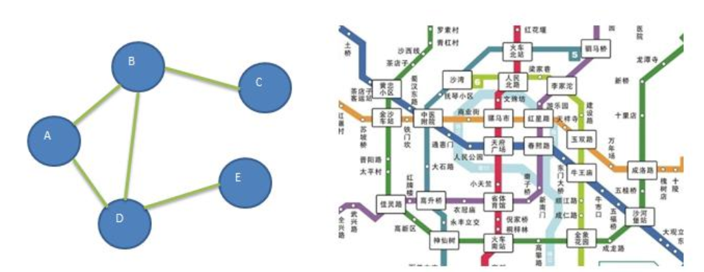
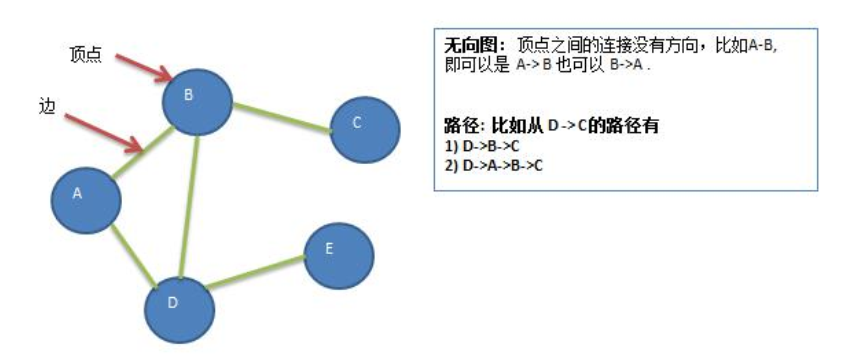
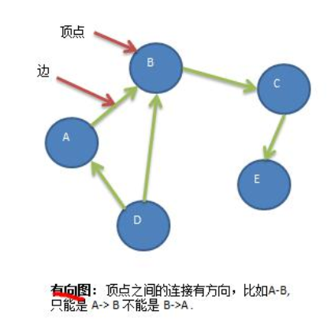
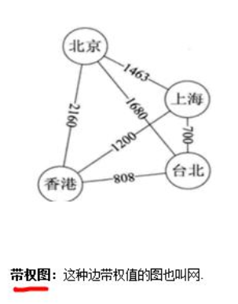
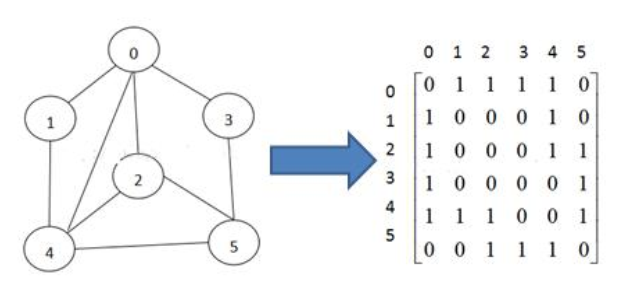
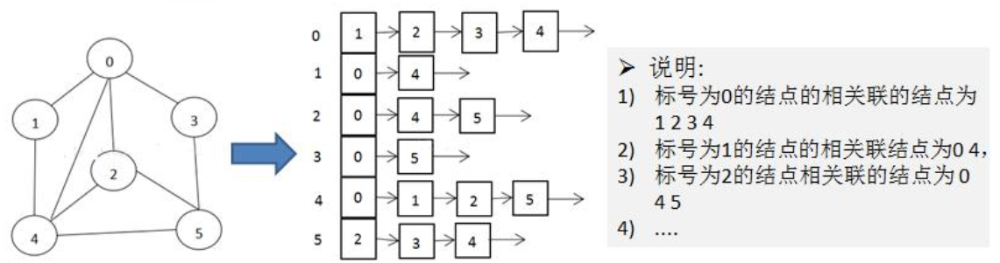
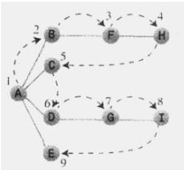

#   图的基本介绍与深度和广度优先遍历算法
+ date: 2020-05-07 10:39:28
+ description: 图的基本介绍与深度和广度优先遍历算法
+ categories:
  - 数据结构与算法
+ tags:
  - 数据结构与算法(Java实现)
---
#   图基本介绍
##  为什么要有图
+   前面我们学了线性表和树
+   线性表局限于一个直接前驱和一个直接后继的关系
+   树也只能有一个直接前驱也就是父节点
+   当我们需要表示多对多的关系时，这里我们就用到了图

##  图的举例说明
图是一种数据结构，其中结点可以具有零个或多个相邻元素。两个结点之间的连接称为边。结点也可以称为顶点。如图


##  图的常用概念
+   顶点(vertex)
+   边(edge)
+   路径
+   无向图

+   有向图

+   带权图


#   图的表示方式
图的表示方式有两种
+   二维数组表示（邻接矩阵）；
+   链表表示（邻接表）。

##  邻接矩阵
邻接矩阵是表示图形中顶点之间相邻关系的矩阵， 对于 n 个顶点的图而言， 矩阵是的 row 和 col 表示的是 1....n个点


##  邻接表
+   邻接矩阵需要为每个顶点都分配 n 个边的空间， 其实有很多边都是不存在,会造成空间的一定损失.
+   邻接表的实现只关心存在的边， 不关心不存在的边。 因此没有空间浪费， 邻接表由数组+链表组成
+   举例说明


#   图的代码实现
##  创建图
```JAVA
package com.zjinc36.graph;

import java.util.ArrayList;
import java.util.Arrays;

public class Graph {
    private ArrayList<String> vertexList;   // 存储顶点集合
    private int[][] edges;  // 存储图对应的邻接矩阵
    private int numOfEdges; // 表示边的数目
    
    public static void main(String[] args) {
        /////////////////////////
        // 创建图
        /////////////////////////
        int n = 5;  // 顶点个数
        String Vertexs[] = {"A", "B", "C", "D", "E"};
        // 创建图对象
        Graph graph = new Graph(n);
        // 循环添加顶点
        for (String vertex : Vertexs) {
            graph.insertVertex(vertex);
        }
        
        // 添加边
        graph.insertEdge(0, 1, 1);
        graph.insertEdge(0, 2, 1);
        graph.insertEdge(1, 2, 1);
        graph.insertEdge(1, 3, 1);
        graph.insertEdge(1, 4, 1);
        
        // 显示邻接矩阵
        graph.showGraph();
    }

    // 构造器
    public Graph(int n) {
        // 初始化矩阵和vertexList
        edges = new int[n][n];
        vertexList = new ArrayList<String>(n);
        numOfEdges = 0;
    }

/////////////////////////////
//创建图
/////////////////////////////
    /**
     * 插入顶点
     * 
     * @param vertex 顶点
     */
    public void insertVertex(String vertex) {
        vertexList.add(vertex);
    }

    /**
     * 添加边
     * 
     * @param v1     表示第一个顶点的下标
     * @param v2     表示第二个顶点的下标
     * @param weight 权重
     */
    public void insertEdge(int v1, int v2, int weight) {
        // 因为是无向图,所以两个方向都要添加
        edges[v1][v2] = weight;
        edges[v2][v1] = weight;
        numOfEdges++;
    }
    
/////////////////////////////
// 图中常用方法
/////////////////////////////
    /**
     * 得到结点的个数
     * 
     * @return
     */
    public int getNumOfVertex() {
        return vertexList.size();
    }

    /**
     * 得到边的数目
     * 
     * @return
     */
    public int getNumOfEdges() {
        return numOfEdges;
    }

    /**
     * 返回下标为i对应的数据 0->"A" 1->"B" 2->"C"
     * 
     * @param i 下标
     * @return
     */
    public String getValueByIndex(int i) {
        return vertexList.get(i);
    }

    /**
     * 返回v1和v2的权值
     * 
     * @param v1
     * @param v2
     * @return
     */
    public int getWeight(int v1, int v2) {
        return edges[v1][v2];
    }

    /**
     * 显示图对应的矩阵
     */
    public void showGraph() {
        for (int[] link : edges) {
            System.out.println(Arrays.toString(link));
        }
    }
}
```

##  深度优先搜索(DFS)
###     规则
深度优先搜索算法有如下规则：
>   规则1：如果可能，访问一个邻接的未访问顶点，标记它，并将它放入栈中。
>   规则2：当不能执行规则 1 时，如果栈不为空，就从栈中弹出一个顶点。
>   规则3：如果不能执行规则 1 和规则 2 时，就完成了整个搜索过程。



　　对于上图，应用深度优先搜索如下：假设选取 A 顶点为起始点，并且按照字母优先顺序进行访问，那么应用规则 1 ，接下来访问顶点 B，然后标记它，并将它放入栈中；再次应用规则 1，接下来访问顶点 F，再次应用规则 1，访问顶点 H。我们这时候发现，没有 H 顶点的邻接点了，这时候应用规则 2，从栈中弹出 H，这时候回到了顶点 F，但是我们发现 F 也除了 H 也没有与之邻接且未访问的顶点了，那么再弹出 F，这时候回到顶点 B，同理规则 1 应用不了，应用规则 2，弹出 B，这时候栈中只有顶点 A了，然后 A 还有未访问的邻接点，所有接下来访问顶点 C，但是 C又是这条线的终点，所以从栈中弹出它，再次回到 A，接着访问 D,G,I，最后也回到了 A，然后访问 E，但是最后又回到了顶点 A，这时候我们发现 A没有未访问的邻接点了，所以也把它弹出栈。现在栈中已无顶点，于是应用规则 3，完成了整个搜索过程。
　　深度优先搜索在于能够找到与某一顶点邻接且没有访问过的顶点。这里以邻接矩阵为例，找到顶点所在的行，从第一列开始向后寻找值为1的列；列号是邻接顶点的号码，检查这个顶点是否未访问过，如果是这样，那么这就是要访问的下一个顶点，如果该行没有顶点既等于1（邻接）且又是未访问的，那么与指定点相邻接的顶点就全部访问过了。

###     代码实现
```JAVA
package com.zjinc36.graph;

import java.util.ArrayList;
import java.util.Arrays;

public class Graph {
    private ArrayList<String> vertexList;   // 存储顶点集合
    private int[][] edges;  // 存储图对应的邻接矩阵
    private int numOfEdges; // 表示边的数目
    
    private boolean[] isVisited;    // 保存已经访问过的结点
    
    /**
     * 测试
     */
    public static void main(String[] args) {
        /////////////////////////
        // 创建图
        /////////////////////////
        int n = 5;  // 顶点个数
        String Vertexs[] = {"A", "B", "C", "D", "E"};
        // 创建图对象
        Graph graph = new Graph(n);
        // 循环添加顶点
        for (String vertex : Vertexs) {
            graph.insertVertex(vertex);
        }
        
        // 添加边
        graph.insertEdge(0, 1, 1);
        graph.insertEdge(0, 2, 1);
        graph.insertEdge(1, 2, 1);
        graph.insertEdge(1, 3, 1);
        graph.insertEdge(1, 4, 1);
        
        // 显示邻接矩阵
        graph.showGraph();
        
        /////////////////////////
        // 深度遍历
        /////////////////////////
        System.out.println("深度遍历");
        graph.dfs();
    }

    // 构造器
    public Graph(int n) {
        // 初始化矩阵和vertexList
        edges = new int[n][n];
        vertexList = new ArrayList<String>(n);
        numOfEdges = 0;
        
        isVisited = new boolean[n];
    }
/////////////////////////////
//深度优先遍历
/////////////////////////////
    /**
     * 得到第一个邻接结点的下标
     * 
     * @param index 邻接矩阵的行的下标
     * @return 如果存在就返回对应的下标，否则返回-1
     */
    public int getFirstNeighbor(int index) {
        for (int j = 0; j < vertexList.size(); j++) {
            if (edges[index][j] > 0) {
                return j;
            }
        }
        return -1;
    }

    /**
     * 根据前一个邻接结点的下标来获取下一个邻接结点
     * 
     * @param v1 邻接矩阵的行的下标
     * @param v2 邻接矩阵的列(上一个被访问的矩阵的列的下标)
     * @return
     */
    public int getNextNeighbor(int v1, int v2) {
        for (int j = v2 + 1; j < vertexList.size(); j++) {
            if (edges[v1][j] > 0) {
                return j;
            }
        }
        return -1;
    }
    
    /**
     * 深度优先遍历算法
     * ==> 规则1：如果可能，访问一个邻接的未访问顶点，标记它，并将它放入栈中。
     * ==> 规则2：当不能执行规则 1 时，如果栈不为空，就从栈中弹出一个顶点。
     * ==> 规则3：如果不能执行规则 1 和规则 2 时，就完成了整个搜索过程。
     * @param isVisited 是否访问过
     * @param i 邻接矩阵的行的下标
     */
    public void dfs(boolean[] isVisited, int i) {
        // 0. 访问顶点
        // ==> 首先我们访问该结点 => 这里表现为输出
        System.out.print(getValueByIndex(i) + "->");
        // ==> 将结点设置为已经访问
        isVisited[i] = true;
        // 1. 访问一个邻接的未访问顶点，标记它，并将它放入栈中
        // ==> 查找结点i的第一个邻接结点w
        int firstNeighbor = getFirstNeighbor(i);
        while (firstNeighbor != -1) {   // 不等于-1,说明找到邻接结点
            // ==> 判断这个邻接结点是否访问过
            if (!isVisited[firstNeighbor]) {    
                // ==> 如果没有访问过,则以当前这个邻接结点开始,继续寻找下一个邻接结点
                // ==> 也就是进行深度优先遍历
                dfs(isVisited, firstNeighbor);
            }
            // ==> 如果firstNeighbor结点已经被访问过
            // ==> 访问下一个邻接的未访问顶点
            firstNeighbor = getNextNeighbor(i, firstNeighbor);
        }
    }
    
    // 对dfs进行一个重载,遍历我们所有的结点,并进行dfs
    public void dfs() {
        // 遍历所有的结点,进行dfs[回溯]
        for (int i = 0; i < getNumOfVertex(); i++) {
            // 只有未被访问过才需要进行深度优先遍历
            if (!isVisited[i]) {
                dfs(isVisited, i);
            }
        }
    }

/////////////////////////////
//创建图
/////////////////////////////
    /**
     * 插入顶点
     * 
     * @param vertex 顶点
     */
    public void insertVertex(String vertex) {
        vertexList.add(vertex);
    }

    /**
     * 添加边
     * 
     * @param v1     表示第一个顶点的下标
     * @param v2     表示第二个顶点的下标
     * @param weight 权重
     */
    public void insertEdge(int v1, int v2, int weight) {
        // 因为是无向图,所以两个方向都要添加
        edges[v1][v2] = weight;
        edges[v2][v1] = weight;
        numOfEdges++;
    }
    
/////////////////////////////
// 图中常用方法
/////////////////////////////
    /**
     * 得到结点的个数
     * 
     * @return
     */
    public int getNumOfVertex() {
        return vertexList.size();
    }

    /**
     * 得到边的数目
     * 
     * @return
     */
    public int getNumOfEdges() {
        return numOfEdges;
    }

    /**
     * 返回下标为i对应的数据 0->"A" 1->"B" 2->"C"
     * 
     * @param i 下标
     * @return
     */
    public String getValueByIndex(int i) {
        return vertexList.get(i);
    }

    /**
     * 返回v1和v2的权值
     * 
     * @param v1
     * @param v2
     * @return
     */
    public int getWeight(int v1, int v2) {
        return edges[v1][v2];
    }

    /**
     * 显示图对应的矩阵
     */
    public void showGraph() {
        for (int[] link : edges) {
            System.out.println(Arrays.toString(link));
        }
    }
}
```


##  广度优先搜索(BFS)
　　深度优先搜索要尽可能的远离起始点，而广度优先搜索则要尽可能的靠近起始点，它首先访问起始顶点的所有邻接点，然后再访问较远的区域，这种搜索不能用栈实现，而是用队列实现。

###     规则
>   规则1：访问下一个未访问的邻接点（如果存在），这个顶点必须是当前顶点的邻接点，标记它，并把它插入到队列中。
>   规则2：如果已经没有未访问的邻接点而不能执行规则 1 时，那么从队列列头取出一个顶点（如果存在），并使其成为当前顶点。
>   规则3：如果因为队列为空而不能执行规则 2，则搜索结束。


　　对于上面的图，应用广度优先搜索：以A为起始点，首先访问所有与 A 相邻的顶点，并在访问的同时将其插入队列中，现在已经访问了 A,B,C,D和E。这时队列（从头到尾）包含 BCDE，已经没有未访问的且与顶点 A 邻接的顶点了，所以从队列中取出B，寻找与B邻接的顶点，这时找到F，所以把F插入到队列中。已经没有未访问且与B邻接的顶点了，所以从队列列头取出C，它没有未访问的邻接点。因此取出 D 并访问 G，D也没有未访问的邻接点了，所以取出E，现在队列中有 FG，在取出 F，访问 H，然后取出 G，访问 I，现在队列中有 HI，当取出他们时，发现没有其它为访问的顶点了，这时队列为空，搜索结束。
###     代码实现
```JAVA
package com.zjinc36.graph;

import java.util.ArrayList;
import java.util.Arrays;
import java.util.LinkedList;

public class Graph {
    private ArrayList<String> vertexList;   // 存储顶点集合
    private int[][] edges;  // 存储图对应的邻接矩阵
    private int numOfEdges; // 表示边的数目
    
    private boolean[] isVisited;    // 保存已经访问过的结点
    
    /**
     * 测试
     */
    public static void main(String[] args) {
        /////////////////////////
        // 创建图
        /////////////////////////
        int n = 5;  // 顶点个数
        String Vertexs[] = {"A", "B", "C", "D", "E"};
        // 创建图对象
        Graph graph = new Graph(n);
        // 循环添加顶点
        for (String vertex : Vertexs) {
            graph.insertVertex(vertex);
        }
        
        // 添加边
        graph.insertEdge(0, 1, 1);
        graph.insertEdge(0, 2, 1);
        graph.insertEdge(1, 2, 1);
        graph.insertEdge(1, 3, 1);
        graph.insertEdge(1, 4, 1);
        
        // 显示邻接矩阵
        graph.showGraph();

        /////////////////////////
        // 广度优先遍历
        /////////////////////////
        System.out.println();
        System.out.println("广度优先遍历");
        graph.bfs();
    }

    // 构造器
    public Graph(int n) {
        // 初始化矩阵和vertexList
        edges = new int[n][n];
        vertexList = new ArrayList<String>(n);
        numOfEdges = 0;
        
        isVisited = new boolean[n];
    }
/////////////////////////////
//广度优先遍历
/////////////////////////////
    private void bfs(boolean[] isVisited, int i) {
        int u; // 表示队列的头结点对应下标
        int w; // 邻接结点 w
        // 队列， 记录结点访问的顺序
        LinkedList queue = new LinkedList();
        // 访问结点， 输出结点信息
        System.out.print(getValueByIndex(i) + "=>");
        // 标记为已访问
        isVisited[i] = true;
        // 将结点加入队列
        queue.addLast(i);
        while (!queue.isEmpty()) {
            // 取出队列的头结点下标
            u = (Integer) queue.removeFirst();
            // 得到第一个邻接结点的下标 w
            w = getFirstNeighbor(u);
            while (w != -1) {// 找到
                // 是否访问过
                if (!isVisited[w]) {
                    System.out.print(getValueByIndex(w) + "=>");
                    // 标记已经访问
                    isVisited[w] = true;
                    // 入队
                    queue.addLast(w);
                }
                // 以 u 为前驱点， 找 w 后面的下一个邻结点
                w = getNextNeighbor(u, w); // 体现出我们的广度优先
            }
        }
    }

    /**
     * 遍历所有结点,都进行广度优先搜索
     */
    public void bfs() {
        for (int i = 0; i < getNumOfVertex(); i++) {
            if (!isVisited[i]) {
                bfs(isVisited, i);
            }
        }
    }

/////////////////////////////
//创建图
/////////////////////////////
    /**
     * 插入顶点
     * 
     * @param vertex 顶点
     */
    public void insertVertex(String vertex) {
        vertexList.add(vertex);
    }

    /**
     * 添加边
     * 
     * @param v1     表示第一个顶点的下标
     * @param v2     表示第二个顶点的下标
     * @param weight 权重
     */
    public void insertEdge(int v1, int v2, int weight) {
        // 因为是无向图,所以两个方向都要添加
        edges[v1][v2] = weight;
        edges[v2][v1] = weight;
        numOfEdges++;
    }
    
/////////////////////////////
// 图中常用方法
/////////////////////////////
    /**
     * 得到结点的个数
     * 
     * @return
     */
    public int getNumOfVertex() {
        return vertexList.size();
    }

    /**
     * 得到边的数目
     * 
     * @return
     */
    public int getNumOfEdges() {
        return numOfEdges;
    }

    /**
     * 返回下标为i对应的数据 0->"A" 1->"B" 2->"C"
     * 
     * @param i 下标
     * @return
     */
    public String getValueByIndex(int i) {
        return vertexList.get(i);
    }

    /**
     * 返回v1和v2的权值
     * 
     * @param v1
     * @param v2
     * @return
     */
    public int getWeight(int v1, int v2) {
        return edges[v1][v2];
    }

    /**
     * 显示图对应的矩阵
     */
    public void showGraph() {
        for (int[] link : edges) {
            System.out.println(Arrays.toString(link));
        }
    }
}
```

#   参考
+   [算法|深度优先搜索（DFS）与广度优先搜索（BFS）的Java实现 ](https://www.cnblogs.com/jlutiger/p/10791979.html)
+   [Java实现图的深度和广度优先遍历算法](https://blog.csdn.net/u013761665/article/details/47319659)
