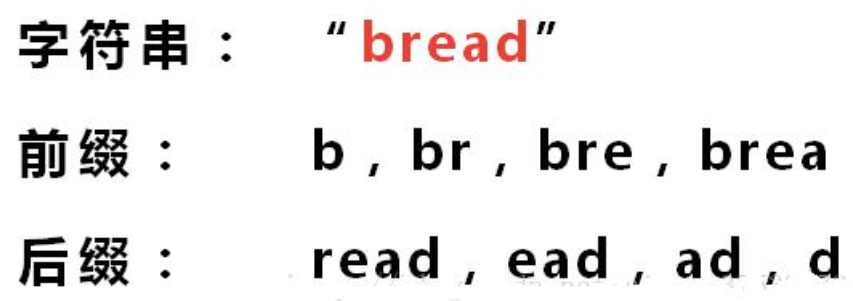

#   应用场景-字符串匹配问题
+   有一个字符串 str1= "BBC ABCDAB ABCDABCDABDE"，和一个子串 str2="ABCDABD"
+   现在要判断 str1 是否含有 str2,如果存在，就返回第一次出现的位置,如果没有，则返回-1

#   解决方式一:暴力匹配算法

##  思路
如果用暴力匹配的思路，并假设现在 str1 匹配到 i 位置，子串 str2 匹配到 j 位置，则有
+   如果当前字符匹配成功（即 str1[i] == str2[j]），则 i++， j++，继续匹配下一个字符
+   如果匹配失败（即 str1[i]! = str2[j]） ， 令 i = i - (j - 1)， j = 0。 相当于每次匹配失败时， i 回溯， j 被置为 0。

##  有什么问题
+   用暴力方法解决的话就会有大量的回溯， 每次只移动一位， 若是不匹配， 移动到下一位接着判断， 浪费了大量的时间。 (不可行!)

##  代码实现
```JAVA
package com.zjc.algorithm.kmp;

public class ViolenceMatch {
    public static void main(String[] args) {
        // 测试暴力匹配算法
        String str1 = "BBC ABCDAB ABCDABCDABDE";
        String str2 = "ABCDABD";
        int index = violenceMatch(str1, str2);
        System.out.println("index=" + index);
    }

    // 暴力匹配算法实现
    public static int violenceMatch(String str1, String str2) {
        char[] s1 = str1.toCharArray();
        char[] s2 = str2.toCharArray();
        int s1Len = s1.length;
        int s2Len = s2.length;
        int i = 0; // i 索引指向 s1
        int j = 0; // j 索引指向 s2
        while (i < s1Len && j < s2Len) {// 保证匹配时， 不越界
            if (s1[i] == s2[j]) {// 匹配 ok
                i++;
                j++;
            } else { // 没有匹配成功
                // 如果失配（即 str1[i]! = str2[j]） ， 令 i = i - (j - 1)， j = 0。
                i = i - (j - 1);
                j = 0;
            }
        }
        // 判断是否匹配成功
        if (j == s2Len) {
            return i - j;
        } else {
            return -1;
        }
    }
}
```

#   KMP 算法介绍
1.  KMP 是一个解决模式串在文本串是否出现过， 如果出现过， 最早出现的位置的经典算法
2.  Knuth-Morris-Pratt 字符串查找算法， 简称为 "KMP 算法"， 常用于在一个文本串 S 内查找一个模式串 P 的出现位置， 这个算法由 Donald Knuth、 Vaughan Pratt、 James H. Morris 三人于 1977 年联合发表， 故取这 3 人的姓氏命名此算法.
3.  KMP 方法算法就利用之前判断过信息， 通过一个 next 数组， 保存模式串中前后最长公共子序列的长度， 每次回溯时， 通过 next 数组找到， 前面匹配过的位置，省去了大量的计算时间
4.  参考资料： https://www.cnblogs.com/ZuoAndFutureGirl/p/9028287.html

##  字符串匹配问题
+   有一个字符串 str1= "BBC ABCDAB ABCDABCDABDE"， 和一个子串 str2="ABCDABD"
+   现在要判断 str1 是否含有 str2, 如果存在， 就返回第一次出现的位置, 如果没有， 则返回-1
+   要求： 使用 KMP 算法完成判断， 不能使用简单的暴力匹配算法.

##  思路分析图解
举例来说， 有一个字符串 Str1 = "BBC ABCDAB ABCDABCDABDE"， 判断， 里面是否包含另一个字符串 Str2 ="ABCDABD"？

1. 首先， 用 Str1 的第一个字符和 Str2 的第一个字符去比较， 不符合， 关键词向后移动一位

2. 重复第一步， 还是不符合， 再后移

3. 一直重复， 直到 Str1 有一个字符与 Str2 的第一个字符符合为止

4. 接着比较字符串和搜索词的下一个字符， 还是符合

5. 遇到 Str1 有一个字符与 Str2 对应的字符不符合。

6. 这时候， 想到的是继续遍历 Str1 的下一个字符， 重复第 1 步。 (其实是很不明智的， 因为此时 BCD 已经比较过了，没有必要再做重复的工作，一个基本事实是，当空格与 D 不匹配时， 你其实知道前面六个字符是"ABCDAB"。KMP 算法的想法是，设法利用这个已知信息， 不要把"搜索位置"移回已经比较过的位置，继续把它向后移， 这样就提高了效率。)

7. 怎么做到把刚刚重复的步骤省略掉？ 可以对 Str2 计算出一张《部分匹配表》，这张表的产生在后面介绍

8. 已知空格与 D 不匹配时， 前面六个字符"ABCDAB"是匹配的。 查表可知， 最后一个匹配字符 B 对应的"部分匹配值"为2，因此按照下面的公式算出向后移动的位数：移动位数 = 已匹配的字符数 - 对应的部分匹配值因为 6 - 2 等于 4， 所以将搜索词向后移动 4 位
9. 因为空格与Ｃ 不匹配， 搜索词还要继续往后移。这时，已匹配的字符数为 2（"AB"），对应的"部分匹配值"为 0。所以，移动位数 = 2 - 0，结果为2，于是将搜索词向后移 2 位

10. 因为空格与 A 不匹配， 继续后移一位。

11. 逐位比较， 直到发现 C 与 D 不匹配。 于是， 移动位数 = 6 - 2， 继续将搜索词向后移动 4 位

12. 逐位比较， 直到搜索词的最后一位， 发现完全匹配， 于是搜索完成。 如果还要继续搜索（即找出全部匹配），移动位数 = 7 - 0， 再将搜索词向后移动 7 位，这里就不再重复了

13. 介绍《部分匹配表》 怎么产生的先介绍前缀， 后缀是什么

```
"部分匹配值"就是"前缀"和"后缀"的最长的共有元素的长度。 以"ABCDABD"为例，
==> "A"的前缀和后缀都为空集， 共有元素的长度为 0；
==> "AB"的前缀为[A]， 后缀为[B]， 共有元素的长度为 0；
==> "ABC"的前缀为[A, AB]， 后缀为[BC, C]， 共有元素的长度 0；
==> "ABCD"的前缀为[A, AB, ABC]， 后缀为[BCD, CD, D]， 共有元素的长度为 0；
==> "ABCDA"的前缀为[A, AB, ABC, ABCD]， 后缀为[BCDA, CDA, DA, A]， 共有元素为"A"， 长度为 1；
==> "ABCDAB"的前缀为[A, AB, ABC, ABCD, ABCDA]， 后缀为[BCDAB, CDAB, DAB, AB, B]， 共有元素为"AB"，长度为 2；
==> "ABCDABD"的前缀为[A, AB, ABC, ABCD, ABCDA, ABCDAB]， 后缀为[BCDABD, CDABD, DABD, ABD, BD,D]， 共有元素的长度为 0。
```

14. "部分匹配"的实质是， 有时候，字符串头部和尾部会有重复。比如，"ABCDAB"之中有两个"AB"，那么它的"部分匹配值"就是 2（"AB"的长度）。搜索词移动的时候，第一个"AB"向后移动 4 位（字符串长度-部分匹配值） ， 就可以来到第二个"AB"的位置。

到此 KMP 算法思想分析完毕!

##  代码实现
```JAVA
package com.zjc.algorithm.kmp;

import java.util.Arrays;

public class KMPAlgorithm {
    public static void main(String[] args) {
        String str1 = "BBC ABCDAB ABCDABCDABDE";
        String str2 = "ABCDABD";
        // String str2 = "BBC";
        int[] next = kmpNext("ABCDABD"); // [0, 1, 2, 0]
        System.out.println("next=" + Arrays.toString(next));
        int index = kmpSearch(str1, str2, next);
        System.out.println("index=" + index); // 15 了
    }

    /**
     * kmp 搜索算法
     * 
     * @param str1 源字符串
     * @param str2 子串
     * @param next 部分匹配表, 是子串对应的部分匹配表
     * @return 如果是-1 就是没有匹配到， 否则返回第一个匹配的位置
     */
    public static int kmpSearch(String str1, String str2, int[] next) {
        // 遍历
        for (int i = 0, j = 0; i < str1.length(); i++) {
            // 需要处理 str1.charAt(i) ！ = str2.charAt(j), 去调整 j 的大小
            // KMP 算法核心点, 可以验证...
            while (j > 0 && str1.charAt(i) != str2.charAt(j)) {
                j = next[j - 1];
            }
            if (str1.charAt(i) == str2.charAt(j)) {
                j++;
            }
            if (j == str2.length()) {// 找到了 // j = 3 i
                return i - j + 1;
            }
        }
        return -1;
    }

    /**
     * 获取到一个字符串(子串) 的部分匹配值表
     * 
     * @param dest 目标字符串
     * @return
     */
    public static int[] kmpNext(String dest) {
        // 创建一个 next 数组保存部分匹配值
        int[] next = new int[dest.length()];
        next[0] = 0; // 如果字符串是长度为 1 部分匹配值就是 0
        for (int i = 1, j = 0; i < dest.length(); i++) {
            // 当 dest.charAt(i) != dest.charAt(j) ， 我们需要从 next[j-1]获取新的 j
            // 直到我们发现 有 dest.charAt(i) == dest.charAt(j)成立才退出
            // 这是 kmp 算法的核心点
            while (j > 0 && dest.charAt(i) != dest.charAt(j)) {
                j = next[j - 1];
            }
            // 当 dest.charAt(i) == dest.charAt(j) 满足时， 部分匹配值就是+1
            if (dest.charAt(i) == dest.charAt(j)) {
                j++;
            }
            next[i] = j;
        }
        return next;
    }
}
```
