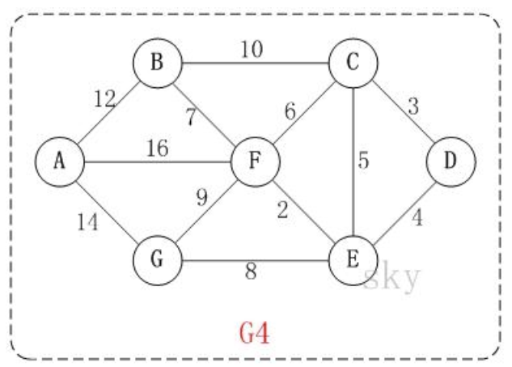
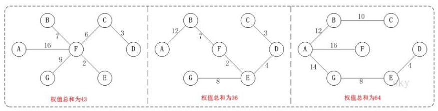
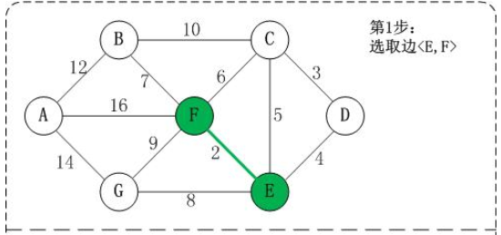
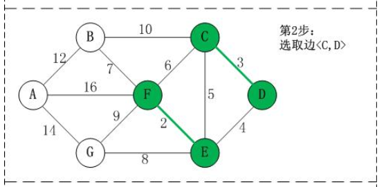
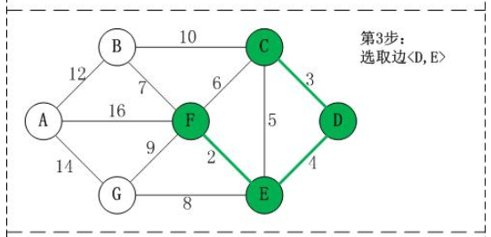
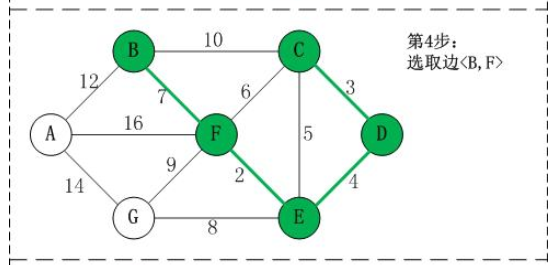
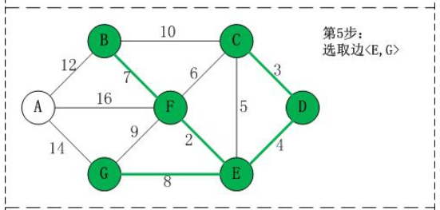
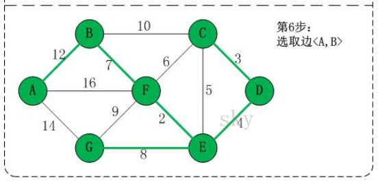
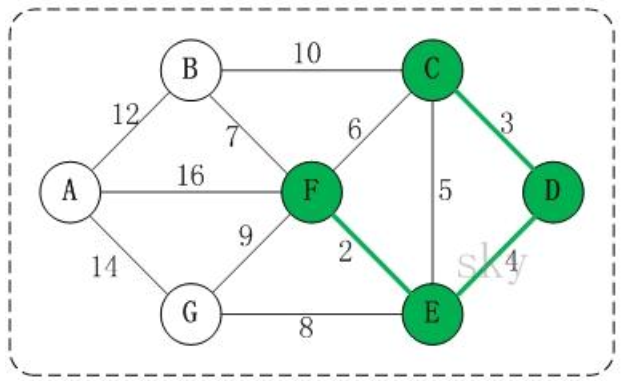
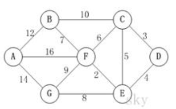

#   克鲁斯卡尔算法--公交站问题--最小生成树
+ date: 2020-05-08 16:22:14
+ description: 克鲁斯卡尔算法--公交站问题--最小生成树
+ categories:
  - 数据结构与算法
+ tags:
  - 数据结构与算法(Java实现)
---
#   最小生成树(Minimum Cost Spanning Tree)
简称MST。给定一个带权的无向连通图,如何选取一棵生成树,使树上所有边上权的总和为最小,这叫最小生成树
1.  N 个顶点， 一定有 N-1 条边
2.  包含全部顶点
3.  N-1 条边都在图中
4.  **求最小生成树的算法主要是普里姆算法和克鲁斯卡尔算法**
5.  举例说明(如图)



例如， 对于如上图 G4 所示的连通网可以有多棵权值总和不相同的生成树




#   克鲁斯卡尔算法介绍
##  基本说明
1.  克鲁斯卡尔(Kruskal)算法， 是用来求加权连通图的最小生成树的算法。
2.  基本思想： 按照权值从小到大的顺序选择 n-1 条边， 并保证这 n-1 条边不构成回路
3.  具体做法： 首先构造一个只含 n 个顶点的森林， 然后依权值从小到大从连通网中选择边加入到森林中， 并使森林中不产生回路， 直至森林变成一棵树为止

##  克鲁斯卡尔算法图解
在含有 n 个顶点的连通图中选择 n-1 条边， 构成一棵极小连通子图， 并使该连通子图中 n-1 条边上权值之和达到最小， 则称其为连通网的最小生成树。


例如， 对于如上图 G4 所示的连通网可以有多棵权值总和不相同的生成树


以上图 G4 为例， 来对克鲁斯卡尔进行演示(假设， 用数组 R 保存最小生成树结果)。



















##  克鲁斯卡尔算法文字描述
1.  将边<E,F>加入 R 中。边<E,F>的权值最小， 因此将它加入到最小生成树结果 R 中。
2.  将边<C,D>加入 R 中。上一步操作之后， 边<C,D>的权值最小， 因此将它加入到最小生成树结果 R 中。
3.  将边<D,E>加入 R 中。上一步操作之后， 边<D,E>的权值最小， 因此将它加入到最小生成树结果 R 中。
4.  将边<B,F>加入 R 中。上一步操作之后， 边<C,E>的权值最小， 但<C,E>会和已有的边构成回路； 因此， 跳过边<C,E>。 同理， 跳过边<C,F>。 将边<B,F>加入到最小生成树结果 R 中。
5.  将边<E,G>加入 R 中。上一步操作之后， 边<E,G>的权值最小， 因此将它加入到最小生成树结果 R 中。
6.  将边<A,B>加入 R 中。上一步操作之后， 边<F,G>的权值最小， 但<F,G>会和已有的边构成回路； 因此， 跳过边<F,G>。 同理， 跳过边<B,C>。 将边<A,B>加入到最小生成树结果 R 中。

此时， 最小生成树构造完成！ 它包括的边依次是： <E,F> <C,D> <D,E> <B,F> <E,G> <A,B>。

##  克鲁斯卡尔算法分析
根据前面介绍的克鲁斯卡尔算法的基本思想和做法， 我们能够了解到， 克鲁斯卡尔算法重点需要解决的以下两个问题：
+   问题一 对图的所有边按照权值大小进行排序。( ==> 很好解决， 采用排序算法进行排序即可)
+   问题二 将边添加到最小生成树中时， 怎么样判断是否形成了回路。( ==> 解决如下)

##  如何判断是否构成回路-举例说明(如图)



在将<E,F> <C,D> <D,E>加入到最小生成树 R 中之后， 这几条边的顶点就都有了终点：
```
(01) C 的终点是 F。
(02) D 的终点是 F。
(03) E 的终点是 F。
(04) F 的终点是 F。
```

关于终点的说明：

1.  就是将所有顶点按照从小到大的顺序排列好之后； 某个顶点的终点就是"与它连通的最大顶点"。
2.  因此， 接下来， 虽然<C,E>是权值最小的边。 但是 C 和 E 的终点都是 F， 即它们的终点相同， 因此， 将<C,E>加入最小生成树的话，会形成回路。这就是判断回路的方式。 也就是说， **我们加入的边的两个顶点不能都指向同一个终点， 否则将构成回路**。


#   应用场景-公交站问题
##  问题




1.  某城市新增 7 个站点(A, B, C, D, E, F, G) ， 现在需要修路把 7 个站点连通
2.  各个站点的距离用边线表示(权) ， 比如 A – B 距离 12 公里
3.  问： 如何修路保证各个站点都能连通， 并且总的修建公路总里程最短

##  代码实现
```JAVA
package com.zjc.algorithm.kruskal;

import java.util.Arrays;

public class KruskalCase {
    private int edgeNum; // 边的个数
    private char[] vertexs; // 顶点数组
    private int[][] matrix; // 邻接矩阵
    // 使用 INF 表示两个顶点不能连通
    private static final int INF = Integer.MAX_VALUE;

    public static void main(String[] args) {
        char[] vertexs = { 'A', 'B', 'C', 'D', 'E', 'F', 'G' };
        // 克鲁斯卡尔算法的邻接矩阵
        int matrix[][] = {
                /* A *//* B *//* C *//* D *//* E *//* F *//* G */
                /* A */ { 0, 12, INF, INF, INF, 16, 14 },
                /* B */ { 12, 0, 10, INF, INF, 7, INF },
                /* C */ { INF, 10, 0, 3, 5, 6, INF },
                /* D */ { INF, INF, 3, 0, 4, INF, INF },
                /* E */ { INF, INF, 5, 4, 0, 2, 8 },
                /* F */ { 16, 7, 6, INF, 2, 0, 9 },
                /* G */ { 14, INF, INF, INF, 8, 9, 0 } };
        // 大家可以在去测试其它的邻接矩阵， 结果都可以得到最小生成树.
        // 创建 KruskalCase 对象实例
        KruskalCase kruskalCase = new KruskalCase(vertexs, matrix);
        // 输出构建的
        kruskalCase.print();
        kruskalCase.kruskal();
    }

    // 构造器
    public KruskalCase(char[] vertexs, int[][] matrix) {
        // 初始化顶点数和边的个数
        int vlen = vertexs.length;
        // 初始化顶点, 复制拷贝的方式
        this.vertexs = new char[vlen];
        for (int i = 0; i < vertexs.length; i++) {
            this.vertexs[i] = vertexs[i];
        }
        // 初始化边, 使用的是复制拷贝的方式
        this.matrix = new int[vlen][vlen];
        for (int i = 0; i < vlen; i++) {
            for (int j = 0; j < vlen; j++) {
                this.matrix[i][j] = matrix[i][j];
            }
        }
        // 统计边的条数
        for (int i = 0; i < vlen; i++) {
            for (int j = i + 1; j < vlen; j++) {
                if (this.matrix[i][j] != INF) {
                    edgeNum++;
                }
            }
        }
    }

    public void kruskal() {
        int index = 0; // 表示最后结果数组的索引
        int[] ends = new int[edgeNum]; // 用于保存"已有最小生成树" 中的每个顶点在最小生成树中的终点
        // 创建结果数组, 保存最后的最小生成树
        EData[] rets = new EData[edgeNum];
        // 获取图中 所有的边的集合 ， 一共有 12 边
        EData[] edges = getEdges();
        System.out.println(
                "图的边的集合=" + Arrays.toString(edges) + " 共" + edges.length); // 12
        // 按照边的权值大小进行排序(从小到大)
        sortEdges(edges);
        // 遍历 edges 数组， 将边添加到最小生成树中时， 判断是准备加入的边否形成了回路， 如果没有， 就加入 rets,否则不能加入
        for (int i = 0; i < edgeNum; i++) {
            // 获取到第 i 条边的第一个顶点(起点)
            int p1 = getPosition(edges[i].start); // p1=4
            // 获取到第 i 条边的第 2 个顶点
            int p2 = getPosition(edges[i].end); // p2 = 5
            // 获取 p1 这个顶点在已有最小生成树中的终点
            int m = getEnd(ends, p1); // m = 4
            // 获取 p2 这个顶点在已有最小生成树中的终点
            int n = getEnd(ends, p2); // n = 5
            // 是否构成回路
            if (m != n) { // 没有构成回路
                ends[m] = n; // 设置 m 在"已有最小生成树"中的终点 <E,F>
                                // [0,0,0,0,5,0,0,0,0,0,0,0]
                rets[index++] = edges[i]; // 有一条边加入到 rets 数组
            }
        }
        // <E,F> <C,D> <D,E> <B,F> <E,G> <A,B>。
        // 统计并打印 "最小生成树", 输出 rets
        System.out.println("最小生成树为");
        for (int i = 0; i < index; i++) {
            System.out.println(rets[i]);
        }
    }

    // 打印邻接矩阵
    public void print() {
        System.out.println("邻接矩阵为: \n");
        for (int i = 0; i < vertexs.length; i++) {
            for (int j = 0; j < vertexs.length; j++) {
                System.out.printf("%12d", matrix[i][j]);
            }
            System.out.println();// 换行
        }
    }
    /*
     *
     * 功能： 对边进行排序处理, 冒泡排序
     * 
     * @param edges 边的集合
     */

    private void sortEdges(EData[] edges) {
        for (int i = 0; i < edges.length - 1; i++) {
            for (int j = 0; j < edges.length - 1 - i; j++) {
                if (edges[j].weight > edges[j + 1].weight) {// 交换
                    EData tmp = edges[j];
                    edges[j] = edges[j + 1];
                    edges[j + 1] = tmp;
                }
            }
        }
    }
    /*
     *
     * *
     * 
     * @param ch 顶点的值， 比如'A','B'
     * 
     * @return 返回 ch 顶点对应的下标， 如果找不到， 返回-1
     */

    private int getPosition(char ch) {
        for (int i = 0; i < vertexs.length; i++) {
            if (vertexs[i] == ch) {// 找到
                return i;
            }
        }
        // 找不到,返回-1
        return -1;
    }
    /*
     *
     * 功能: 获取图中边， 放到 EData[] 数组中， 后面我们需要遍历该数组 是通过 matrix 邻接矩阵来获取 EData[] 形式
     * [['A','B', 12], ['B','F',7], .....]
     * 
     * @return
     */

    private EData[] getEdges() {
        int index = 0;
        EData[] edges = new EData[edgeNum];
        for (int i = 0; i < vertexs.length; i++) {
            for (int j = i + 1; j < vertexs.length; j++) {
                if (matrix[i][j] != INF) {
                    edges[index++] = new EData(vertexs[i], vertexs[j],
                            matrix[i][j]);
                }
            }
        }
        return edges;
    }

    /*
     *
     * 功能: 获取下标为 i 的顶点的终点(), 用于后面判断两个顶点的终点是否相同
     * 
     * @param ends ： 数组就是记录了各个顶点对应的终点是哪个,ends 数组是在遍历过程中， 逐步形成
     * 
     * @param i : 表示传入的顶点对应的下标
     * 
     * @return 返回的就是 下标为 i 的这个顶点对应的终点的下标, 一会回头还有来理解
     */
    private int getEnd(int[] ends, int i) { // i = 4 [0,0,0,0,5,0,0,0,0,0,0,0]
        while (ends[i] != 0) {
            i = ends[i];
        }
        return i;
    }
}

//创建一个类 EData ， 它的对象实例就表示一条边
class EData {
    char start; // 边的一个点
    char end; // 边的另外一个点
    int weight; // 边的权值
    // 构造器

    public EData(char start, char end, int weight) {
        this.start = start;
        this.end = end;
        this.weight = weight;
    }

    // 重写 toString, 便于输出边信息
    @Override
    public String toString() {
        return "EData [<" + start + ", " + end + ">= " + weight + "]";
    }
}
```


