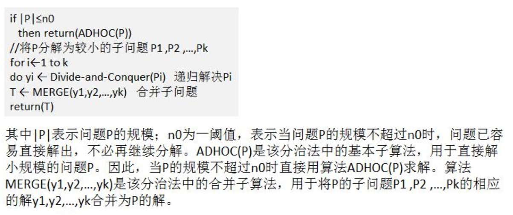

#   分治算法--汉诺塔问题
+ date: 2020-05-08 14:04:39
+ description: 分治算法--汉诺塔问题
+ categories:
  - 数据结构与算法
+ tags:
  - 数据结构与算法(Java实现)
---
#   分治算法介绍
1.  分治法是一种很重要的算法。 字面上的解释是“分而治之” ， 就是把一个复杂的问题分成两个或更多的相同或相似的子问题，再把子问题分成更小的子问题……直到最后子问题可以简单的直接求解， 原问题的解即子问题的解的合并。这个技巧是很多高效算法的基础， 如排序算法(快速排序， 归并排序)， 傅立叶变换(快速傅立叶变换)……

2.  分治算法可以求解的一些经典问题
+   二分搜索
+   大整数乘法
+   棋盘覆盖
+   合并排序
+   快速排序
+   线性时间选择
+   最接近点对问题
+   循环赛日程表
+   汉诺塔

#   分治算法的基本步骤
分治法在每一层递归上都有三个步骤：
1) 分解： 将原问题分解为若干个规模较小， 相互独立， 与原问题形式相同的子问题
2) 解决： 若子问题规模较小而容易被解决则直接解， 否则递归地解各个子问题
3) 合并： 将各个子问题的解合并为原问题的解。

#   分治(Divide-and-Conquer(P))算法设计模式


#   分治算法最佳实践-汉诺塔
##  汉诺塔的传说
汉诺塔： 汉诺塔（又称河内塔） 问题是源于印度一个古老传说的益智玩具。 大梵天创造世界的时候做了三根金刚石柱子， 在一根柱子上从下往上按照大小顺序摞着 64 片黄金圆盘。 大梵天命令婆罗门把圆盘从下面开始按大小顺序重新摆放在另一根柱子上。 并且规定， 在小圆盘上不能放大圆盘，三根柱子之间一次只能移动一个圆盘。假如每秒钟一次， 共需多长时间呢？ 移完这些金片需要 5845.54 亿年以上，太阳系的预期寿命据说也就是数百亿年。 真的过了 5845.54 亿年， 地球上的一切生命， 连同梵塔、 庙宇等， 都早已经灰飞烟灭。

##  汉诺塔游戏的演示和思路分析
1.  如果是有一个盘， A->C, 
2.  如果我们有 n >= 2 情况， 我们总是可以看做是两个盘 
    *   最下边的盘
    *   上面的盘
3.  先把最上面的盘 A->B
4.  把最下边的盘 A->C
4.  把 B 塔的所有盘 从 B->C

##  汉诺塔游戏的代码实现
```JAVA
package com.zjc.algorithm.dac;

public class Hanoitower {
    public static void main(String[] args) {
        hanoiTower(5, 'A', 'B', 'C');
    }

    /**
     * 汉诺塔的移动的方法
     * 使用分治算法
     * @param num 盘的数量
     * @param a a柱子
     * @param b b柱子
     * @param c c柱子
     */
    public static void hanoiTower(int num, char a, char b, char c) {
        //如果只有一个盘
        if (num == 1) {
            System.out.println("第 1 个盘从 " + a + "->" + c);
        } else {
            // 如果我们有 n >= 2 情况， 我们总是可以看做是两个盘 1.最下边的一个盘 2. 上面的所有盘
            // 1. 先把 最上面的所有盘 A->B， 移动过程会使用到 c
            hanoiTower(num - 1, a, c, b);
            // 2. 把最下边的盘 A->C
            System.out.println("第" + num + "个盘从 " + a + "->" + c);
            // 3. 把 B 塔的所有盘 从 B->C , 移动过程使用到 a 塔
            hanoiTower(num - 1, b, a, c);
        }
    }
}
```
