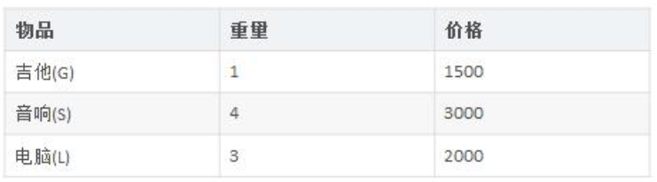
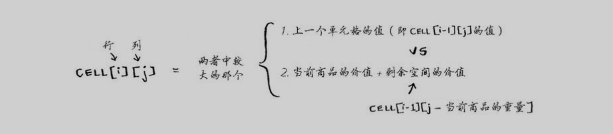
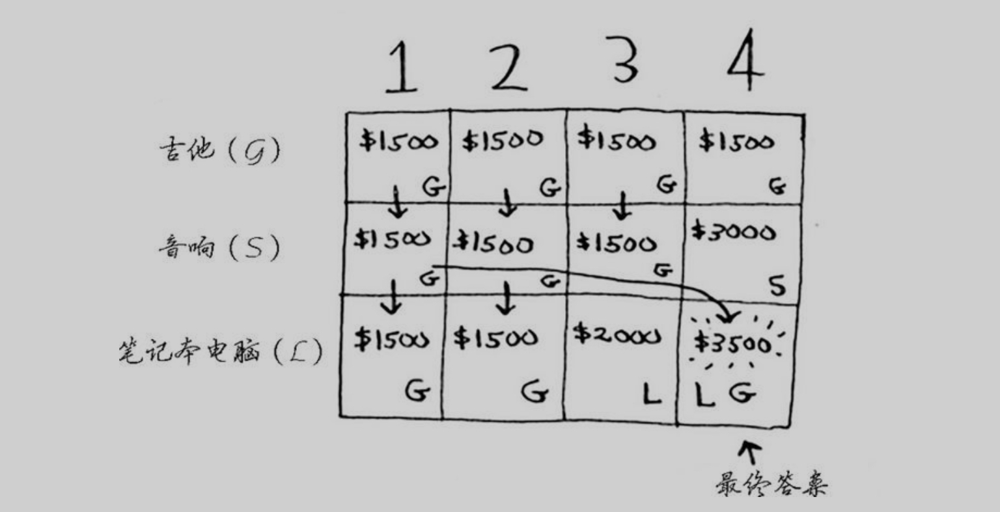
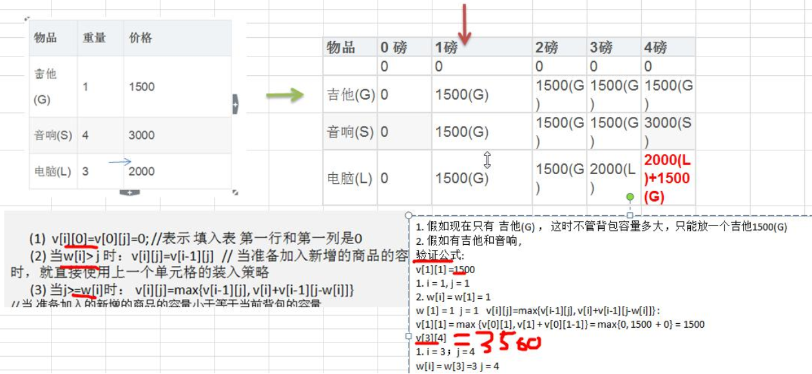

#   动态规划算法介绍
1.  动态规划(Dynamic Programming)算法的核心思想是： 将大问题划分为小问题进行解决， 从而一步步获取最优解的处理算法
2.  动态规划算法与分治算法类似， 其基本思想也是将待求解问题分解成若干个子问题， 先求解子问题， 然后从这些子问题的解得到原问题的解。
3.  与分治法不同的是， 适合于用动态规划求解的问题， 经分解得到子问题往往不是互相独立的。 ( 即下一个子阶段的求解是建立在上一个子阶段的解的基础上， 进行进一步的求解 )
4.  动态规划可以通过填表的方式来逐步推进， 得到最优解

#   背包问题
+   背包问题主要是指一个给定容量的背包、 若干具有一定价值和重量的物品，如何选择物品放入背包使物品的价值最大。其中又分 
    *   0-1背包
    *   完全背包(完全背包指的是： 每种物品都有无限件可用, 无限背包可以转化为 01 背包)

##  0-1背包问题
背包问题： 有一个背包， 容量为 4 磅 ， 现有如下物品


+   要求达到的目标为装入的背包的总价值最大， 并且重量不超出
+   要求装入的物品不能重复

##  0-1背包问题的解决
###     思路

算法的主要思想，利用动态规划来解决。每次遍历到的第 i 个物品，根据 w[i]和 v[i]来确定是否需要将该物品,即对于给定的 n 个物品， 设 v[i]、 w[i]分别为第 i 个物品的价值和重量， C 为背包的容量。 再令 v[i][j]表示在前 i 个物品中能够装入容量为 j 的背包中的最大价值。 则我们有下面的结果：
1.  `v[i][0]=v[0][j]=0;` //表示 填入表 第一行和第一列是 0
2.  当 `w[i]> j`时： `v[i][j]=v[i-1][j]`  ==> 当准备加入新增的商品的容量大于 当前背包的容量时， 就直接使用上一个单元格的装入策略
3.  当 `j>=w[i]`时： `v[i][j]=max{v[i-1][j], v[i]+v[i-1][j-w[i]]}` ==> 当准备加入的新增的商品的容量小于等于当前背包的容量
```
// 装入的方式:
v[i-1][j]： 就是上一个单元格的装入的最大值
v[i] : 表示当前商品的价值
v[i-1][j-w[i]] ： 装入 i-1 商品， 到剩余空间 j-w[i]的最大值
当 j>=w[i]时： v[i][j]=max{v[i-1][j], v[i]+v[i-1][j-w[i]]}
```

###     图解分析



##  代码实现
```JAVA
package com.zjc.algorithm.dynamic;

public class KnapsackProblem {
    public static void main(String[] args) {
        int[] w = { 1, 4, 3 };// 物品的重量
        int[] val = { 1500, 3000, 2000 }; // 物品的价值 这里 val[i] 就是前面讲的 v[i]
        int m = 4; // 背包的容量
        int n = val.length; // 物品的个数
        // 创建二维数组，
        // v[i][j] 表示在前 i 个物品中能够装入容量为 j 的背包中的最大价值
        int[][] v = new int[n + 1][m + 1];
        // 为了记录放入商品的情况， 我们定一个二维数组
        int[][] path = new int[n + 1][m + 1];
        // 初始化第一行和第一列, 这里在本程序中， 可以不去处理， 因为默认就是 0
        for (int i = 0; i < v.length; i++) {
            v[i][0] = 0; // 将第一列设置为 0
        }
        for (int i = 0; i < v[0].length; i++) {
            v[0][i] = 0; // 将第一行设置 0
        }
        // 根据前面得到公式来动态规划处理
        for (int i = 1; i < v.length; i++) { // 不处理第一行 i 是从 1 开始的
            for (int j = 1; j < v[0].length; j++) {// 不处理第一列, j 是从 1 开始的
                // 公式
                if (w[i - 1] > j) { // 因为我们程序 i 是从 1 开始的， 因此原来公式中的 w[i] 修改成
                                    // w[i-1]
                    v[i][j] = v[i - 1][j];
                } else {
                    // 说明:
                    // 因为我们的 i 从 1 开始的， 因此公式需要调整成
                    // v[i][j]=Math.max(v[i-1][j], val[i-1]+v[i-1][j-w[i-1]]);
                    // v[i][j] = Math.max(v[i - 1][j], val[i - 1] + v[i - 1][j -
                    // w[i - 1]]);
                    // 为了记录商品存放到背包的情况， 我们不能直接的使用上面的公式， 需要使用 if-else 来体现公式
                    if (v[i - 1][j] < val[i - 1] + v[i - 1][j - w[i - 1]]) {
                        v[i][j] = val[i - 1] + v[i - 1][j - w[i - 1]];
                        // 把当前的情况记录到 path
                        path[i][j] = 1;
                    } else {
                        v[i][j] = v[i - 1][j];
                    }
                }
            }
        }
        // 输出一下 v 看看目前的情况
        for (int i = 0; i < v.length; i++) {
            for (int j = 0; j < v[i].length; j++) {
                System.out.print(v[i][j] + " ");
            }
            System.out.println();
        }
        System.out.println("============================");
        // 输出最后我们是放入的哪些商品
        // 遍历 path, 这样输出会把所有的放入情况都得到, 其实我们只需要最后的放入
//      for (int i = 0; i < path.length; i++) {
//          for (int j = 0; j < path[i].length; j++) {
//              if (path[i][j] == 1) {
//                  System.out.printf("第%d 个商品放入到背包\n", i);
//              }
//          }
//      }
        // 动脑筋
        int i = path.length - 1; // 行的最大下标
        int j = path[0].length - 1; // 列的最大下标
        while (i > 0 && j > 0) { // 从 path 的最后开始找
            if (path[i][j] == 1) {
                System.out.printf("第%d 个商品放入到背包\n", i);
                j -= w[i - 1]; // w[i-1]
            }
            i--;
        }
    }
}
```
