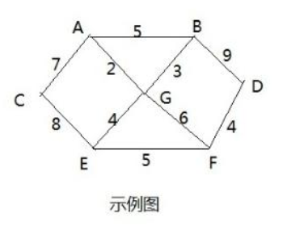
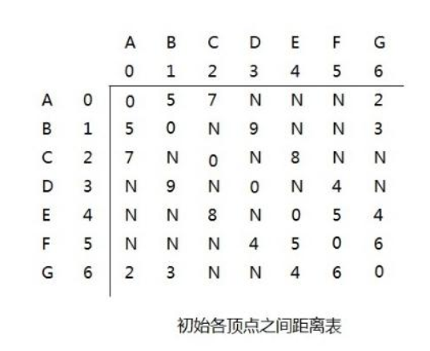
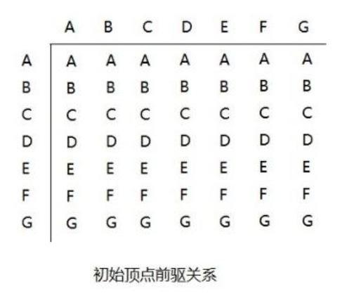
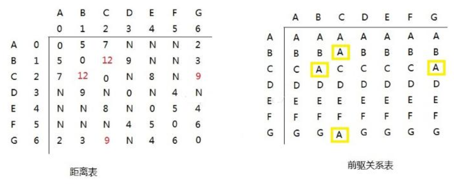
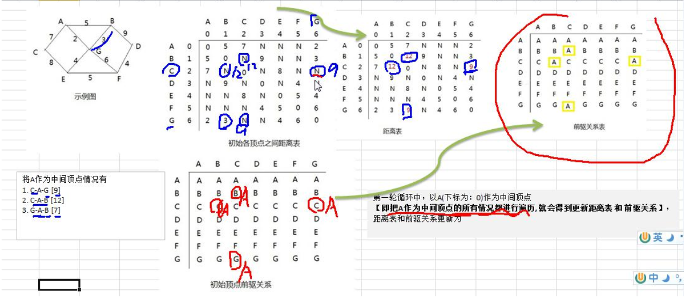
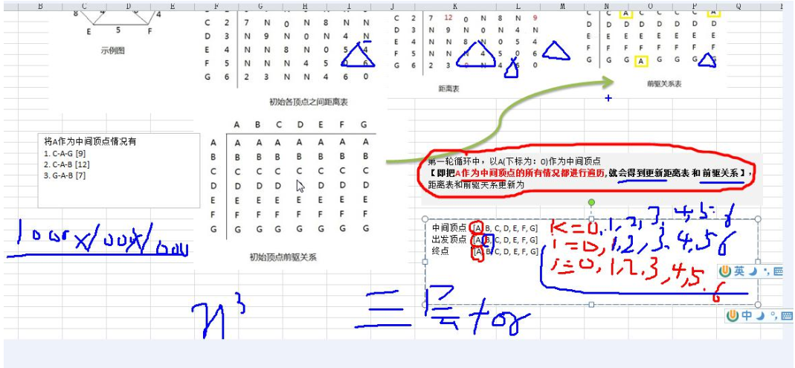

#   弗洛伊德算法Floyd--最短路径问题
+ date: 2020-05-09 12:27:31
+ description: 弗洛伊德算法Floyd--最短路径问题
+ categories:
  - 数据结构与算法
+ tags:
  - 数据结构与算法(Java实现)
---
#   弗洛伊德(Floyd)算法介绍
1.  和 Dijkstra 算法一样， 弗洛伊德(Floyd)算法也是一种用于寻找给定的加权图中顶点间最短路径的算法。 该算法名称以创始人之一、 1978 年图灵奖获得者、 斯坦福大学计算机科学系教授罗伯特· 弗洛伊德命名
2.  弗洛伊德算法(Floyd)计算图中各个顶点之间的最短路径
3.  迪杰斯特拉算法用于计算图中某一个顶点到其他顶点的最短路径。

##  弗洛伊德算法 VS 迪杰斯特拉算法
+   迪杰斯特拉算法通过选定的被访问顶点， 求出从出发访问顶点到其他顶点的最短路径；
+   弗洛伊德算法中每一个顶点都是出发访问点， 所以需要将每一个顶点看做被访问顶点，求出从每一个顶点到其他顶点的最短路径。

##  弗洛伊德(Floyd)算法步骤
1.  设置顶点 vi 到顶点 vk 的最短路径已知为 Lik， 顶点 vk 到 vj 的最短路径已知为 Lkj， 顶点 vi 到 vj 的路径为 Lij，则 vi 到 vj 的最短路径为： min((Lik+Lkj),Lij)， vk 的取值为图中所有顶点， 则可获得 vi 到 vj 的最短路径
2.  至于 vi 到 vk 的最短路径 Lik 或者 vk 到 vj 的最短路径 Lkj， 是以同样的方式获得

##  弗洛伊德(Floyd)算法图解分析










###     第一轮循环...
第一轮循环中， 以 A(下标为： 0)作为中间顶点【即把 A 作为中间顶点的所有情况都进行遍历, 就会得到更新距离表 和 前驱关系】 ，距离表和前驱关系更新为：




###     分析如下
+   以 A 顶点作为中间顶点是， B->A->C 的距离由 N->12
+   以 A 顶点作为中间顶点是， G->A->C 的距离由 N->9
+   以 A 顶点作为中间顶点是， G->A->B 的距离为7,由于距离表中G->...->B已经存在距离为 3, 所以不进行替换
+   更换中间顶点， 循环执行操作， 直到所有顶点都作为中间顶点更新后， 计算结束







#   最短路径问题
##  题目


1.  战争时期， 胜利乡有 7 个村庄(A, B, C, D, E, F, G) ， 现在有六个邮差， 从 G 点出发， 需要分别把邮件分别送到A, B, C , D, E, F 六个村庄
2.  各个村庄的距离用边线表示(权) ， 比如 A – B 距离 5 公里
3.  问： 如何计算出 G 村庄到 其它各个村庄的最短距离?

##  代码实现
```JAVA
package com.zjc.algorithm.floyd;

import java.util.Arrays;

public class FloydAlgorithm {
    public static void main(String[] args) {
        // 测试看看图是否创建成功
        char[] vertex = { 'A', 'B', 'C', 'D', 'E', 'F', 'G' };
        // 创建邻接矩阵
        int[][] matrix = new int[vertex.length][vertex.length];
        final int N = 65535;
        matrix[0] = new int[] { 0, 5, 7, N, N, N, 2 };
        matrix[1] = new int[] { 5, 0, N, 9, N, N, 3 };
        matrix[2] = new int[] { 7, N, 0, N, 8, N, N };
        matrix[3] = new int[] { N, 9, N, 0, N, 4, N };
        matrix[4] = new int[] { N, N, 8, N, 0, 5, 4 };
        matrix[5] = new int[] { N, N, N, 4, 5, 0, 6 };
        matrix[6] = new int[] { 2, 3, N, N, 4, 6, 0 };
        // 创建 Graph 对象
        Graph graph = new Graph(vertex.length, matrix, vertex);
        // 调用弗洛伊德算法
        graph.floyd();
        graph.show();
    }
}

//创建图
class Graph {
    private char[] vertex; // 存放顶点的数组
    private int[][] dis; // 保存， 从各个顶点出发到其它顶点的距离， 最后的结果， 也是保留在该数组
    private int[][] pre;// 保存到达目标顶点的前驱顶点
    // 构造器

    /**
     * *
     * 
     * @param length 大小
     * @param matrix 邻接矩阵
     * @param vertex 顶点数组
     */
    public Graph(int length, int[][] matrix, char[] vertex) {
        this.vertex = vertex;
        this.dis = matrix;
        this.pre = new int[length][length];
        // 对 pre 数组初始化, 注意存放的是前驱顶点的下标
        for (int i = 0; i < length; i++) {
            Arrays.fill(pre[i], i);
        }
    }

    // 显示 pre 数组和 dis 数组
    public void show() {
        // 为了显示便于阅读， 我们优化一下输出
        char[] vertex = { 'A', 'B', 'C', 'D', 'E', 'F', 'G' };
        for (int k = 0; k < dis.length; k++) {
            // 先将 pre 数组输出的一行
            for (int i = 0; i < dis.length; i++) {
                System.out.print(vertex[pre[k][i]] + " ");
            }
            System.out.println();
            // 输出 dis 数组的一行数据
            for (int i = 0; i < dis.length; i++) {
                System.out.print("(" + vertex[k] + "到" + vertex[i] + "的最短路径是"
                        + dis[k][i] + ") ");
            }
            System.out.println();
            System.out.println();
        }
    }

    // 弗洛伊德算法, 比较容易理解， 而且容易实现
    public void floyd() {
        int len = 0; // 变量保存距离
        // 对中间顶点遍历， k 就是中间顶点的下标 [A, B, C, D, E, F, G]
        for (int k = 0; k < dis.length; k++) { //
            // 从 i 顶点开始出发 [A, B, C, D, E, F, G]
            for (int i = 0; i < dis.length; i++) {
                // 到达 j 顶点 // [A, B, C, D, E, F, G]
                for (int j = 0; j < dis.length; j++) {
                    // => 求出从 i 顶点出发， 经过 k 中间顶点， 到达j 顶点距离
                    len = dis[i][k] + dis[k][j];
                    if (len < dis[i][j]) {// 如果 len 小于 dis[i][j]
                        dis[i][j] = len;// 更新距离
                        pre[i][j] = pre[k][j];// 更新前驱顶点
                    }
                }
            }
        }
    }
}
```


