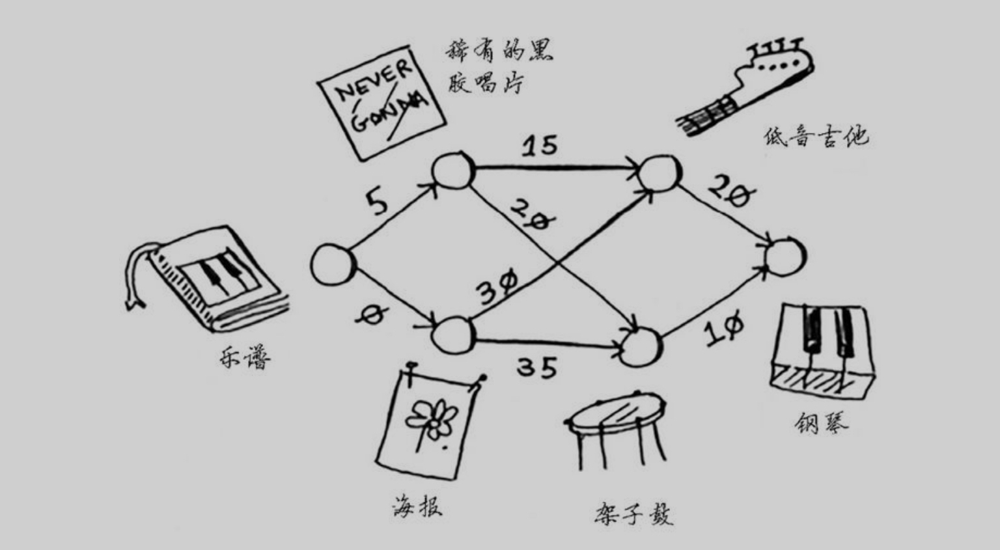
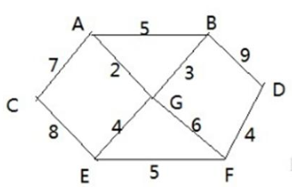
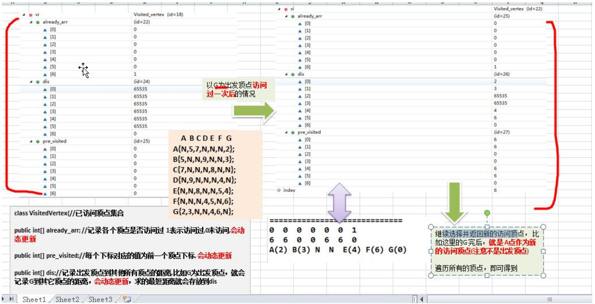

#   迪克斯特拉算法Dijkstra算法基本介绍
##  步骤
1.  找出最便宜的点
2.  对于该结点的邻居,检查是否有前往它们的更短路径,如果有,就更新其开销
3.  重复这个过程,直到对图中的每个结点都这样做了
4.  计算最终路径

##  手动演示

###     第一轮
1.  从图中可知最便宜的点是`乐谱`
2.  邻居是黑胶唱片和海报

此时可以更新表格如下

|结点|开销|
|----|----|
|黑胶唱片 | 5 |
|海报     | 0 |

###     第二轮
1.  从上一轮的表格可知最便宜的点是`海报`
2.  邻居是吉他和架子鼓

此时可以更新表格如下

|结点|开销|
|----|----|
|黑胶唱片        | 5           |
|~~海报~~        | ~~0~~       |
|海报 -> 吉他    | 0 + 30 = 30 |
|海报 -> 架子鼓  | 0 + 35 = 35 |

###     第三轮
1.  从上一轮的表格可知最便宜的点是`黑胶唱片`
2.  邻居是吉他和架子鼓

此时可以更新表格如下

|结点|开销|
|----|----|
|~~黑胶唱片~~        | ~~5~~           |
|~~海报 -> 吉他~~    | ~~0 + 30 = 30~~ |
|~~海报 -> 架子鼓~~  | ~~0 + 35 = 35~~ |
|黑胶唱片 -> 吉他    |   5 + 15 = 20   |
|黑胶唱片 -> 架子鼓  |   5 + 20 = 25   |

###     第四轮
1.  从上一轮的表格可知最便宜的点是`黑胶唱片 -> 吉他`
2.  邻居是钢琴(终点)

此时可以更新表格如下

|结点|开销|
|----|----|
|~~黑胶唱片~~                | ~~5~~                |
|~~海报 -> 吉他~~            | ~~0 + 30 = 30~~      |
|~~海报 -> 架子鼓~~          | ~~0 + 35 = 35~~      |
|~~黑胶唱片 -> 吉他~~        |   ~~5 + 15 = 20~~    |
|~~黑胶唱片 -> 架子鼓~~      |   ~~5 + 20 = 25~~    |
|  黑胶唱片 -> 吉他 -> 钢琴  |   5 + 15 + 20 = 40   |

###     最后
由于上一轮已经走到终点了,所以,需要对最后一个结点--架子鼓也需要计算一下开销,即`黑胶唱片 -> 架子鼓 -> 钢琴 => 5 + 20 + 10 = 35`,与前面`黑胶唱片 -> 吉他 -> 钢琴 => 5 + 15 + 20 = 40`进行比较,得到最终的路径为`黑胶唱片 -> 架子鼓 -> 钢琴`

##  缺点
如果有负权边,就不能使用迪克斯特拉算法,可以使用`贝尔曼--福德算法(Bellman-Fordalgorithm)`

#   最短路径问题
##  题目


1.  战争时期， 胜利乡有 7 个村庄(A, B, C, D, E, F, G) ， 现在有六个邮差， 从 G 点出发， 需要分别把邮件分别送到A, B, C , D, E, F 六个村庄
2.  各个村庄的距离用边线表示(权) ， 比如 A – B 距离 5 公里
3.  问： 如何计算出 G 村庄到 其它各个村庄的最短距离?

##  分析
1.  设置出发顶点为 v， 顶点集合 V{v1,v2,vi...}， v 到 V 中各顶点的距离构成距离集合 Dis， Dis{d1,d2,di...}， Dis集合记录着 v 到图中各顶点的距离(到自身可以看作 0， v 到 vi 距离对应为 di)
2.  从 Dis 中选择值最小的 di 并移出 Dis 集合， 同时移出 V 集合中对应的顶点 vi， 此时的 v 到 vi 即为最短路径
3.  更新 Dis 集合， 更新规则为： 比较 v 到 V 集合中顶点的距离值， 与 v 通过 vi 到 V 集合中顶点的距离值， 保留值较小的一个(同时也应该更新顶点的前驱节点为vi， 表明是通过 vi 到达的)
4.  重复执行两步骤， 直到最短路径顶点为目标顶点即可结束



##  代码实现
```JAVA
package com.zjc.algorithm.dijkstra;

import java.util.Arrays;

public class DijkstraAlgorithm {
    public static void main(String[] args) {
        char[] vertex = { 'A', 'B', 'C', 'D', 'E', 'F', 'G' };
        // 邻接矩阵
        int[][] matrix = new int[vertex.length][vertex.length];
        final int N = 65535;// 表示不可以连接
        matrix[0] = new int[] { N, 5, 7, N, N, N, 2 };
        matrix[1] = new int[] { 5, N, N, 9, N, N, 3 };
        matrix[2] = new int[] { 7, N, N, N, 8, N, N };
        matrix[3] = new int[] { N, 9, N, N, N, 4, N };
        matrix[4] = new int[] { N, N, 8, N, N, 5, 4 };
        matrix[5] = new int[] { N, N, N, 4, 5, N, 6 };
        matrix[6] = new int[] { 2, 3, N, N, 4, 6, N };
        // 创建 Graph 对象
        Graph graph = new Graph(vertex, matrix);
        // 测试, 看看图的邻接矩阵是否 ok
        graph.showGraph();
        // 测试迪杰斯特拉算法
        graph.dsj(2);// C
        graph.showDijkstra();
    }
}

class Graph {
    private char[] vertex; // 顶点数组
    private int[][] matrix; // 邻接矩阵
    private VisitedVertex vv; // 已经访问的顶点的集合
    // 构造器

    public Graph(char[] vertex, int[][] matrix) {
        this.vertex = vertex;
        this.matrix = matrix;
    }

    // 显示结果
    public void showDijkstra() {
        vv.show();
    }

    // 显示图
    public void showGraph() {
        for (int[] link : matrix) {
            System.out.println(Arrays.toString(link));
        }
    }

    /**
     * 迪杰斯特拉算法实现
     * 
     * @param index 表示出发顶点对应的下标
     */
    public void dsj(int index) {
        vv = new VisitedVertex(vertex.length, index);
        update(index);// 更新 index 顶点到周围顶点的距离和前驱顶点
        for (int j = 1; j < vertex.length; j++) {
            index = vv.updateArr();// 选择并返回新的访问顶点
            update(index); // 更新 index 顶点到周围顶点的距离和前驱顶点
        }
    }

    /**
     * 更新 index 下标顶点到周围顶点的距离和周围顶点的前驱顶点
     * 
     * @param index
     */
    private void update(int index) {
        int len = 0;
        // 根据遍历我们的邻接矩阵的 matrix[index]行
        for (int j = 0; j < matrix[index].length; j++) {
            // len 含义是 : 出发顶点到 index 顶点的距离 + 从 index 顶点到 j 顶点的距离的和
            len = vv.getDis(index) + matrix[index][j];
            // 如果 j 顶点没有被访问过， 并且 len 小于出发顶点到 j 顶点的距离， 就需要更新
            if (!vv.in(j) && len < vv.getDis(j)) {
                vv.updatePre(j, index); // 更新 j 顶点的前驱为 index 顶点
                vv.updateDis(j, len); // 更新出发顶点到 j 顶点的距离
            }
        }
    }
}

/**
 * 已访问顶点集合
 */
class VisitedVertex {
    // 记录各个顶点是否访问过 1 表示访问过,0 未访问,会动态更新
    public int[] already_arr;
    // 每个下标对应的值为前一个顶点下标, 会动态更新
    public int[] pre_visited;
    // 记录出发顶点到其他所有顶点的距离,比如 G 为出发顶点， 就会记录 G 到其它顶点的距离， 会动态更新， 求的最短距离就会存放到 dis
    public int[] dis;

    /**
     * 构造器
     * 
     * @param length :表示顶点的个数
     * @param        index: 出发顶点对应的下标, 比如 G 顶点， 下标就是 6
     */
    public VisitedVertex(int length, int index) {
        this.already_arr = new int[length];
        this.pre_visited = new int[length];
        this.dis = new int[length];
        // 初始化 dis 数组
        Arrays.fill(dis, 65535);
        this.already_arr[index] = 1; // 设置出发顶点被访问过
        this.dis[index] = 0;// 设置出发顶点的访问距离为 0
    }

    /**
     * 功能: 判断 index 顶点是否被访问过
     * 
     * @param index
     * @return 如果访问过， 就返回 true, 否则访问 false
     */
    public boolean in(int index) {
        return already_arr[index] == 1;
    }

    /**
     * 功能: 更新出发顶点到 index 顶点的距离
     * 
     * @param index
     * @param len
     */
    public void updateDis(int index, int len) {
        dis[index] = len;
    }

    /**
     * 功能: 更新 pre 这个顶点的前驱顶点为 index 顶点
     * 
     * @param pre
     * @param index
     */
    public void updatePre(int pre, int index) {
        pre_visited[pre] = index;
    }

    /**
     * 功能:返回出发顶点到 index 顶点的距离
     * 
     * @param index
     * @return
     */
    public int getDis(int index) {
        return dis[index];
    }

    /**
     * 继续选择并返回新的访问顶点， 比如这里的 G 完后， 就是 A 点作为新的访问顶点(注意不是出发顶点)
     * 
     * @return
     */
    public int updateArr() {
        int min = 65535, index = 0;
        for (int i = 0; i < already_arr.length; i++) {
            if (already_arr[i] == 0 && dis[i] < min) {
                min = dis[i];
                index = i;
            }
        }
        // 更新 index 顶点被访问过
        already_arr[index] = 1;
        return index;
    }

    /**
     * 显示最后的结果 即将三个数组的情况输出
     */
    public void show() {
        System.out.println("==========================");
        // 输出 already_arr
        for (int i : already_arr) {
            System.out.print(i + " ");
        }
        System.out.println();
        // 输出 pre_visited
        for (int i : pre_visited) {
            System.out.print(i + " ");
        }
        System.out.println();
        // 输出 dis
        for (int i : dis) {
            System.out.print(i + " ");
        }
        System.out.println();
        // 为了好看最后的最短距离， 我们处理
        char[] vertex = { 'A', 'B', 'C', 'D', 'E', 'F', 'G' };
        int count = 0;
        for (int i : dis) {
            if (i != 65535) {
                System.out.print(vertex[count] + "(" + i + ") ");
            } else {
                System.out.println("N ");
            }
            count++;
        }
        System.out.println();
    }
}
```

#   参考
+   《算法图解》的kindle版,第7章.作者: [美] Aditya Bhargava. 译者: 袁国忠.ISBN:978-7-115-44763-0


