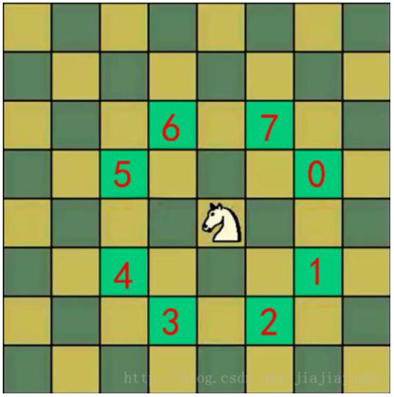
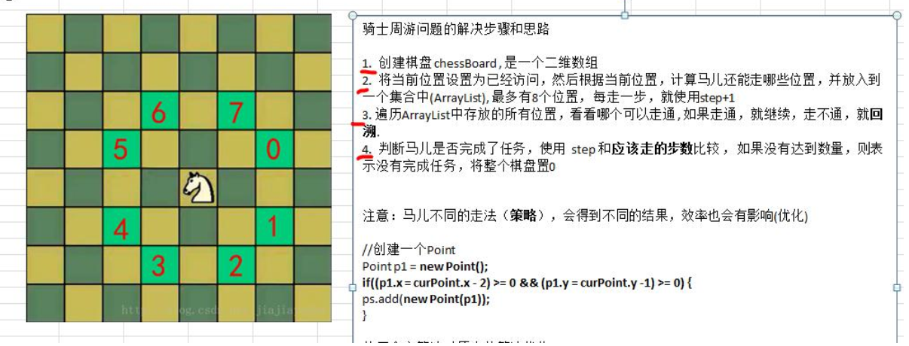
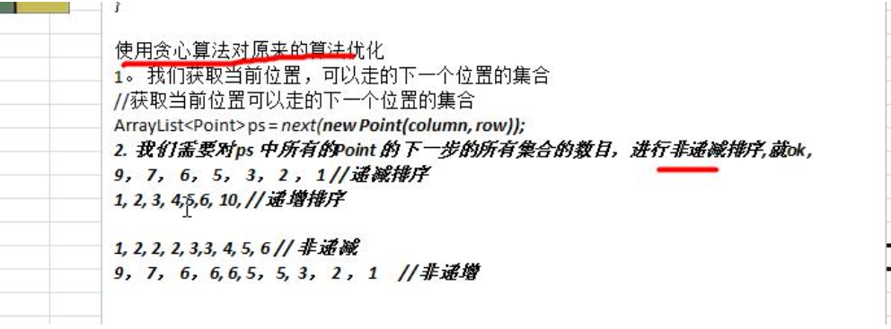

#   马踏棋盘算法介绍和游戏演示
+   马踏棋盘算法也被称为骑士周游问题
+   将马随机放在国际象棋的 8× 8 棋盘 `Board[0～7][0～7]`的某个方格中， 马按走棋规则(马走日字)进行移动。 要求每个方格只进入一次， 走遍棋盘上全部 64 个方格
+   游戏演示: [http://www.4399.com/flash/146267_2.htm](http://www.4399.com/flash/146267_2.htm)



#   马踏棋盘游戏分析
1.  马踏棋盘问题(骑士周游问题)实际上是图的深度优先搜索(DFS)的应用。
2.  如果使用回溯（就是深度优先搜索） 来解决， 假如马儿踏了 53 个点， 如图： 走到了第 53 个， 坐标（1,0） ， 发现已经走到尽头， 没办法， 那就只能回退了，查看其他的路径， 就在棋盘上不停的回溯……
对第一种实现方式的思路图解


3.  分析第一种方式的问题， 并使用贪心算法（greedyalgorithm） 进行优化。 解决马踏棋盘问题.

4.  使用前面的游戏来验证算法是否正确。

#   代码实现
```JAVA
package com.zjc.algorithm.horse;

import java.awt.Point;
import java.util.ArrayList;
import java.util.Comparator;

public class HorseChessboard {
    private static int X; // 棋盘的列数
    private static int Y; // 棋盘的行数
    // 创建一个数组， 标记棋盘的各个位置是否被访问过
    private static boolean visited[];
    // 使用一个属性， 标记是否棋盘的所有位置都被访问
    private static boolean finished; // 如果为 true,表示成功

    public static void main(String[] args) {
        System.out.println("骑士周游算法， 开始运行~~");
        // 测试骑士周游算法是否正确
        X = 8;
        Y = 8;
        int row = 1; // 马儿初始位置的行， 从 1 开始编号
        int column = 1; // 马儿初始位置的列， 从 1 开始编号
        // 创建棋盘
        int[][] chessboard = new int[X][Y];
        visited = new boolean[X * Y];// 初始值都是 false
        // 测试一下耗时
        long start = System.currentTimeMillis();
        traversalChessboard(chessboard, row - 1, column - 1, 1);
        long end = System.currentTimeMillis();
        System.out.println("共耗时: " + (end - start) + " 毫秒");
        // 输出棋盘的最后情况
        for (int[] rows : chessboard) {
            for (int step : rows) {
                System.out.print(step + "\t");
            }
            System.out.println();
        }
    }

    /**
     * 完成骑士周游问题的算法
     * @param chessboard 棋盘
     * @param row 马儿当前的位置的行 从 0 开始
     * @param column 马儿当前的位置的列 从 0 开始
     * @param step 是第几步 ,初始位置就是第 1 步
     */
    public static void traversalChessboard(int[][] chessboard, int row,
            int column, int step) {
        chessboard[row][column] = step;
        // row = 4 X = 8 column = 4 = 4 * 8 + 4 = 36
        visited[row * X + column] = true; // 标记该位置已经访问
        // 获取当前位置可以走的下一个位置的集合
        ArrayList<Point> ps = next(new Point(column, row));
        // 对 ps 进行排序,排序的规则就是对 ps 的所有的 Point 对象的下一步的位置的数目， 进行非递减排序
        sort(ps);
        // 遍历 ps
        while (!ps.isEmpty()) {
            Point p = ps.remove(0);// 取出下一个可以走的位置
            // 判断该点是否已经访问过
            if (!visited[p.y * X + p.x]) {// 说明还没有访问过
                traversalChessboard(chessboard, p.y, p.x, step + 1);
            }
        }
        // 判断马儿是否完成了任务， 使用 step 和应该走的步数比较 ，
        // 如果没有达到数量， 则表示没有完成任务， 将整个棋盘置 0
        // 说明: step < X * Y 成立的情况有两种
        // 1. 棋盘到目前位置,仍然没有走完
        // 2. 棋盘处于一个回溯过程
        if (step < X * Y && !finished) {
            chessboard[row][column] = 0;
            visited[row * X + column] = false;
        } else {
            finished = true;
        }
    }

    /**
     * 功能： 根据当前位置(Point 对象)， 计算马儿还能走哪些位置(Point)， 并放入到一个集合中(ArrayList), 最多 有 8
     * 个位置
     * @param curPoint
     * @return
     */
    public static ArrayList<Point> next(Point curPoint) {
        // 创建一个 ArrayList
        ArrayList<Point> ps = new ArrayList<Point>();
        // 创建一个 Point
        Point p1 = new Point();
        // 表示马儿可以走 5 这个位置
        if ((p1.x = curPoint.x - 2) >= 0 && (p1.y = curPoint.y - 1) >= 0) {
            ps.add(new Point(p1));
        }
        // 判断马儿可以走 6 这个位置
        if ((p1.x = curPoint.x - 1) >= 0 && (p1.y = curPoint.y - 2) >= 0) {
            ps.add(new Point(p1));
        }
        // 判断马儿可以走 7 这个位置
        if ((p1.x = curPoint.x + 1) < X && (p1.y = curPoint.y - 2) >= 0) {
            ps.add(new Point(p1));
        }
        // 判断马儿可以走 0 这个位置
        if ((p1.x = curPoint.x + 2) < X && (p1.y = curPoint.y - 1) >= 0) {
            ps.add(new Point(p1));
        }
        // 判断马儿可以走 1 这个位置
        if ((p1.x = curPoint.x + 2) < X && (p1.y = curPoint.y + 1) < Y) {
            ps.add(new Point(p1));
        }
        // 判断马儿可以走 2 这个位置
        if ((p1.x = curPoint.x + 1) < X && (p1.y = curPoint.y + 2) < Y) {
            ps.add(new Point(p1));
        }
        // 判断马儿可以走 3 这个位置
        if ((p1.x = curPoint.x - 1) >= 0 && (p1.y = curPoint.y + 2) < Y) {
            ps.add(new Point(p1));
        }
        // 判断马儿可以走 4 这个位置
        if ((p1.x = curPoint.x - 2) >= 0 && (p1.y = curPoint.y + 1) < Y) {
            ps.add(new Point(p1));
        }
        return ps;
    }

    // 根据当前这个一步的所有的下一步的选择位置， 进行非递减排序, 减少回溯的次数
    public static void sort(ArrayList<Point> ps) {
        ps.sort(new Comparator<Point>() {
            @Override
            public int compare(Point o1, Point o2) {
                // 获取到 o1 的下一步的所有位置个数
                int count1 = next(o1).size();
                // 获取到 o2 的下一步的所有位置个数
                int count2 = next(o2).size();
                if (count1 < count2) {
                    return -1;
                } else if (count1 == count2) {
                    return 0;
                } else {
                    return 1;
                }
            }
        });
    }
}
```
