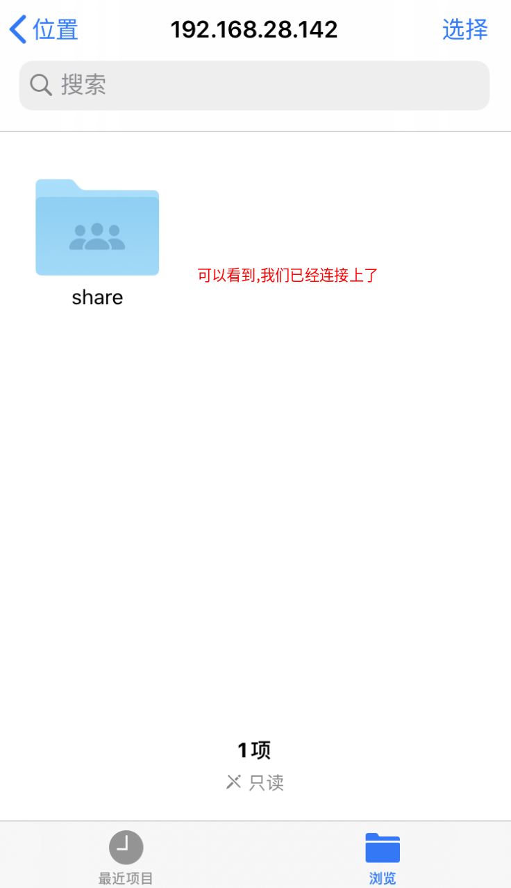

#   Ubuntu开启smb协议与手机互联
description: Ubuntu开启smb协议与手机互联
date: 2020-05-29 15:44:23
categories:
- Ubuntu
tags:
- Ubuntu配置
---
#   samba的安装
##  方式一:命令行安装
```
sudo apt-get insall samba
sudo apt-get install smbfs
```

##  方式二:图形界面gnome中安装
1.  在需要共享的目录中右键(这个也可以在属性中找到)


2.  选择共享此目录后创建共享


3.  如果没有安装smba会自动提示你需要安装

#  创建共享目录
## 方式一:命令行创建
1.  创建需要共享的目录
```
#   注意：XXX为用户名
mkdir /home/XXX/share
sudo chmod 777 /home/XXX/share
```
2.  将上述创建的文件夹添加到配置文件中
```
sudo cp /etc/samba/smb.conf /etc/samba/smb.conf.bak
sudo vim /etc/samba/smb.conf

#   在smb.conf最后添加
[share]
　　path = /home/XXX/share
　　available = yes
　　browsealbe = yes
　　public = yes
　　writable = yes
```

## 方式二:图形界面gnome中创建
1.  在需要共享的目录中右键(这个也可以在属性中找到)


2.  选择共享此目录后创建共享


3.  这样就共享了这个目录

#   配置其他设备连接时的用户名密码
##  配置用户名和密码
```
sudo touch /etc/samba/smbpasswd
sudo smbpasswd -a username
然后会要求你输入samba帐户的密码
```
注意
1.  如果没有配置目录，当你登录时会提示`session setup failed: NT_STATUS_LOGON_FAILURE`
2.  前面添加的用户必须是系统中存在的用户,不能凭空乱写,否则也会报错

##  重启samba服务器
```
#   ubuntu比较乱,有可能是老版本的
sudo /etc/init.d/samba restart

#   而ubuntu18.04是底下这个命令
sudo service smbd restart

#   也有可能使用systemctl,这个看自己的机子
```

##  测试一下
```
smbclient -L //localhost/share
```

#   配置防火墙(非必要步骤)
我是ubuntu18.04,又我习惯让局域网内可以连接的,所以使用如下命令
```
#   查看现有规则
sudo ufw status numbered

#   配置错了可以用如下命令删除
sudo ufw delete 序号

#   我本地添加的规则,让局域网内能够连接
sudo ufw allow from 192.168.0.0/16 to any app Samba

#   也可以直接关闭防火墙
ufw enable/disable  #   打开/关闭ufw
```

#   手机连接
##  首先查看电脑的ip
```
ifconfig
```


##  手机连接
1.  这里我们使用`iphone`自带的`文件`进行连接,如果iphone的文件没有如下功能则是ios版本太低,可以另外下app,比如`FileExplorer`等,只要能使用smb协议的都行


2.  连接服务器


3.  键入smb服务器地址,ip和我们前面查的保持一致


4.  键入用户名和密码(如果是客人的不需要用户名密码,但目录的权限相对的需要更改)


5.  可以看到,我们连接上了



