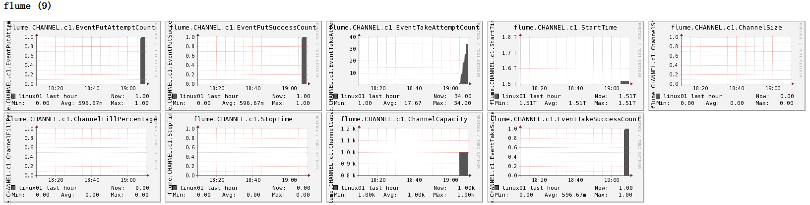

#   Flume监控之Ganglia
+ date: 2020-06-04 10:36:19
+ description: Flume监控之Ganglia
+ categories:
  - BigData
+ tags:
  - Flume
---
#   配置Flume被Ganglia监控
修改`/opt/module/flume/conf`目录下的`flume-env.sh`配置：
```bash
JAVA_OPTS="-Dflume.monitoring.type=ganglia -Dflume.monitoring.hosts=192.168.1.102:8649 -Xms100m -Xmx200m"
```


#   操作Flume测试监控
##  启动Flume任务
```bash
 bin/flume-ng agent \
--conf conf/ \
--name a1 \
--conf-file job/flume-telnet-logger.conf \
-Dflume.root.logger==INFO,console \
-Dflume.monitoring.type=ganglia \
-Dflume.monitoring.hosts=192.168.1.102:8649
```


##  发送数据观察ganglia监测图
```
$ telnet localhost 44444
```
样式如图：

图例说明：

|字段（图表名称）        |字段含义|
|----|----|
|EventPutAttemptCount    |source尝试写入channel的事件总数量|
|EventPutSuccessCount    |成功写入channel且提交的事件总数量|
|EventTakeAttemptCount   |sink尝试从channel拉取事件的总数量。这不意味着每次事件都被返回，因为sink拉取的时候channel可能没有任何数据。|
|EventTakeSuccessCount   |sink成功读取的事件的总数量|
|StartTime               |channel启动的时间（毫秒）|
|StopTime                |channel停止的时间（毫秒）|
|ChannelSize             |目前channel中事件的总数量|
|ChannelFillPercentage   |channel占用百分比|
|ChannelCapacity         |channel的容量|


+   当尝试提交的次数大于成功提交的次数就说明flume有异常了,这时候的办法是增加flume的个数和内存
+   开发中在flume-env.sh中设置JVM heap为4G或更高，部署在单独的服务器上（4核8线程16G内存）,-Xmx与-Xms最好设置一致，减少内存抖动带来的性能影响，如果设置不一致容易导致频繁fullgc。

