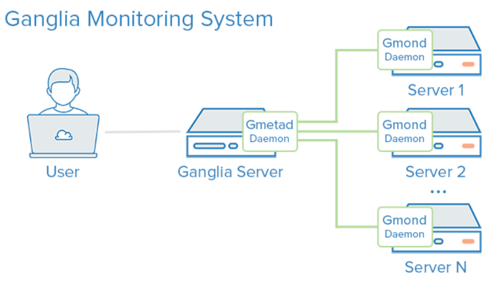
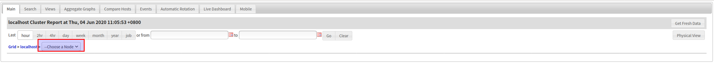

这里的系统是Ubuntu18.04
#   依赖安装

##  安装apache2服务(cendos下的httpd服务)
```
sudo apt-get install apache2
```

##  安装php
```
sudo apt-get install php7.2
```

##  安装rrdtool
1.  说明
RRDtool用于数据存储和可视化，可以方便地对机器性能及系统运行状态进行可视化监控，广泛应用于对Hadoop，Spark等分布式系统的监测管理。轮询调度数据库，用于存储数据和可视化时间序列。RRD 也被用于生成用户界面的 web 前端。

2.  安装
```
sudo apt-get install rrdtool
```

#   ganglia简介
Ganglia的核心包含 gmond、gmetad 以及一个 Web 接界面。主要是用来监控系统性能，如：cpu 、mem、硬盘利用率， I/O 负载、网络流量情况等，通过曲线很容易见到每个节点的工作状态，对合理调整、分配系统资源，提高系统整体性能起到重要作用。


##  Gmod
Ganglia monitoring，它是一个守护进程，用于收集机器内的 metric，它还可以接受别的 node 发送过来的 metric，并且保存一小段时间（几十秒），运行在每一个需要监测的节点上，收集监测统计，发送和接受在同一个组播或单播通道上的统计信息。Gmond 可以扮演下面三种角色：
+   收集 metric 并发送出去，同时也接收别的 node 发送过来的 metric；
+   只采集 metric 并发送出去（关键字 deaf）；
+   只接收别的机器发送过来的 metric（关键字 mute）； 默认情况下，gmond 监听 8649 端口，用来发送和接收 udp，tcp 数据包。

##  Gmetad
Ganglia meta daemon，也是一个守护进程，定期检查 gmonds ，从那里拉取数据，并将他们的指标存储在 RRD 存储引擎中。它可以查询多个集群并聚合指标。默认情况下 gmond 通过 multicast 的方式发送自己采集到的数据，整个 Multicast group 里的 node 都拥有整个 cluster 的全部 metrics。而 gmetad 可以从一个 cluster 的任意一个 node 拿到整个 cluster 的全部 metric 并记录到 rrd 数据库。 默认情况下，gmetad 监听 8651 端口，从这里可以拿到 gmetad 存放的最新 metric 数据，也可以给更高层的 gmetad 使用；监听 8652 端口，提供数据查询接口，供 web 使用。

#   安装ganglia

##  主节点(master node)安装
1.  安装ganglia-monitor
```
sudo apt-get install ganglia-monitor
```

2.  安装gmetad
```
sudo apt-get install gmetad
```

3.  安装ganglia-webfrontend
```
sudo apt-get install ganglia-webfrontend
```

#   配置
1.  修改/etc/ganglia/gmond.conf配置
```
# 修改Cluster name
cluster {
  name = "localhost" ## use the name from gmetad.conf 需要和gmetad的配置文件名相同
  owner = "unspecified"
  latlong = "unspecified"
  url = "unspecified"
}
# 修改 udp_send_channel，添加 host
udp_send_channel = {
  # mcast_join = xxx.xxx.xxx.xxx
  host = localhost
  port = 8649
  ttl = 1
}
# 修改 udp_recv_channel，注释掉 mcast_join, bind
udp_recv_channel = {
  # mcast_join = xxx.xxx.xxx.xxx
  port = 8649
  bind = localhost
}
```

2.  修改/etc/ganglia/gmetad.conf
```
# data_source可以这样配置
# data_source "my cluster" 10 localhost  my.machine.edu:8649  1.2.3.5:8655
# data_source "my grid" 50 1.3.4.7:8655 grid.org:8651 grid-backup.org:8651
# data_source "another source" 1.3.4.7:8655  1.3.4.8
# data_source "ganglia" localhost  #"群集名称(和前面配置保持一致)" 轮询时间  ip地址或名称（名称需要可以解析）

data_source "localhost" localhost   # 需要配置和gmond.conf相同

# gridname "域名"  #任意写,也可不写
```

3.  如果有多台主机则需要在数据源那行增加所有主机的ip
```
data_source "ganglia" localhost  #“群集名称” 轮询时间  ip地址或名称（名称需要可以解析）
data_source "web" 192.168.2.146 192.168.2.98
```

4.  重启 ganglia-monitor 和 gmetad 服务
```
systemctl restart gmetad.service
systemctl restart ganglia-monitor.service
```

##  配置ganglia-webfrontend(配置apache2)
1.  查看apache2的默认访问目录
```
cat /etc/apache2/sites-enabled/000-default
```
找到DocumentRoot,我这里是
```
DocumentRoot /var/www/html
```

2.  我们需要将ganglia-webfronted的web相关代码链接到apache可以访问的位置或者移动到apache可以访问的目录
```
sudo ln -s /usr/share/ganglia-webfrontend/ /var/www/html/ganglia
或者
sudo mv /usr/share/ganglia-webfrontend/   /var/www/html/ganglia
```

3.  重启apache2
```
systemctl restart apache2.service
```

#   配置完成,访问
然后在浏览器输入http://serverIP/ganglia 即可访问


#   参考
[ubuntu安装ganglia](https://blog.csdn.net/Scape1989/article/details/19252431)
[ubuntu16.04安装ganglia](https://www.xitongjiaocheng.com/ubuntu/2018/64390.html)
