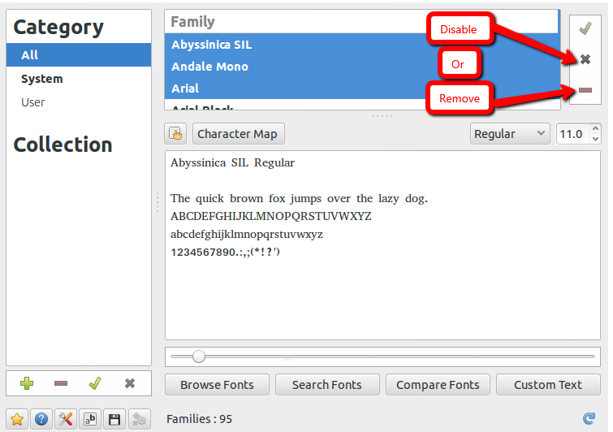

#   Ubuntu中安装和删除字体
description: Ubuntu中安装和删除字体
date: 2020-06-04 13:25:54
categories:
- Ubuntu
tags:
- Ubuntu装机日志
---
#	通过命令管理字体

##  安装字体
linux系统的字体文件放在/usr/share/fonts/目录以及用户的~/.fonts和~/.local/share/fonts目录下，第一个位置为系统所用用户共享，将字体安装到这个目录需要管理员权限；后面两个位置则为当前登陆用户所有,安装字体到这个目录不需要管理员权限。

1.	安装到 /usr/share/fonts/ (需要管理员权限)
```
# 下载字体
wget https://github.com/fangwentong/dotfiles/raw/master/ubuntu-gui/fonts/Monaco.ttf

# 安装字体
sudo mkdir -p /usr/share/fonts/custom
sudo mv Monaco.ttf /usr/share/fonts/custom
sudo chmod 744 /usr/share/fonts/custom/Monaco.ttf

sudo mkfontscale  #生成核心字体信息
sudo mkfontdir
sudo fc-cache -fv
```

2.	安装到 ~/.fonts/ (安装到 ~/.local/share/fonts 原理相同)
```
# 下载字体
wget https://github.com/fangwentong/dotfiles/blob/ubuntu/fonts/Monaco.ttf?raw=true

# 安装字体
mkdir -p ~/.fonts
mv Monaco.ttf ~/.fonts
fc-cache -vf  #刷新系统字体缓存
```

##	卸载字体

若不再需要某个字体，可以删除相应字体文件，刷新系统字体缓存即可
```
fc-cache -vf  #刷新系统字体缓存
```

#   通过图形界面

##  系统自带工具安装
这种方法的优点是安装前能预览字体效果，安装过程简单便捷，动几下鼠标就完成了安装，非常适合在图形界面下安装; 缺点是安装借助图形化工具，无法通过自动化脚本安装。
```
+   首先到这里下载字体,这里用Monaco.ttf进行说明
+   然后在Ubuntu系统中，双击下载得到的Monaco.ttf文件，即用系统自带的字体查看器打开了该文件，点击面板上的安装按钮，即可完成安装
+   这种方法安装后，字体文件存放在~/.local/share/fonts目录下。
```

##  安装第三方工具
1.  安装
```
sudo apt-get install font-manager
```

2.  界面



#   参考
[在ubuntu中，如何删除字体](https://www.kutu66.com/ubuntu/article_165241)
[在linux中安装/卸载字体](https://blog.wentong.me/2014/05/add-fonts-to-your-linux/)
