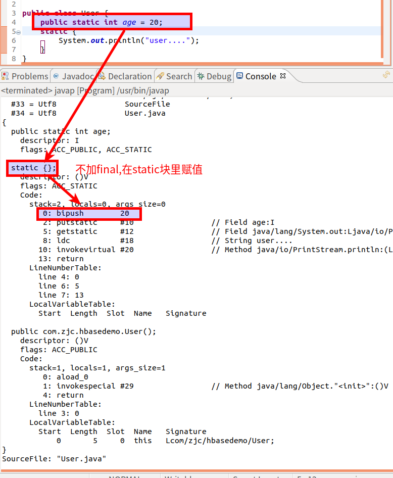
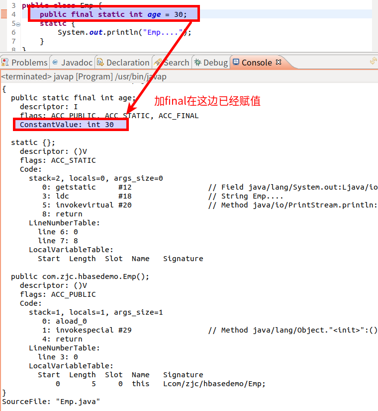

#   Java中用final修饰静态变量后对静态代码块的影响
description: Java中用final修饰静态变量后对静态代码块的影响
date: 2020-06-10 12:34:22
tags:
---
#   判断如下代码打印结果
User.java
```JAVA
public class User {
	public static int age = 20;
	static {
		System.out.println("user....");
	}
}
```

Emp.java
```JAVA
public class Emp {
    // 注意,这里的final
	public final static int age = 30;
	static {
		System.out.println("Emp....");
	}
}
```

运行代码
```JAVA
public class Test {
	public static void main(String[] args) {
		System.out.println(User.age);
		System.out.println(Emp.age);
	}
}
```

结果
```
user....
20
30
```

问:为什么不打印`Emp....`,按理来说,static代码块在代码类加载的时候就应该调用的,也就是说`Emp....`应该要打印出来的

#   为什么不打印`Emp....`
我们分别查看User.java和Emp.java的字节码
##   不加final的User的字节码

```
{
  public static int age;
    descriptor: I
    flags: ACC_PUBLIC, ACC_STATIC

  static {};
    descriptor: ()V
    flags: ACC_STATIC
    Code:
      stack=2, locals=0, args_size=0
         0: bipush        20
         2: putstatic     #10                 // Field age:I
         5: getstatic     #12                 // Field java/lang/System.out:Ljava/io/PrintStream;
         8: ldc           #18                 // String user....
        10: invokevirtual #20                 // Method java/io/PrintStream.println:(Ljava/lang/String;)V
        13: return
      LineNumberTable:
        line 4: 0
        line 6: 5
        line 7: 13
      LocalVariableTable:
        Start  Length  Slot  Name   Signature

  public com.zjc.hbasedemo.User();
    descriptor: ()V
    flags: ACC_PUBLIC
    Code:
      stack=1, locals=1, args_size=1
         0: aload_0
         1: invokespecial #29                 // Method java/lang/Object."<init>":()V
         4: return
      LineNumberTable:
        line 3: 0
      LocalVariableTable:
        Start  Length  Slot  Name   Signature
            0       5     0  this   Lcom/zjc/hbasedemo/User;
}
SourceFile: "User.java"
```

##   加final的Emp的字节码

```
{
  public static final int age;
    descriptor: I
    flags: ACC_PUBLIC, ACC_STATIC, ACC_FINAL
    ConstantValue: int 30

  static {};
    descriptor: ()V
    flags: ACC_STATIC
    Code:
      stack=2, locals=0, args_size=0
         0: getstatic     #12                 // Field java/lang/System.out:Ljava/io/PrintStream;
         3: ldc           #18                 // String Emp....
         5: invokevirtual #20                 // Method java/io/PrintStream.println:(Ljava/lang/String;)V
         8: return
      LineNumberTable:
        line 6: 0
        line 7: 8
      LocalVariableTable:
        Start  Length  Slot  Name   Signature

  public com.zjc.hbasedemo.Emp();
    descriptor: ()V
    flags: ACC_PUBLIC
    Code:
      stack=1, locals=1, args_size=1
         0: aload_0
         1: invokespecial #29                 // Method java/lang/Object."<init>":()V
         4: return
      LineNumberTable:
        line 3: 0
      LocalVariableTable:
        Start  Length  Slot  Name   Signature
            0       5     0  this   Lcom/zjc/hbasedemo/Emp;
}
SourceFile: "Emp.java"
```

#   结论
对于有final关键字来说
+   对`final`的含义来说,是将变量变为一个"不可改变的变量(类似常量)"
+   而从字节码可以看出,有`final`关键字的变量比static更早被赋值,所以,当我们调用`Emp.age`时,并不需要static块的内容被加载,所以static块的内容不会被打印

对于无final关键字来说,从字节码中可以得出
这段代码
```JAVA
public class User {
	public static int age = 20;
	static {
		System.out.println("user....");
	}
}
```
相当于这段代码
```JAVA
public class User {
    // (这代码在Test.java中调用也要跟着改,这里只是说明用)
	// public static int age = 20;
	static {
            int age = 20;
            System.out.println("User....");
	}
}
```
