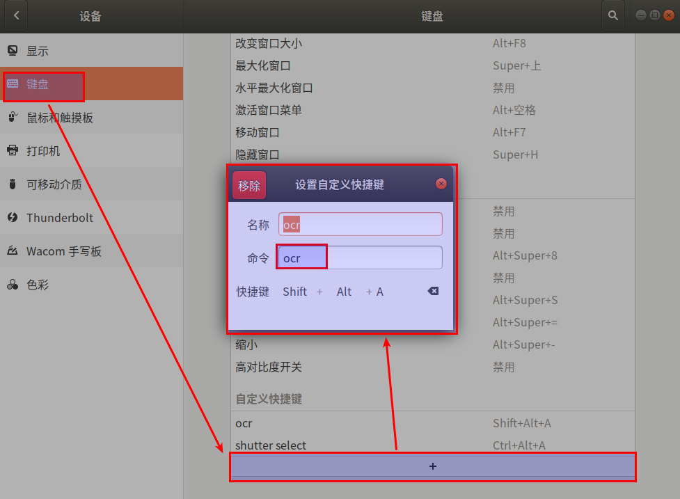

#   Ubuntu中一键OCR识别图片截图文字转文本
description: 本文主要希望在ubuntu系统下实现 一键OCR识别图片截图中的内容使之转换为文本可以复制粘贴
date: 2020-06-14 09:20:26
categories:
- Ubuntu
tags:
- Ubuntu装机日志
---
#	主要思路
利用截图软件gnome-screenshot 进行截取需要被文字识别的图片；利用文字识别OCR软件tesseract，进行识别将结果输出，复制到文件和剪切板

#	步骤1：安装依赖软件
##  安装tesseract
tesseract是一个开源的OCR引擎，最初是由惠普公司开发用来作为其平板扫描仪的OCR引擎，2005年惠普将其开源出来，之后google接手负责维护。目前稳定的版本是3.0。4.0版本加入了基于LSTM的神经网络技术，中文字符识别准确率有所提高。
1.  添加源
```
sudo add-apt-repository ppa:alex-p/tesseract-ocr
```
2.  更新源
```
sudo apt-get update
```
3.  安装
```
sudo apt-get install tesseract-ocr
```

##  安装中文字库
1.  tesseract支持60多种语言的识别不同，使用之前需要先下载对应语言的字库，下载地址：https://github.com/tesseract-ocr/tessdata
2.  下载完成之后把.traineddata字库文件放到tessdata目录下，默认路径是/usr/share/tesseract-ocr/4.00/tessdata

##  安装剩余软件：shutter，xclip, imagemagick
这3个不需要添加源，直接终端输入代码：
```
# 截屏软件
sudo apt-get install shutter
# 终端复制命令
sudo apt-get install xclip
# 图片处理
sudo apt-get install imagemagick
```

#   步骤2：制作shell脚本
1.  创建一个可执行脚本,脚本内容为以下代码,并脚本放到环境变量所在目录
2.  注意：将代码中，SCR="/home/Username/Documents/temp"双引号中的路径替换成你想要存放截图以及识别结果txt文档的路径
3.  用`tesseract --list-langs`检查安装过的语言包
```console
tesseract --list-langs
List of available languages (3):
eng
chi_sim
osd
```
4.  脚本内容如下
```bash
#!/bin/bash
# Dependencies: tesseract-ocr imagemagick shutter xclip

#Name: OCR
#Date: 2020-06-14
#Fuction: take a screenshot and OCR the letters in the picture
#Path: /home/UserName/...

#you can only scan one character at a time
SCR="/home/UserName/Documents/temp"

####take a shot what you wana to OCR to text
# The purpose of assigning the result to the variable is
# to wait for this command to complete before executing the next line
shutterOutput=`shutter -s -e -o $SCR.png > /dev/null 2>&1`

####increase the png
mogrify -modulate 100,0 -resize 400% $SCR.png
#should increase detection rate

####OCR by tesseract
# Language packages are identified with the `tesseract --list-langs` command
tesseract $SCR.png $SCR &> /dev/null -l eng+chi_sim

####use sed to delete the blanks & get the text and copy to clipboard
cat $SCR.txt | sed 's/ //g' | xclip -selection clipboard

# If you need to delete the newline, please use this statement
# and comment the previous sentence (the first line plus #)
#cat $SCR.txt | sed 's/ //g'| xargs | xclip -selection clipboard

# The pop-up window prompts the end of OCR
notify-send "OCR Done"

exit
```

# 步骤3：设置快捷键，一键调用shell脚本
+   进入：设置->键盘 拉到底部，点击+
+   名称：自由设置，建议以shell脚本名称命名
+   命令：脚本名字




#   参考
[Linux系统（ubuntu）一键OCR识别图片截图文字转文本](https://zhuanlan.zhihu.com/p/114917496)
[Tesseract安装使用](http://huanyouchen.github.io/2018/05/10/install-Tesseract-and-use-it-with-py/)
