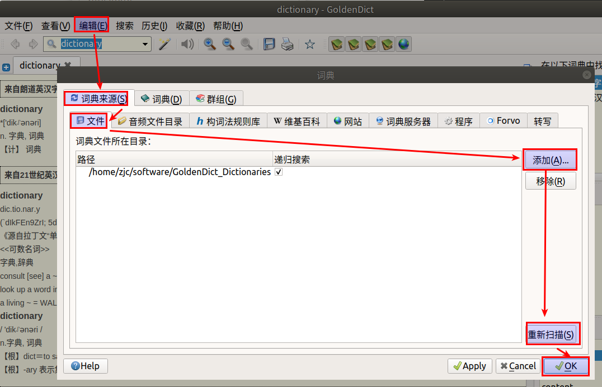
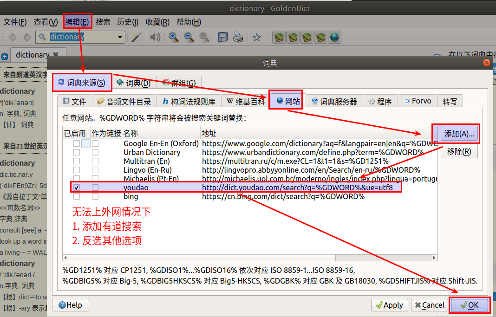
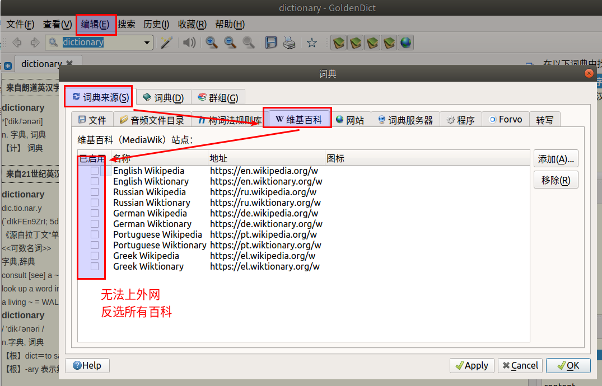
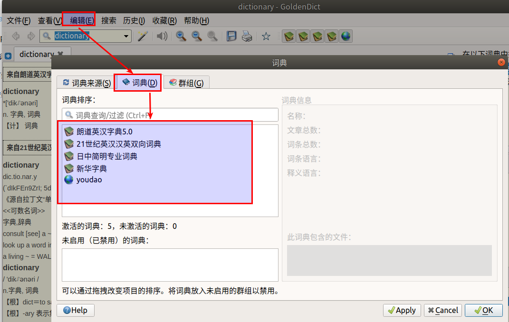
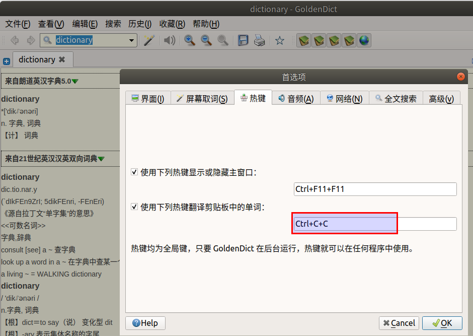

#   Ubuntu中安装词典GoldenDict
description: Ubuntu中安装词典GoldenDict
date: 2020-06-14 12:15:30
categories:
- Ubuntu
tags:
- Ubuntu装机日志
---
#   安装
```console
sudo apt-get install goldendict
```

#   添加词库
1.  离线词库下载
测试过[http://download.huzheng.org/zh\_CN/](http://download.huzheng.org/zh_CN/)
测试过[英汉:朗文5++ ·双解·例句发音](https://freemdict.com/2018/06/04/%e8%8b%b1%e6%b1%89-%e6%9c%97%e6%96%875-%c2%b7%e5%8f%8c%e8%a7%a3%c2%b7%e4%be%8b%e5%8f%a5%e5%8f%91%e9%9f%b3/)
没测试过[http://download.huzheng.org/](http://download.huzheng.org/)

2.  添加




3.  添加在线搜索
这里添加有道`http://dict.youdao.com/search?q=%GDWORD%&ue=utf8`




4.  取消百科的搜索




5.  调整词典顺序




#   使用
+   快捷键




+   屏幕取词
将需要查询的内容选取,按`ctrl + c + c`快捷键

#   教程
[安装使用 GoldenDict 查词神器 (Windows/Mac/Linux)](https://www.jianshu.com/p/b6b2c1d78d7c)

