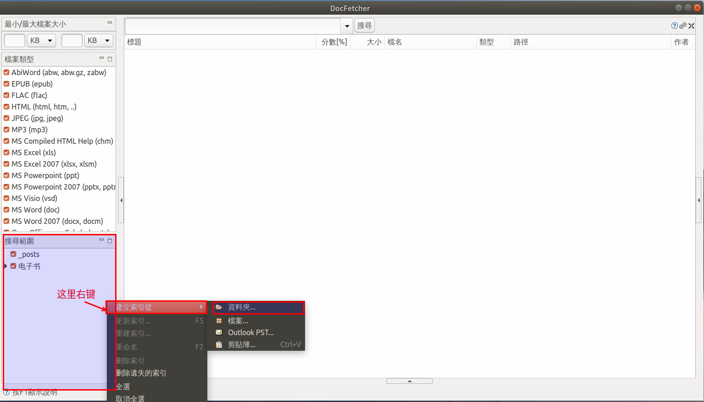
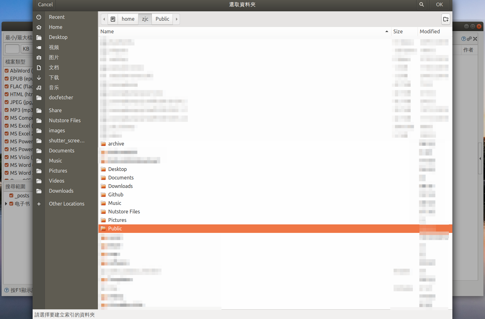
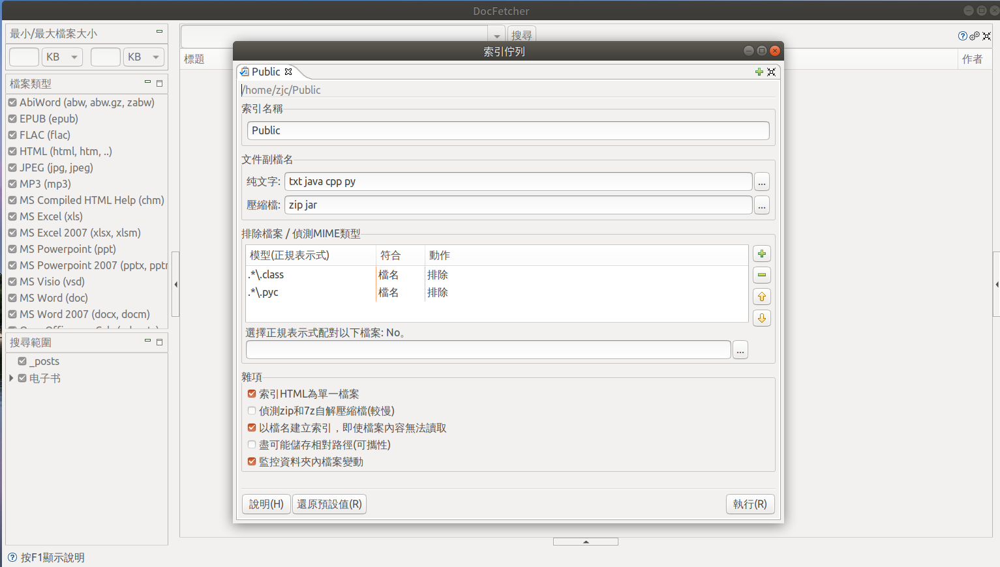

#   Ubuntu中安装桌面搜索应用DocFetcher
description: Ubuntu中安装桌面搜索应用DocFetcher
date: 2020-07-07 08:15:49
categories:
- Ubuntu
tags:
- Ubuntu装机日志
---
#   作用
+   DocFetcher 是一个使用 Java 语言开发的开源桌面搜索应用程序
    *   能搜索docx和pdf的内容

#   平台
Windows，Linux 和 OS X

#   安装
1.  基于java,所以需要运行环境：Java Runtime Environment（JRE）1.7 +
2.  参考官网说明:[http://docfetcher.sourceforge.net/en/download.html](http://docfetcher.sourceforge.net/en/download.html)

#   使用方法
##  建立索引

为了快速的进行文本检索，DocFetcher 在检索文档文本前需要建立索引，用户可以根据需要为文件夹或者整个磁盘建立索引，当然，仅仅在第一次检索时需要为所要检索的文件夹或磁盘建立索引，建立索引后，当文件内容发生了变化 DocFetcher 会自动更新索引。以下是建立索引的详细方法：

1.  如图所示，右击[搜索范围]框的空白处，选择弹出菜单中的[建立索引 - 资料夹]。

2.  在弹出的选择窗口中选择需要检索文档的位置，点击[确认]。

3.  在弹出的窗口中可以对索引的细节进行设置，可以选择所要检索的文件格式，在排除列表中可以使用正则表达式过滤不需要建立索引的文件和文件格式，其他选项没有特殊要求使用默认值即可。最后选择[执行]，将开始建立索引。

4.  建立索引的过程耗时较长，具体时间取决于所选建立索引的文件夹中包含的文件数量及文件大小。索引建立完成后在首页的[搜索范围]框内便有了对应的目录。

##  检索数据

对于建立好索引的目录，可以通过勾选检索目录、勾选文件类型、设定文件大小、输入关键字来进行文本检索，这里仅对 DocFetcher 的检索语法做简单介绍，详细内容请参照官方文档。
+   短语搜索：需要将所要检索的短语放入英文双引号内。如 ："可转债"，返回包含词语"可转债"的文件；
+   布尔运算：支持复杂条件的检索，常用运算符包含 AND、OR 、NOT 等，短语间没有运算符时将默认使用 OR。如 "可转债" AND "可交换债"，返回既包含短语"可转债"又包含短语"可交换债"的文件；
+   通配符：问号（'?'）和星号（'*'）可用于表示某些字符未知。如 ："可"*，返回包含"可以"、"可转债"、"可交换债"等包含以"可"开头的语句的文件；
+   模糊搜索：可以搜索与给定单词类似的单词。如，roam~，返回包含 foam 和的单词的文档 roams 的文件。

###     检索关键字格式
关键字是默认分词的，中文分词有时候一言难尽，所以**如果想搜索整个词语请务必使用英文双引号括住**，否则将导致 DocFetcher 将词语分词后使用 OR 运算进行检索，最终使检索结果出乎意料

#   参考
[DocFetcher 使用教程——高效的文档文本检索工具](https://hacpai.com/article/1568960776746#part1-%E5%BB%BA%E7%AB%8B%E7%B4%A2%E5%BC%95)
