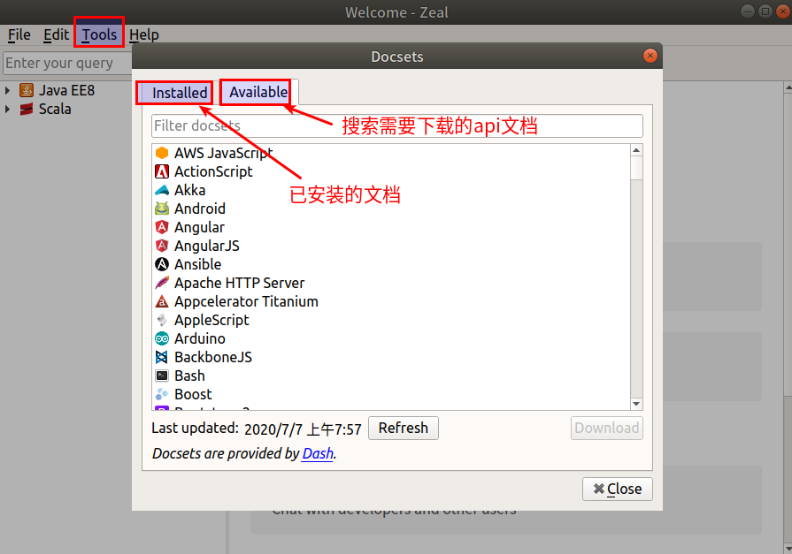

#   官网
[Zeal](https://zealdocs.org/)

#   作用
离线 API 文档大全

#   平台
Linux 和 Windows 

#   安装
+   参考这里[https://zealdocs.org/download.html](https://zealdocs.org/download.html)
+   ubuntu安装
```shell
sudo apt-get install zeal
```

#   使用
##  下载文档
在初次安装 Zeal 之后，需要转到 File → Options → Docsets 先下载文档，然后方能使用


##  使用文档
+   有两种方式来查询文档
    *   直接输入 keyword 关键字进行查询，这将搜索已下载的所有文档。
    *   包含文档类型前缀的查询，例如：python:keyword 这将仅限于搜索 Python 文档。


