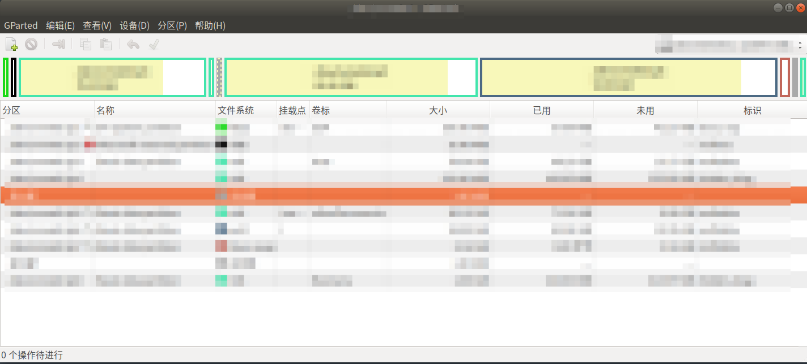

#   Ubuntu中安装分区管理工具gparted
description: Ubuntu中安装分区管理工具gparted
date: 2020-07-08 15:16:44
categories:
- Ubuntu
tags:
- Ubuntu装机日志
---
#   作用
+   [官网](https://gparted.org/index.php)
+   GNOME Partition Editor,分区管理工具

#   安装
+   [https://gparted.org/download.php](https://gparted.org/download.php)
+   Ubuntu安装
```shell
sudo apt-get install gparted
```
+   主界面



