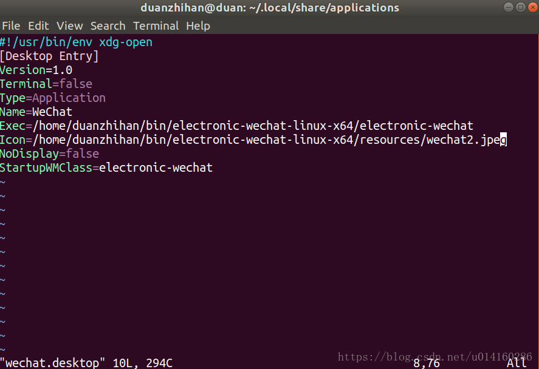
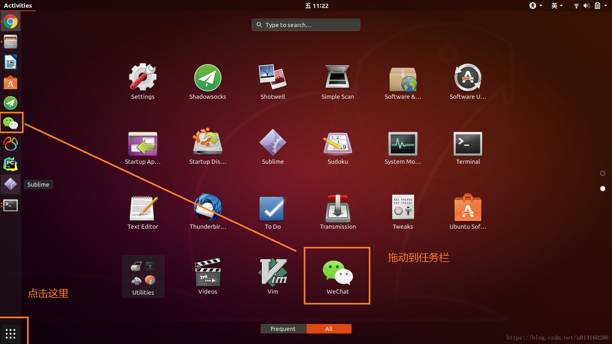
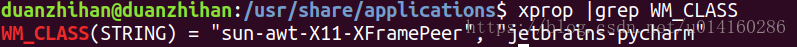

#   Ubuntu18.04如何固定图标到任务栏
+ date: 2020-07-18 14:53:24
+ description: Ubuntu18.04如何固定图标到任务栏
+ categories:
  - Ubuntu
+ tags:
  - Ubuntu装机日志
---
#   添加图标
```shell
sudo vim /usr/share/applications/softName.desktop
或者
sudo vim ~/.local/share/applications/softName.desktop
```
+   softName就是添加快捷方式的名称，也就是软件的名称

添加如下内容
```
[Desktop Entry]
#!/usr/bin/env xdg-open
[Desktop Entry]
Version=1.0
Terminal=false
Type=Application
Name=
Exec=
Icon=
NoDisplay=false
StartupWMClass=
```




说明

+   [Desktop Entry] 每个desktop文件都以这个标签开始，说明这是一个Desktop Entry文件
+   Version = 1.0 标明Desktop Entry的版本（可选）
+   Name = IdeaIU 程序名称（必须），这里以创建一个idea的快捷方式为例
+   GenericName = IdeaIU 程序通用名称（可选）
+   Comment =IdeaIU 程序描述（可选）
+   Exec = 程序的启动命令（必选），可以带参数运行
+   Icon = 设置快捷方式的图标（可选），当Type为Application，此项有效
+   Terminal = false 是否在终端中运行（可选），当Type为Application，此项有效
+   Type = Application desktop的类型（必选），常见值有“Application”和“Link”
+   Categories = GNOME;Application;Network; //注明在菜单栏中显示的类别（可选）

#   将图标放到任务栏
点击应用按钮，把刚生成的应用图标拖到任务栏中




但是有可能会出现启动应用出现双图标,如下


为了解决这个问题，首先打开应用，然后在终端输入：
```shell
xprop |grep WM_CLASS
```
此时鼠标指针会变成一个十字准心，点击已经打开的软件界面，终端会反馈一条信息，包括2个字符串



把第1个字符串里的内容添加到StartupWMClass里，保存，关闭应用重新打开，将不会出现双图标的情况了


