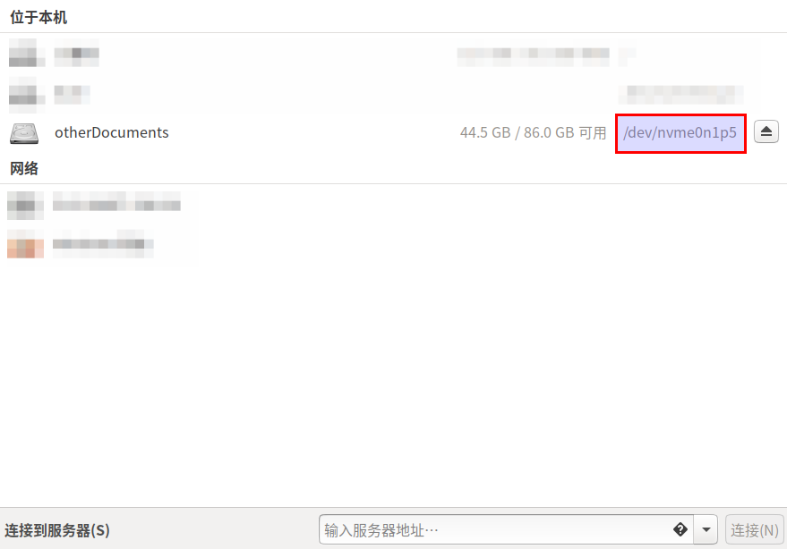
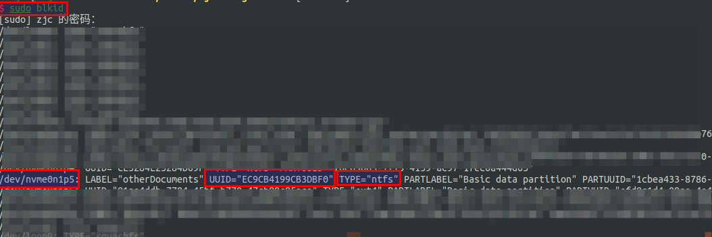

#   Ubuntu设置开机自动加/挂载硬盘
+ date: 2020-07-24 18:28:39
+ description: Ubuntu设置开机自动加/挂载硬盘
+ categories:
  - Ubuntu
+ tags:
  - Ubuntu装机日志
---
#   找到要挂载的磁盘的名称




#   查看磁盘的分区UUID

1.  新打开一个终端：sudo blkid 
2.  找到分区的UUID与tpye




#   在/etc/fstab中添加
```bash
# /etc/fstab: static file system information.
#
# Use 'blkid' to print the universally unique identifier for a
# device; this may be used with UUID= as a more robust way to name devices
# that works even if disks are added and removed. See fstab(5).
#
# <file system> <mount point>   <type>  <options>       <dump>  <pass>
# # <file system> 磁盘设备名或该设备的Label
# # <mount point> 挂载点（目录）
# # <type> 磁盘分区的文件系统
# # <options> 文件系统参数
# # <dump> 能否被dump命令作用
# # <pass> 是否以fsck检测扇区

# / was on /dev/nvme0n1p5 during installation
UUID=81ae4ddb-7784-45bf-b770-47cb89c85aca /               ext4    errors=remount-ro 0       1
# /boot/efi was on /dev/nvme0n1p1 during installation
UUID=3024-823F  /boot/efi       vfat    umask=0077      0       1
# swap was on /dev/nvme0n1p6 during installation
UUID=7b9777a0-d735-4c9e-b6ba-109ffce567c2 none            swap    sw              0       0

# 复制前面的
# UUID=81ae4ddb-7784-45bf-b770-47cb89c85aca /               ext4    errors=remount-ro 0       1
# 将UUID改为前面得到的UUID
# 把/改为/media/zjc/otherDocuments
# 把errors=remount-ro改为defaults
# 后面的1改0
UUID=EC9CB4199CB3DBF0 /media/zjc/otherDocuments               ntfs    defaults 0       1
```


