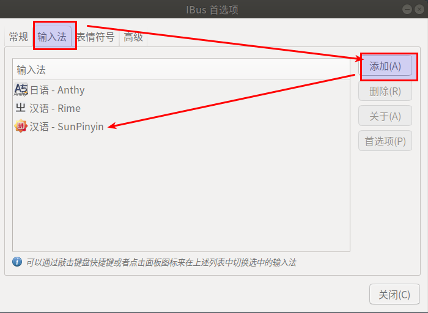
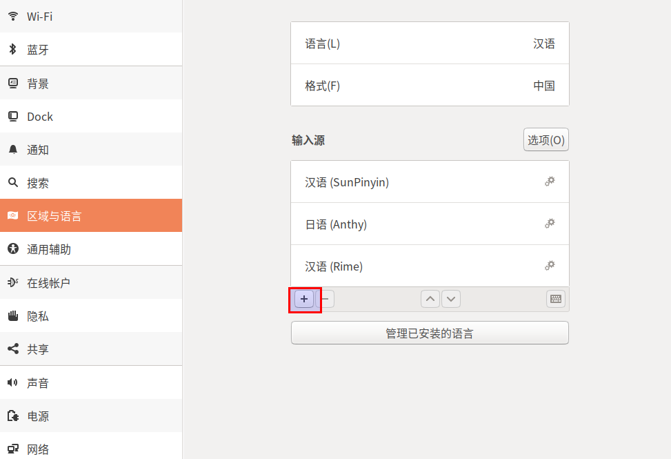
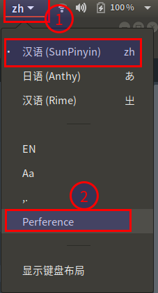

#   ubuntu18.04中ibus-sunpinyin的安装与设置
+ date: 2020-07-26 11:43:09
+ description: ubuntu18.04中ibus-sunpinyin的安装与设置
+ categories:
  - Ubuntu
+ tags:
  - Ubuntu配置
---
#   安装
```bash
sudo apt-get install ibus-sunpinyin
```

#   添加
1.  配置
终端输入
```bash
ibus-setup
```




2.  在设置中添加sun-pinyin输入法




#   设置




##  有可能打不开(问题如下)
1.  ubuntu18.04安装了ibus-pinyin, 选用了sunpinyin，但是无法调出sunpinyin的设置窗口。
2.  当通过命令/usr/lib/ibus/ibus-setup-sunpinyin时，出现如下错误：

```python
Traceback (most recent call last):
  File "/usr/share//ibus-sunpinyin/setup/main.py", line 42, in <module>
    import ibus
ImportError: No module named ibus
```

##  解决
需要安装python-ibus，到 https://launchpad.net/ubuntu/trusty/amd64/python-ibus/1.5.5-1ubuntu3.2 下载`python-ibus_1.5.5-1ubuntu3.2_all.deb`安装包，通过命令安装即可
```bash
sudo gdebi python-ibus_1.5.5-1ubuntu3.2_all.deb

#   如果没有gdebi命令,用如下命令安装
sudo apt-get install gdebi
```

#   修改候选字的大小
+   安装gnome的插件`ibus font setting`
+   地址：[https://extensions.gnome.org/extension/1121/ibus-font-setting/](https://extensions.gnome.org/extension/1121/ibus-font-setting/)

#   如果配置没有生效
1.  遇事不决先重启
```bash
ibus restart
```
2.  注销系统重新登录

