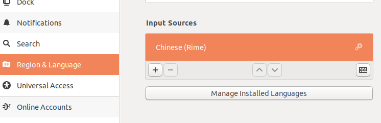

#   官方网站及文档
[https://rime.im/](https://rime.im/)

#   安装
1.  安装
```bash
sudo apt install ibus-rime
```

2.  添加Rime输入法


#   配置
+   Rime的配置是没有界面的
+   根据个人喜好修改配置文件：一般用户直接修改`default.yaml`即可。修改前最好备份一下
    *   网上有很多高端教程要大家创建`default.custom.yaml`，是因为rime升级的时候貌似会进行覆盖操作
    *   但我实践中还是认为找个地方记下来才靠谱，这种基础配置，除非系统爆炸，否则不会再打开第二次的。增加`default.custom.yaml`，以后看到反而更容易出现混乱。

```bash
vim ~/.config/ibus/rime/default.yaml
```
如下修改
```yaml
schema_list:   
  - schema: luna_pinyin_simp #simp是简体，第一位是默认输入法 
menu:
  page_size: 7 #每页候选词个数
ascii_composer:
  switch_key:
    Shift_L: commit_code #左shift提交字母
```
修改完之后重启
```bash
ibus restart
```

#   修改候选字的大小
+   安装gnome的插件`ibus font setting`
+   地址：[https://extensions.gnome.org/extension/1121/ibus-font-setting/](https://extensions.gnome.org/extension/1121/ibus-font-setting/)
