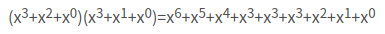

#   循环冗余校验（CRC）算法
date: 2020-07-27 22:39:14
description: 循环冗余校验（CRC）算法
categories:
- 数据结构与算法
---
#   参考
1.  [知乎:https://www.zhihu.com/question/20303082/answer/158430490 -- 作者：红猴子](https://www.zhihu.com/question/20303082/answer/158430490)
2.  [循环冗余校验（CRC）算法入门引导](https://blog.csdn.net/liyuanbhu/article/details/7882789)

#   从奇偶校验说起
所谓通讯过程的校验是指在通讯数据后加上一些附加信息，通过这些附加信息来判断接收到的数据是否和发送出的数据相同。比如说RS232串行通讯可以设置奇偶校验位，所谓奇偶校验就是在发送的每一个字节后都加上一位，使得每个字节中1的个数为奇数个或偶数个。比如我们要发送的字节是0x1a，二进制表示为0001 1010。

采用奇校验，则在数据后补上个0，数据变为0001 1010 0，数据中1的个数为奇数个（3个）

采用偶校验，则在数据后补上个1，数据变为0001 1010 1，数据中1的个数为偶数个（4个）

接收方通过计算数据中1个数是否满足奇偶性来确定数据是否有错。

奇偶校验的缺点也很明显，首先，它对错误的检测概率大约只有50%。也就是只有一半的错误它能够检测出来。另外，每传输一个字节都要附加一位校验位，对传输效率的影响很大。因此，在高速数据通讯中很少采用奇偶校验。奇偶校验优点也很明显，它很简单，因此可以用硬件来实现，这样可以减少软件的负担。因此，奇偶校验也被广泛的应用着。

奇偶校验就先介绍到这来，之所以从奇偶校验说起，是因为这种校验方式最简单，而且后面将会知道奇偶校验其实就是CRC 校验的一种(CRC-1)。

#   累加和校验

另一种常见的校验方式是累加和校验。所谓累加和校验实现方式有很多种，最常用的一种是在一次通讯数据包的最后加入一个字节的校验数据。这个字节内容为前面数据包中全部数据的忽略进位的按字节累加和。比如下面的例子：

我们要传输的信息为： 6、23、4

加上校验和后的数据包：6、23、4、33

这里 33 为前三个字节的校验和。接收方收到全部数据后对前三个数据进行同样的累加计算，如果累加和与最后一个字节相同的话就认为传输的数据没有错误。

累加和校验由于实现起来非常简单，也被广泛的采用。但是这种校验方式的检错能力也比较一般，对于单字节的校验和大概有1/256 的概率将原本是错误的通讯数据误判为正确数据。之所以这里介绍这种校验，是因为CRC校验在传输数据的形式上与累加和校验是相同的，都可以表示为：通讯数据 校验字节（也可能是多个字节）

#   CRC(Cyclic Redundancy )算法
CRC 算法的基本思想是将传输的数据当做一个位数很长的数。将这个数除以另一个数。得到的余数作为校验数据附加到原数据后面

##  发送端计算CRC的过程
+   为什么添加4个0后面说明
+   什么是生成多项式后面说明
+   为什么是XOR后面说明

##  验证码串是否正确

#   生成多项式
比如说我们有两个二进制数，分别为：1101 和1011。

1101 与如下的多项式相联系：

1011与如下的多项式相联系：

两个多项式的乘法：

得到结果后，**合并同类项时采用模2运算**。也就是说乘除法采用正常的多项式乘除法，而加减法都采用模2运算。所谓模2运算就是结果除以2后取余数。比如3 mod 2 = 1。
因此，上面最终得到的多项式为：

对应的二进制数:111111 (注意:这里理论上要有7个1,但这里只写了6个1,去掉的是最高位的1,原因在后面会说明)

加减法采用模2运算后其实就成了一种运算了，就是我们通常所说的异或运算：

|异或加法|异或减法|
|----|----|
|0+0=0|0-0=0|
|0+1=1|1-0=1|
|1+0=1|0-1=1|
|1+1=0|1-1=0|

采用了模2的加减法后，不需要考虑借位的问题，所以除法变简单了。最后得到的余数就是CRC 校验字。为了进行CRC运算，也就是这种特殊的除法运算，必须要指定个被除数，在CRC算法中，这个被除数有一个专有名称叫做“生成多项式”。生成多项式的选取是个很有难度的问题，如果选的不好，那么检出错误的概率就会低很多。好在这个问题已经被专家们研究了很长一段时间了，对于我们这些使用者来说，只要把现成的成果拿来用就行了。

最常用的几种生成多项式如下：

##  什么是位宽
文献中提到的生成多项式经常会说到多项式的位宽（Width，简记为W），这个**位宽不是多项式对应的二进制数的位数，而是位数减1**。

比如CRC8中用到的位宽为8的生成多项式，其实对应得二进制数有九位：100110001。另外一点，多项式表示和二进制表示都很繁琐，交流起来不方便，因此，文献中多用16进制简写法来表示，因为生成多项式的最高位肯定为1，最高位的位置由位宽可知，**故在简记式中，将最高的1统一去掉了**，如CRC32的生成多项式简记为04C11DB7实际上表示的是104C11DB7。当然，这样简记除了方便外，在编程计算时也有它的用处。

##  为什么理论上有7个1但只写了6个
+   对于**对应的二进制数:111111 (注意:这里理论上要有7个1,但这里只写了6个1,去掉的是最高位的1,原因在后面会说明)**的例子，是将最高的1统一去掉了

##  为什么需要补4个0
+   对于**发送端计算CRC的过程**的例子，除数是5位数10011，也就是位宽为4（W=4），按照CRC算法的要求，计算前要在原始数据后填上W个0，也就是4个0。

##  奇偶校验与生成多项式的关系
位宽W=1的生成多项式(CRC1)有两种，分别是X^1和X^1+X^0，读者可以自己证明10 对应的就是奇偶校验中的奇校验，而11对应则是偶校验。因此，写到这里我们知道了奇偶校验其实就是CRC校验的一种特例，这也是我要以奇偶校验作为开篇介绍的原因了。

