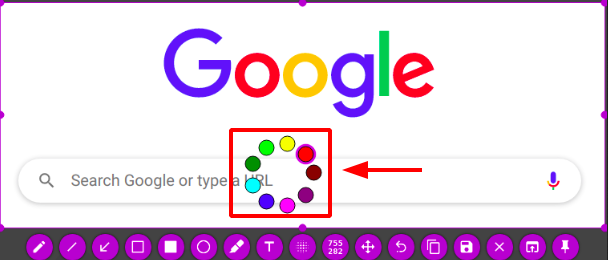

#   Ubuntu20.04中安装flameshot截屏工具
+ date: 2020-08-01 23:27:28
+ description: 截图工具，可添加文字、箭头等
+ categories:
  - Ubuntu
+ tags:
  - Ubuntu装机日志
---
#   作用
截图工具，可添加文字、箭头等

#   安装
在软件商店里有，直接搜索软件名`flameshot`安装就行

#   效果图




#   使用
##  快捷键
|快捷键     |描述|
|----|----|
|←、↓、↑、→     |移动选择区域 1px|
|Shift + ←、↓、↑、→     |将选择区域大小更改 1px|
|Esc     |退出截图|
|Ctrl + C    |复制到粘贴板|
|Ctrl + S    |将选择区域保存为文件|
|Ctrl + Z    |撤销最近的一次操作|
|鼠标右键    |展示颜色拾取器|
|鼠标滚轮    |改变工具的宽度|

边按住 Shift 键并拖动选择区域的其中一个控制点将会对它相反方向的控制点做类似的拖放操作。

##  Flameshot 命令行选项
Flameshot 支持一系列的命令行选项来延时截图和保存图片到自定义的路径。

要使用 Flameshot GUI 模式，运行：
```
flameshot gui
```

要使用 GUI 模式截屏并将你选取的区域保存到一个自定义的路径，运行：
```
flameshot gui -p ~/myStuff/captures
```

要延时 2 秒后打开 GUI 模式可以使用：
```
flameshot gui -d 2000
```

要延时 2 秒并将截图保存到一个自定义的路径（无 GUI）可以使用：
```
flameshot full -p ~/myStuff/captures -d 2000
```

要截图全屏并保存到自定义的路径和粘贴板中使用：
```
flameshot full -c -p ~/myStuff/captures
```

要在截屏中包含鼠标并将图片保存为 PNG 格式可以使用：
```
flameshot screen -r
```

要对屏幕 1 进行截屏并将截屏复制到粘贴板中可以运行：
```
flameshot screen -n 1 -c
```

#   参考
[Linux中的截图工具 - Flameshot](https://www.jianshu.com/p/20fc667279ea)
[Ubuntu 20.04 截图软件的使用 (gnome-screenshot、flameshot、shutter 截图编辑三叉戟)](https://www.sinocalife.com/ubuntu-20-04-screenshot-trident-tools-gnome-screenshot-flameshot-shutter)
