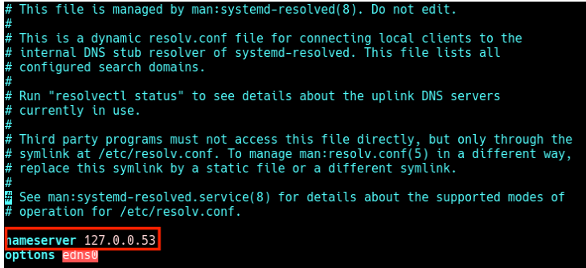
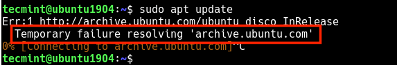
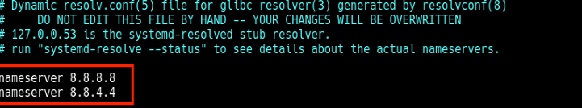
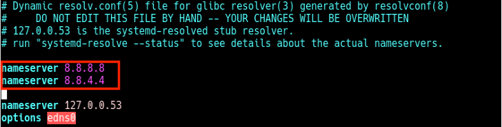

#   修改DNS的方法
修改文件 `/etc/resolvconf/resolv.conf.d/head`（这个文件默认为空），添加以下内容：
```
nameserver 114.114.114.114
```
:wq 保存退出

执行更新：
```
resolvconf -u
```

通过 `/etc/resolv.conf` 查看 DNS 设置:

可看到多了:
```
nameserver 114.114.114.114
```

#   /etc/resolv.conf基本说明
/etc/resolv.conf是DNS名称解析器库的主要配置文件。

解析程序是C库中的一组函数，提供对Internet域名系统 （ DNS ）的访问。 这些功能被配置为检查/etc/hosts文件或多个DNSNameservers中的条目，或者使用主机的网络信息服务 （ NIS ）数据库。

在使用systemd（系统和服务管理器）的现代Linux系统上，DNS或名称解析服务通过systemd解析的服务提供给本地应用程序。

默认情况下，此服务具有四种用于处理域名解析的模式，并在默认操作模式下使用systemd DNS存根文件（ /run/systemd/resolve/stub-resolv.conf ）。

DNS存根文件包含本地存根127.0.0.53作为唯一的DNS服务器，并且重定向到/etc/resolv.conf文件，该文件用于添加系统使用的Nameservers。

如果在/etc/resolv.conf上运行以下ls命令 ，您将看到该文件是/run/systemd/resolve/stub-resolv.conf文件的符号链接。

```console
$ ls -l /etc/resolv.conf
lrwxrwxrwx 1 root root 39 Feb 15  2019 /etc/resolv.conf -> ../run/systemd/resolve/stub-resolv.conf
```

不幸的是，由于/etc/resolv.conf是由systemd解析的服务间接管理的，在某些情况下是由网络服务（通过使用initscripts或NetworkManager ）间接管理的，因此，用户手动进行的任何更改都无法永久保存或仅保存持续一会儿。

#   为什么要修改 /etc/resolv.conf文件？

主要原因可能是因为系统DNS设置配置错误，或者您更喜欢使用特定的Nameservers或您自己的Nameservers。 以下cat命令在我的Ubuntu系统上的/etc/resolv.conf文件中显示默认Nameservers。 
```
cat /etc/resolv.conf
```


##  检查DNSNameservers

在这种情况下，当APT程序包管理器之类的本地应用程序尝试访问本地网络上的FQDN （ 完全合格的域名 ）时，结果是“ 名称解析临时失败 ”错误，如下图所示。


##  临时故障解决

当您运行ping命令时，也会发生同样的情况。
```
$ ping google.com
```


名称解析暂时失败

因此，当用户尝试手动设置Nameservers时，更改不会持续很长时间，也不会在重新启动后被撤销。 要解决此问题，您可以安装并使用reolvconf实用程序使更改永久生效 。

要安装下一部分中所示的resolvconf软件包，首先需要在/etc/resolv.conf文件中手动设置以下Nameservers，以便在Internet上访问Ubuntu仓库服务器的FQDM。 
```
nameserver 8.8.4.4
nameserver 8.8.8.8
```

#   在Ubuntu和Debian中安装resolvconf

首先，更新系统软件包，然后通过运行以下命令从官方系统信息库安装resolvconf 。
```
$ sudo apt update
$ sudo apt install resolvconf
```
一旦resolvconf安装完成， systemd将触发resolvconf.service自动启动和启用。 要检查它是否已启动并正在运行，请发出以下命令。
```
$ sudo systemctl status resolvconf.service
```
如果由于某种原因未启动并自动启用该服务，则可以按以下步骤启动并启用它。
```
$ sudo systemctl start resolvconf.service
$ sudo systemctl enable resolvconf.service
$ sudo systemctl status resolvconf.service
```

#   在Ubuntu和Debian中设置永久DNSNameservers
接下来，打开/etc/resolvconf/resolv.conf.d/head配置文件。
```
$ sudo nano /etc/resolvconf/resolv.conf.d/head
```
并在其中添加以下几行：
```
nameserver 8.8.8.8 
nameserver 8.8.4.4
```


在Resolvconf中设置永久DNSNameservers

保存更改，然后重新启动resolvconf.service或重新引导系统。
```
$ sudo systemctl start resolvconf.service
```
现在，当您检查/etc/resolv.conf文件时，Nameservers条目应永久存储在此处。 从今以后，您将不会在系统上遇到任何有关名称解析的问题

永久DNSNameservers
