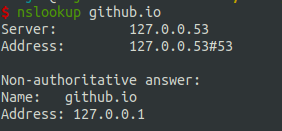
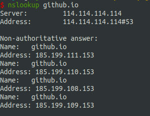
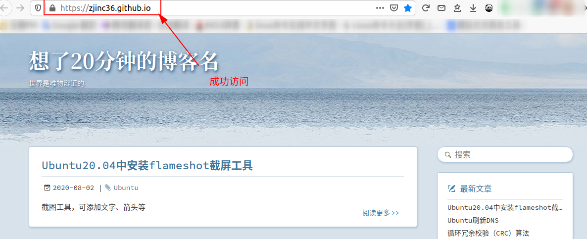

#   解决Github-Page无法访问的其中一种情况
date: 2020-08-26 12:56:43
description: 解决Github-Page无法访问的其中一种情况
categories:
- 未分类
---
#   修改ip
网上很多帖子,但是我修改之后无效

#   修改dns服务器
1.  查看域名指向哪里
```
nslookup github.io
```
我本地如下,指向了127.0.0.1,所以确认是需要修改dns服务器地址了




2.  修改dns服务器地址
修改文件 /etc/resolvconf/resolv.conf.d/head（这个文件默认为空），添加以下内容：
```
nameserver 114.114.114.114
```

执行更新：
```
resolvconf -u
```
通过 /etc/resolv.conf 查看 DNS 设置,可看到多了:
```
nameserver 114.114.114.114
```
此时nslookup可以看到如下



然后能成功访问




