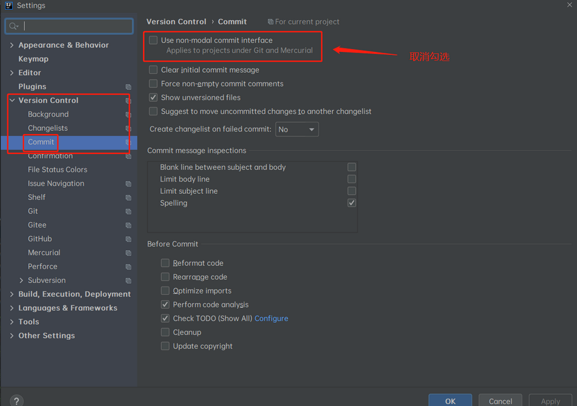

#   idea不显示Local Changes界面
+ date: 2021-01-02 12:01:43
+ description: idea不显示Local Changes界面
+ categories:
  - idea
+ tags:
  - idea配置日志
---
#   按照如下操作调出Local Changes界面
Settings --> Version Control --> Commit -->取消勾选Use non-madal commit interface--> 点击Apply

