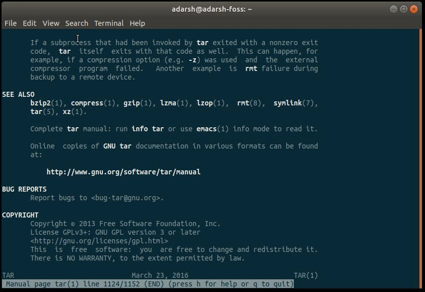
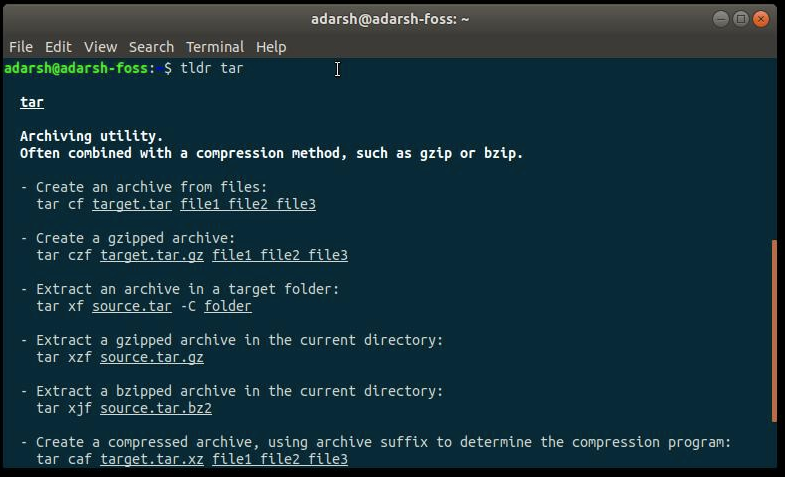
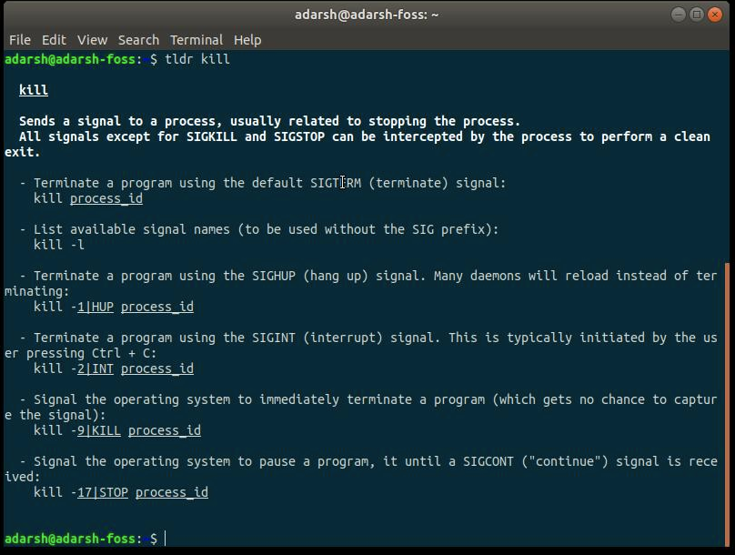

#   tldr-简化版man
+ date: 2021-01-02 12:01:43
+ description: tldr-简化版man
+ categories:
  - Ubuntu
+ tags:
  - Linux命令
---
#   tldr命令是什么
TLDR 页的 GitHub 仓库将其描述为简化的、社区驱动的手册页集合。在实际示例的帮助下，努力让使用手册页的体验变得更简单。如果还不知道，TLDR 取自互联网的常见俚语：太长没读Too Long Didn’t Read。

如果你想比较一下，让我们以 tar 命令为例。 通常，手册页的篇幅会超过 1000 行。tar 是一个归档实用程序，经常与 bzip 或 gzip 等压缩方法结合使用。看一下它的手册页：




而另一方面，TLDR 页面让你只是浏览一下命令，看看它是如何工作的。 tar 的 TLDR 页面看起来像这样，并带有一些方便的例子 —— 你可以使用此实用程序完成的最常见任务：




#   安装
1.  最成熟的 TLDR 客户端是基于 Node.js 的，你可以使用 NPM 包管理器轻松安装它。如果你的系统上没有 Node 和 NPM，请运行以下命令：
```
sudo apt-get install nodejs
sudo apt-get install npm
```
2.  现在，通过在终端中运行以下命令，在 Linux 机器上安装 TLDR 客户端：
```
sudo npm install -g tldr 
```
3.  一旦安装了此终端实用程序，最好在尝试之前更新其缓存。 为此，请运行以下命令：
```
tldr  --update 
```
4.  执行此操作后，就可以阅读任何 Linux 命令的 TLDR 页面了。 为此，只需键入：
```
tldr  <commandname> 
```




#   错误说明
1.  如果出现如下错误，是nodejs版本太低，要升级
```
/usr/local/lib/node_modules/tldr/node_modules/fs-extra/lib/mkdirs/make-dir.js:85
      } catch {
              ^

SyntaxError: Unexpected token {
    at new Script (vm.js:51:7)
    at createScript (vm.js:136:10)
    at Object.runInThisContext (vm.js:197:10)
    at Module._compile (module.js:613:28)
    at Object.Module._extensions..js (module.js:660:10)
    at Module.load (module.js:561:32)
    at tryModuleLoad (module.js:501:12)
    at Function.Module._load (module.js:493:3)
    at Module.require (module.js:593:17)
    at require (internal/module.js:11:18)
```

2.  升级操作
+   更新npm，执行`npm install -g npm`
+   升级nodejs，主要包含如下三步:
    -   第一步：先清除npm缓存：npm cache clean -f
    -   第二步：安装n模块：`npm install -g n` (n模块专门用来管理nodejs的版本)
    -   第三步：升级node.js到最新稳定版：`n stable`  (当然也可以选择最新版本 n lastest)
