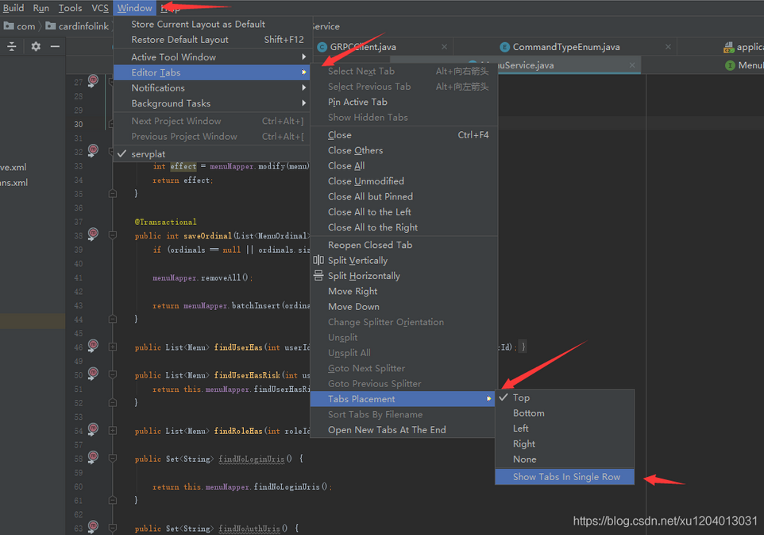

#   idea控制标签页多行显示
+ date: 2021-04-21 10:04:43
+ description: idea控制标签页多行显示
+ categories:
  - idea
+ tags:
  - idea配置日志
---
#   按照如下操作调出Local Changes界面
Window --> Editor --> Tabs Placement --> Show Tabs In Single Row

