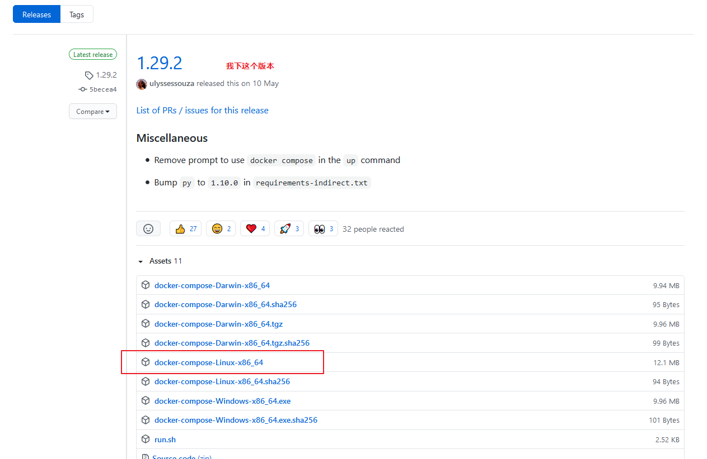

#   centos7.x离线安装docker

##  下载docker安装文件

+   离线安装docker，需要下载docker的安装文件
+   地址：https://download.docker.com/linux/static/stable/x86_64/
+   我下的是最新的版本`docker-18.03.1-ce.tgz`

##  离线docker安装

将安装包文件上传到服务器目录并解压。

```
[root@iZbp13sno1lc2yxlhjc4b3Z ~]#tar -zxvf docker-18.03.1-ce.tgz
```

将解压出来的docker文件内容移动到 /usr/bin/ 目录下

```
[root@iZbp13sno1lc2yxlhjc4b3Z ~]#cp docker/* /usr/bin/
```

##  将docker注册为service
在/etc/systemd/system目录下创建docker.service文件，并配置如下内容保存。

```
[root@iZbp13sno1lc2yxlhjc4b3Z ~]#vim /etc/systemd/system/docker.service
[Unit]
Description=Docker Application Container Engine
Documentation=https://docs.docker.com
After=network-online.target firewalld.service
Wants=network-online.target
[Service]
Type=notify
# the default is not to use systemd for cgroups because the delegate issues still
# exists and systemd currently does not support the cgroup feature set required
# for containers run by docker
ExecStart=/usr/bin/dockerd
ExecReload=/bin/kill -s HUP $MAINPID
# Having non-zero Limit*s causes performance problems due to accounting overhead
# in the kernel. We recommend using cgroups to do container-local accounting.
LimitNOFILE=infinity
LimitNPROC=infinity
LimitCORE=infinity
# Uncomment TasksMax if your systemd version supports it.
# Only systemd 226 and above support this version.
#TasksMax=infinity
TimeoutStartSec=0
# set delegate yes so that systemd does not reset the cgroups of docker containers
Delegate=yes
# kill only the docker process, not all processes in the cgroup
KillMode=process
# restart the docker process if it exits prematurely
Restart=on-failure
StartLimitBurst=3
StartLimitInterval=60s
 
[Install]
WantedBy=multi-user.target
```

添加文件权限并启动docker，执行如下命令：

```
#添加文件权限
chmod +x /etc/systemd/system/docker.service
#重载unit配置文件
systemctl daemon-reload
#启动Docker
systemctl start docker
#设置开机自启
systemctl enable docker.service
```

验证docker安装是否成功：

```
#查看Docker状态
systemctl status docker
#查看Docker版本
docker -v                                                                  
```

##  配置国内源
Docker在默认安装之后，通过命令docker pull 拉取镜像时，默认访问docker hub上的镜像，在国内网络环境下，下载时间较久，所以要配置国内镜像仓库。

```
第一步：新建或编辑daemon.json
vi /etc/docker/daemon.json
 
第二步：daemon.json中编辑如下
{
    "registry-mirrors": ["http://hub-mirror.c.163.com"]
}
 
第三步：重启docker
systemctl restart docker.service
 
第四步：执行docker info查看是否修改成功
docker info
```

##  安装docker-compose
下载 https://github.com/docker/compose/releases



```
mv docker-compose-Linux-x86_64 /usr/bin/docker-compose 
chmod +x /usr/bin/docker-compose

第三步：重启docker
systemctl restart docker.service

docker-compose -v
```


#   参考
[docker离线安装并导入镜像](https://www.jianshu.com/p/1dd72a6b5ae9)
