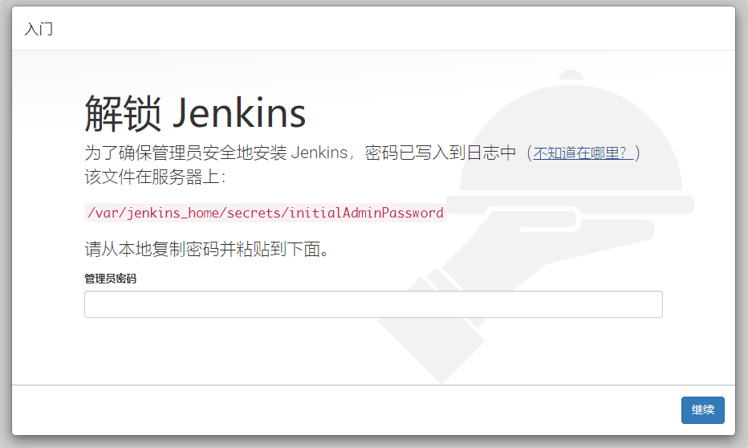
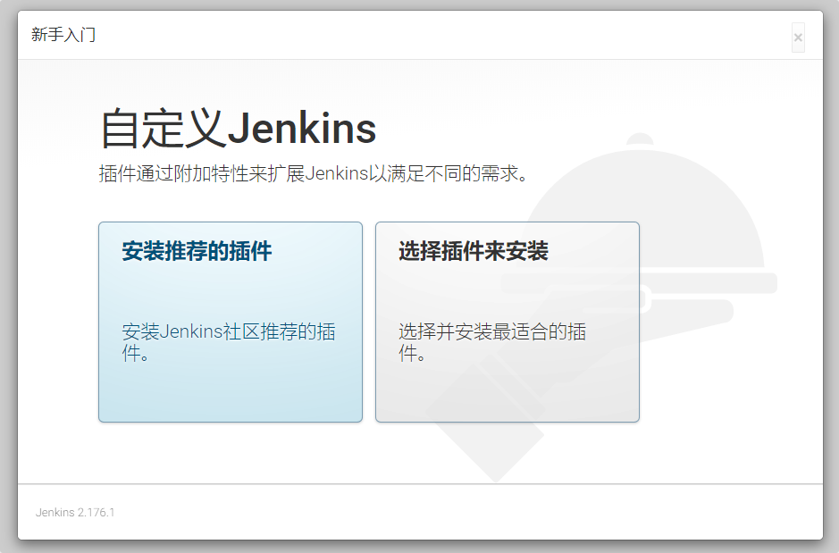
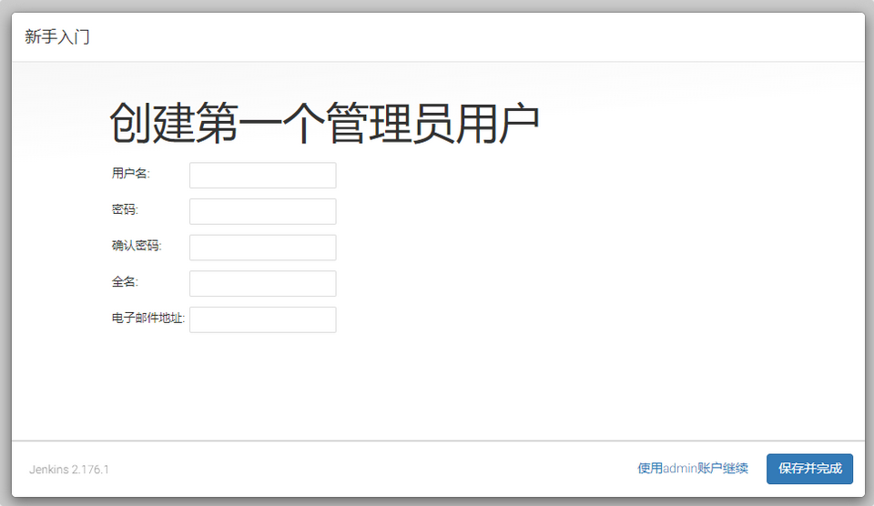
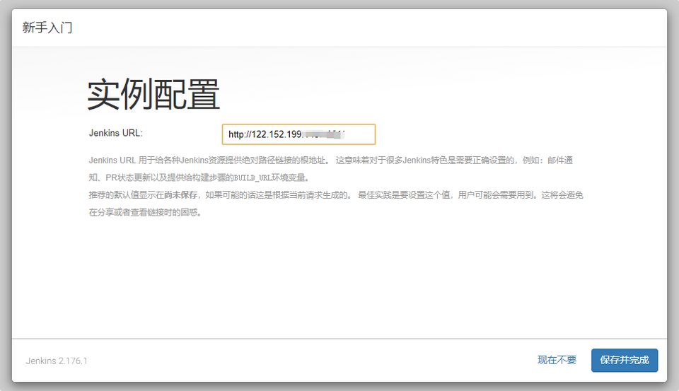

# docker安装jenkins

## 下载镜像

打开终端，输入docker search命令搜索 Docker Hub 上可用的 Jenkins 镜像：

```
$ docker search jenkins
NAME                                         DESCRIPTION                                     STARS               OFFICIAL            AUTOMATED
jenkins                                      Official Jenkins Docker image                   4328                [OK]
jenkins/jenkins                              The leading open source automation server       1563
jenkinsci/blueocean                          https://jenkins.io/projects/blueocean           399
jenkinsci/jenkins                            Jenkins Continuous Integration and Delivery …   367
jenkinsci/jnlp-slave                         A Jenkins slave using JNLP to establish conn…   110                                     [OK]
jenkins/jnlp-slave                           a Jenkins agent (FKA "slave") using JNLP to …   86                                      [OK]
...
```

根据镜像OFFICIAL标签判断，位列第一、名字为jenkins的是 Jenkins 官方提供的镜像。我们是不是应该使用这个官方镜像呢？

如果你看过 Jenkins 文档中 Docker 安装 小节，会发现官方推荐使用的镜像是jenkinsci/blueocean，该镜像包含当前的长期支持 (LTS) 的 Jenkins 版本 (可以生产使用) ，并捆绑了所有 Blue Ocean 插件和功能。

>   若使用的是jenkins镜像，其集成的 Jenkins 版本比较高，会出现好多插件不兼容的情况，对于我等小白来说是一件比较麻烦的事。

这里我们果断使用`jenkinsci/blueocean`镜像，使用docker pull命令拉取：

```
$ docker pull jenkinsci/blueocean
Using default tag: latest
latest: Pulling from jenkinsci/blueocean
Digest: sha256:523769431f19830cfda7ceae37c59c9f01affb551836933aa30114dcaa5df9eb
Status: Image is up to date for jenkinsci/blueocean:latest
```

在本地镜像仓库确认是否已存在：

```
$ docker images
REPOSITORY            TAG                 IMAGE ID            CREATED             SIZE
jenkinsci/blueocean   latest              ef2dc74fe285        21 hours ago        552MB
...
```

## 运行容器

1.  创建本地数据卷

```
mkdir -p /var/module/docker/jenkins_home
```

2.  运行

```
docker run \
  -d \
  --name jenkins \
  -p 60100:8080 \
  -p 60101:50000 \
  -v /var/jenkins_home:/var/module/docker/jenkins_home \
  jenkinsci/blueocean
```

+   -d 标识是让 docker 容器在后台运行
+   --name 定义一个容器的名字，如果没有指定，那么会自动生成一个随机数字符串当做UUID
+   -p 8040:8080 端口映射，我本地的8080被占用了，所以随便映射了一个8040
+   -p 50000:50000 端口映射
+   -v /data/jenkins_home:/var/jenkins_home 绑定一个数据卷，/data/jenkins_home是刚才创建的本地数据卷
+   Tips: 8080 端口用来公开访问 Web 界面，50000 端口允许访问远程 Java (JIRA) API。

3.  使用docker ps命令确认容器是否已经后台运行：

```
$ docker ps
```

##  配置Jenkins
### Step1:解锁jenkins
以上如果一切正常，现在就可以通过`http://<ipaddress>:60100`访问 Jenkins 的 Web 界面了



管理员初始密码被放到了/var/jenkins_home/secrets/initialAdminPassword 文件中，因为我们把 Jenkins 部署在了 Docker 容器中，因此需要先进入到容器，再去查看对应的文件initialAdminPassword内容：

```
$ docker exec -it jenkins /bin/bash
jenkins@93f88d6ca212:/$ cat /var/jenkins_home/secrets/initialAdminPassword
a6f6d08fcc474178833001d1fc79be62
```

如上输出中，a6f6d08fcc474178833001d1fc79be62 便是我们需要的管理员密码，复制并粘贴到 Web 界面，点击继续即可解锁 Jenkins。

### Step2:安装插件



Jenkins 可以说完全由插件来驱动的，所以安装一些基础的插件是非要必要的，这里我们选择 安装推荐的插件，然后静静地等待插件安装完成即可。

### Step3：创建用户



接着继续下一步操作，提示需要创建一个新的用户，自行填写即可

### Step4：配置实例



看看提示，没有问题就点 保存并完成 即可。

至此，Jenkins 初始化配置过程也就完成了。正式开启你的 持续集成&持续部署 之旅吧！
20210506140532.png

## 更换主题

如果你不喜欢 Jenkins 官方默认页面样式，你可以尝试通过如下项目更换一套基于 Material Design 设计的主题。

https://github.com/afonsof/jenkins-material-theme

安装过程请参考其相关文档，此处不再详述。

## 相关资源

+ [Install with Docker | Jenkins Documentation](https://jenkins.io/zh/doc/book/installing/#docker)
+ [jenkinsci/blueocean - Docker Hub](https://hub.docker.com/_/jenkins)
+ [jenkins - Docker Hub](https://hub.docker.com/_/jenkins)

## 参考
[使用 Docker 安装 Jenkins 的最佳方式](https://www.cnblogs.com/esofar/p/11163583.html)
