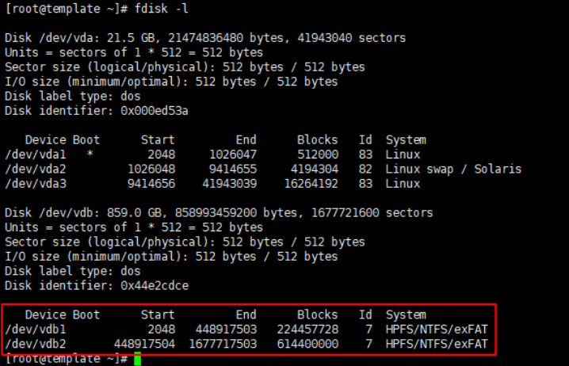

#   云服务器数据盘挂载操作

---

##  检查数据盘情况
```
$ lsblk
```

```
$ fdisk /dev/vdb
根据提示需要输入
输入n，p，1，回车，回车，wq
```

```
$ lsblk
```


##  如果挂载盘超过2T需做如下设置
+   参考: http://blog.sina.com.cn/s/blog_6d55a74b0102xcip.html
+   出现如下情况,有1T没有分区


+   原因:挂载到CentOS 7系统中，MBR格式只支持最大为2T的分区大小
+   解决方案:GPT格式没有限制，需要将硬盘设置为GPT格式

```
# 查看硬盘的分区情况，包括盘符，大小，格式等
parted -l
```


+   开始分区

```
parted /dev/sda                  #选定要操作的硬盘
此时命令提示符会变成（parted）
(parted) mklabel gpt            # 将硬盘设置为GPT格式，设置MBR:mklabel msdos
(parted) mkpart                  # 开始分区
分区名称？[]? data1               # 输入分区名称，这里设置为：data1
文件系统类型？ext2 ?               # 设置分区类型，这里设置为：ext4 （默认为ext2）
起始点？                            # 设置分区起点，这里设置为1，设置为0的话后面会报错。
结束点？                            # 设置分区终点，这里设置为1000GB
(parted)                          # 结束分区
```


+   分区结束,可以看到一个vdb1分区有3T

##  找到可用的数据盘

```
$ fdisk -l
```



可以发现当前目录有两块分区存在(如果不存在,有更前置操作)

##  格式化分区及挂载目录

### 格式化挂载数据硬盘分区

```
mkfs.ext4 /dev/vdb1
```

```
mkfs.ext4 /dev/vdb2
```

### 配置目录自动挂载

####    方案一(已废弃)
云主机系统启动时自动挂载磁盘，不能采用在 /etc/fstab直接指定 /dev/xvdb1的方法，因为云中设备的顺序编码在关闭或者开启云主机过程中可能发生改变
```
echo '/dev/vdb1  /mnt ext4    defaults    0  0' >> /etc/fstab
```

```
echo '/dev/vdb2  /mnt ext4    defaults    0  0' >> /etc/fstab
```

最终/etc/fstab文件内容如下 (下图没有更新,下图里的数据为ext4)


####    方案二(使用UUID来配置自动挂载数据盘)
https://www.ctyun.cn/help2/10000053/10002902

### 创建挂载目录

```
mkdir /mnt/vdb1
```

```
mkdir /mnt/vdb2
```

最终挂载目录如下


### 执行mount挂载操作
```
mount /dev/vdb1 /mnt/vdb1
```

```
mount /dev/vdb2 /mnt/vdb2
```

##  查看分区
查看是否挂载成功
```
df -h
```
