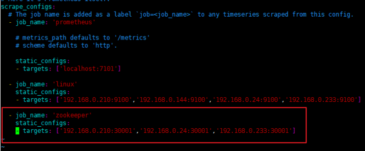
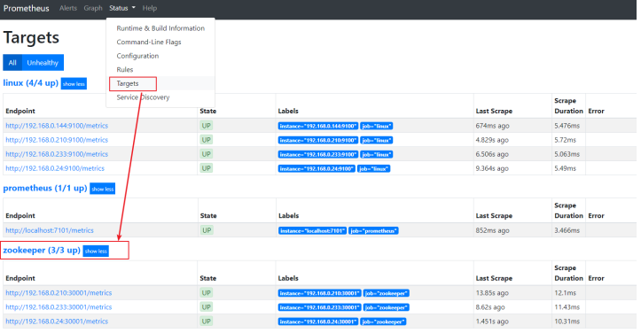
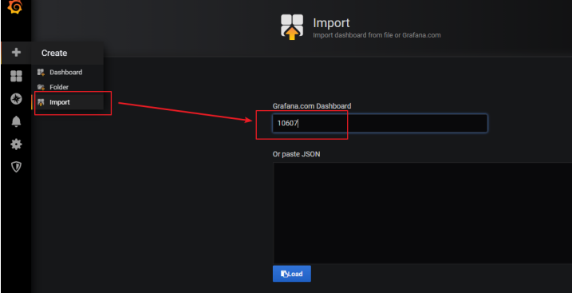
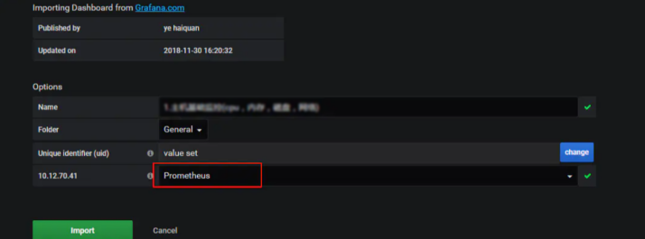
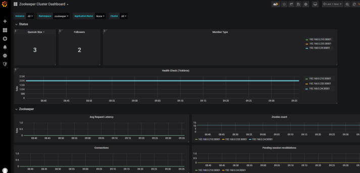

# 基于jmx_exporter采集zookeeper数据到prometheus

---

##  安装
使用ansible安装
去仓库翻

##  手动安装

### 配置zookeeper.yaml文件
1.  这个文件自己找个地方放,并记录下文件位置,我放在`/opt/module/jmx_exporter`
2.  地址在这

```
https://github.com/prometheus/jmx_exporter/blob/master/example_configs/zookeeper.yaml
```

3.  内容如下

```
rules:
  # replicated Zookeeper
  - pattern: "org.apache.ZooKeeperService<name0=ReplicatedServer_id(\\d+)><>(\\w+)"
    name: "zookeeper_$2"
    type: GAUGE
  - pattern: "org.apache.ZooKeeperService<name0=ReplicatedServer_id(\\d+), name1=replica.(\\d+)><>(\\w+)"
    name: "zookeeper_$3"
    type: GAUGE
    labels:
      replicaId: "$2"
  - pattern: "org.apache.ZooKeeperService<name0=ReplicatedServer_id(\\d+), name1=replica.(\\d+), name2=(\\w+)><>(Packets\\w+)"
    name: "zookeeper_$4"
    type: COUNTER
    labels:
      replicaId: "$2"
      memberType: "$3"
  - pattern: "org.apache.ZooKeeperService<name0=ReplicatedServer_id(\\d+), name1=replica.(\\d+), name2=(\\w+)><>(\\w+)"
    name: "zookeeper_$4"
    type: GAUGE
    labels:
      replicaId: "$2"
      memberType: "$3"
  - pattern: "org.apache.ZooKeeperService<name0=ReplicatedServer_id(\\d+), name1=replica.(\\d+), name2=(\\w+), name3=(\\w+)><>(\\w+)"
    name: "zookeeper_$4_$5"
    type: GAUGE
    labels:
      replicaId: "$2"
      memberType: "$3"
  # standalone Zookeeper
  - pattern: "org.apache.ZooKeeperService<name0=StandaloneServer_port(\\d+)><>(\\w+)"
    type: GAUGE
    name: "zookeeper_$2"
  - pattern: "org.apache.ZooKeeperService<name0=StandaloneServer_port(\\d+), name1=InMemoryDataTree><>(\\w+)"
    type: GAUGE
name: "zookeeper_$2"
```

### 添加java.env文件为zookeeper开启jmx

```
vim /opt/module/zookeeper/conf/java.env
```

键入如下内容

```
export JMX_DIR="/opt/module/jmx_exporter"
export SERVER_JVMFLAGS="$SERVER_JVMFLAGS -javaagent:$JMX_DIR/jmx_prometheus_javaagent-0.13.0.jar=30001:$JMX_DIR/zookeeper.yaml"
```

参考:https://www.codenong.com/cs106528076/

### 重启zookeeper

```
systemctl restart zookeeper.service
systemctl status zookeeper.service
```

##  配置Prometheus，收集exporter的数据

```
vim /opt/module/prometheus/prometheus.yml
```



然后重启prometheus，打开prometheus页面查看是不是有对应的数据了



##  导入grafana模板，数据展示

在导入界面，我们输入模板的编号，这里我使用的是`10607`号模板，如要使用其他的模板，请到grafana的官网去查找 https://grafana.com/dashboards



选择数据源，然后点击导入



然后你就可以看到下面一个这么形象具体好看的界面了


