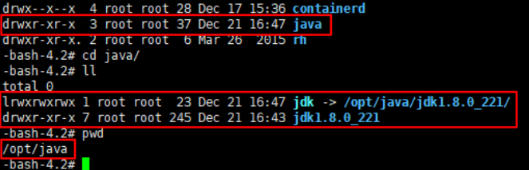

#   安装jdk

---

>   写在前面
>   这里有写了一份ansible-playbook,笔记里没有

##  安装
我放这



##  设置环境变量
1.  创建配置文件

```
cd /etc/profile.d
touch java.sh
```

2.  添加

```
export JAVA_HOME= /opt/java/jdk 
export JRE_HOME=${JAVA_HOME}/jre
export CLASSPATH=.:${JAVA_HOME}/lib:${JRE_HOME}/lib
export PATH=${JAVA_HOME}/bin:$PATH
```

3.  使环境变量生效

```
source /etc/profile
```

4.  检查

```
java -version
```
