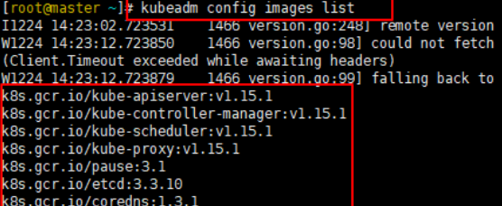
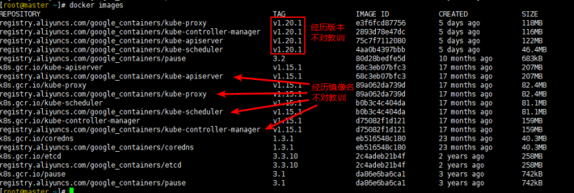
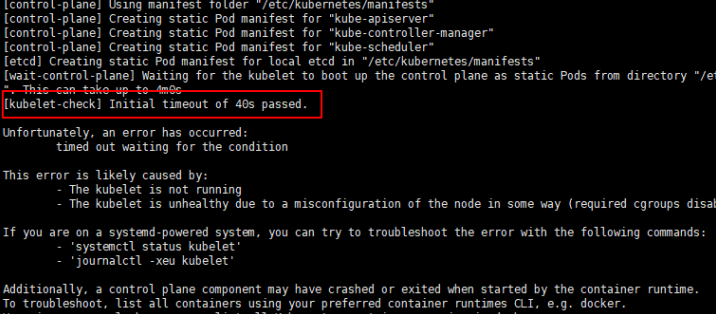
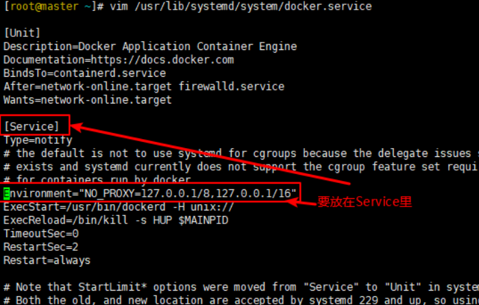
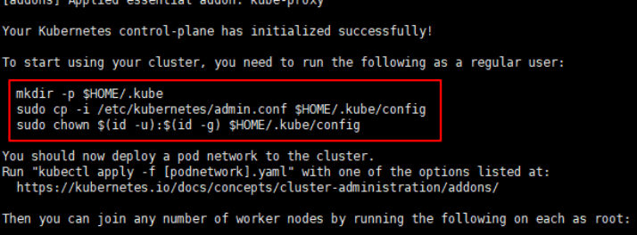
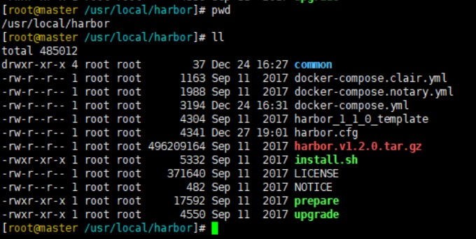
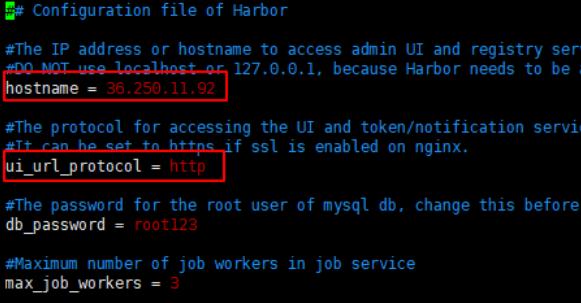
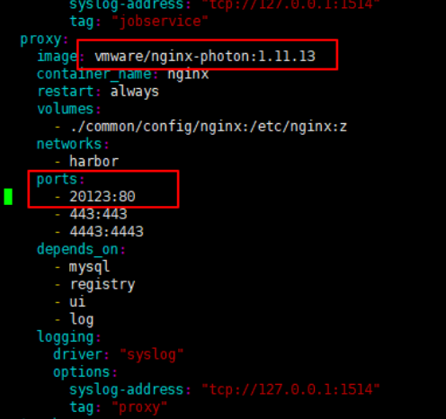
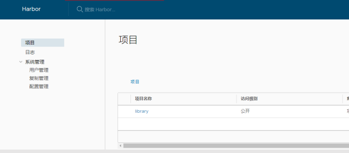
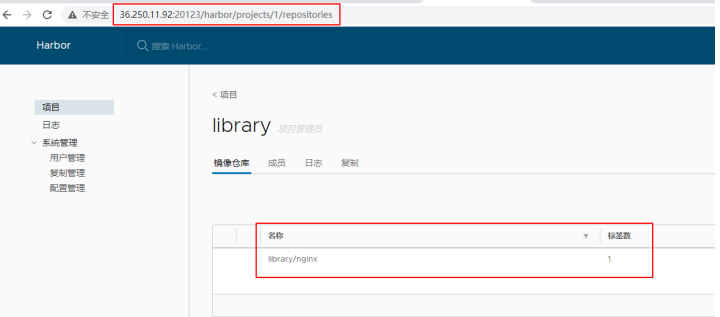

# 安装k8s和docker

---

##  centos 7 单机部署 k8s

### 卸载 kubernetes
参考:https://www.cnblogs.com/wangzy-tongq/p/13273351.html

```
kubeadm reset -f
modprobe -r ipip
lsmod
rm -rf ~/.kube/
rm -rf /etc/kubernetes/
rm -rf /etc/systemd/system/kubelet.service.d
rm -rf /etc/systemd/system/kubelet.service
rm -rf /usr/bin/kube*
rm -rf /etc/cni
rm -rf /opt/cni
rm -rf /var/lib/etcd
rm -rf /var/etcd
yum clean all
yum remove kube*
```

### 设置系统主机名以及Host文件的相互解析

```
$ hostnamectl set-hostname master
```

```
$ vim /etc/hosts
```

追加
```
192.168.11.7 master
```

### 安装依赖包

```
$ yum install -y conntrack ntpdate ntp ipvsadm ipset jq iptables curl sysstat libseccomp wget vim net-tools git
```

### (!!!跳过)设置防火墙为iptables并设置空规则
```
$ systemctl stop firewalld && systemctl disable firewalld
```

```
$ yum -y install iptables-services && systemctl start iptables && systemctl enable iptables && iptables -F && service iptables save
```

### 关闭Swap
k8s初始化时,init会去检测swap是否有关闭,因为它觉得如果开启了swap,容器pod就有可能会放在虚拟内存里去运行,会大大的降低工作效率,所以它会强制要求关闭

```
$ swapoff -a && sed -i '/ swap / s/^\(.*\)$/#\1/g' /etc/fstab
```

```
# 上面一行做的事情拆开来看如下
# 删除 swap 区所有内容
swapoff -a
# 删除 swap 挂载，这样系统下次启动不会再挂载 swap
vim /etc/fstab
# (不重启) 重启系统，测试
reboot
free -h
# swap 一行应该全部是 0
```

### 关闭SELinux

```
# 临时关闭 + 永久关闭
$ setenforce 0 && sed -i 's/^SELINUX=.*/SELTNUX=disabled/' /etc/selinux/config
```

### 配置内核参数，将桥接的IPv4流量传递到iptables的链

1.  创建kubernetes.conf文件

```
$ cat > kubernetes.conf << EOF
# 必须要
net.bridge.bridge-nf-call-iptables = 1
# 必须要
net.bridge.bridge-nf-call-ip6tables = 1
net.ipv4.ip_forward=1
net.ipv4.tcp_tw_recycle=0
# 禁止使用swap空间,只有当系统OOM时才允许使用它
vm.swappiness=0
# 不检查物理内存是否够用
vm.overcommit_memory=1
# 开启OOM
vm.panic_on_oom=0
fs.inotify.max_user_instances=8192
fs.inotify.max_user_watches=1048576
fs.file-max=52706963
fs.nr_open=52706963
net.ipv6.conf.all.disable_ipv6=1
net.netfilter.nf_conntrack_max=2310720
EOF
```

2.  将kubernetes.conf文件复制到/etc/sysctl.d/下

```
$ cp kubernetes.conf /etc/sysctl.d/kubernetes.conf
```

3.  加载kubernetes.conf文件

```
$ sysctl --system
```

### 调整系统时区

```
// 设置系统时区为 中国/上海
$ timedatectl set-timezone Asia/Shanghai
// 将当前的UTC时间写入硬件时钟
$ timedatectl set-local-rtc 0
// 重启依赖于系统时间的服务
$ systemctl restart rsyslog
$ systemctl restart crond
```

### 关闭不需要的服务
```
systemctl stop postfix.service && systemctl disable postfix.service
```

### 设置rsyslogd和systemd journald
+ 持久化保存日志目录
```
$ mkdir /var/log/journal
$ mkdir /etc/systemd/journald.conf.d
```

```
$ cat > /etc/systemd/journald.conf.d/99-prophet.conf << EOF
[Journal]
# 持久化保存到磁盘
Storage=persistent

# 压缩历史日志
Compress=yes

SyncIntervalSec=5m
RateLimitInterval=30s
RateLimitBurst=1000

# 最大占用空间 10G
SystemMaxUse=10G

# 单日志文件最大 200M
SystemMaxFileSize=200M

# 日志保存时间2周
MaxRetentionSec=2week

# 不将日志转发到 syslog
ForwardToSyslog=no
EOF
```

```
$ systemctl restart systemd-journald
```

### (!!!跳过)升级系统内核为4.44
+ CentOs7.x系统自带的3.10.x内核存在一些Bugs,导致运行的Docker,Kubernetes不稳定
```
$ rpm -Uvh http://www.elrepo.org/elrepo-release-7.0-3.el7.elrepo.noarch.rpm
```

+ 安装完成后检查 /boot/grub2/grub.cfg 中对应内核 menuentry 中是否包含 initrd16 配置,如果没有,再安装一次
```
$ yum --enablerepo=elrepo-kernel install -y kernel-lt
```

+ 设置开机从新内核启动
```
$ grub2-set-default 'CentOs Linux (4.4.189-1.el7.elrepo.x86_64) 7 (Core)'
```

### kube-proxy开启ipvs的前置条件
```
modprobe br_netfilter

cat > /etc/sysconfig/modules/ipvs.modules << EOF
#!/bin/bash
modprobe -- ip_vs
modprobe -- ip_vs_rr
modprobe -- ip_vs_wrr
modprobe -- ip_vs_sh
modprobe -- nf_conntrack_ipv4
EOF
```

```
chmod 755 /etc/sysconfig/modules/ipvs.modules && bash /etc/sysconfig/modules/ipvs.modules && lsmod | grep -e ip_vs -e nf_conntrack_ipv4
```

### 安装Docker软件
+ 安装依赖
```
yum install -y yum-utils device-mapper-persistent-data lvm2
```

+ 添加阿里云镜像
```
yum-config-manager --add-repo https://mirrors.aliyun.com/docker-ce/linux/centos/docker-ce.repo
```

+ `注意:Kubernetes 1.15.1对应的docker版本`
```
Kubernetes 1.15.1  --> Docker版本1.13.1、17.03、17.06、17.09、18.06、18.09
```

+ 查看仓库中的docker版本

```
yum list docker-ce.x86_64 --showduplicates | sort -r
yum update -y && yum install -y docker-ce-18.09.0 docker-ce-cli-18.09.0
```

+ 创建/etc/docker目录

```
mkdir -p /etc/docker

配置daemon (添加阿里云仓库加速器)

cat > /etc/docker/daemon.json << EOF
{
    "exec-opts": ["native.cgroupdriver=systemd"],
    "log-driver": "json-file",
    "log-opts": {
        "max-size": "100m"
    },
    "registry-mirrors": ["https://b9pmyelo.mirror.aliyuncs.com/"]
}
EOF
```

```
mkdir -p /etc/systemd/system/docker.service.d
```

+ 重启dockers服务

```
systemctl daemon-reload && systemctl restart docker && systemctl enable docker

systemctl show --property=Environment docker  //查看docker配置的代理信息
```

### 安装kubelet kubectl kubeadm
+ 添加阿里云源

```
cat > /etc/yum.repos.d/kubernetes.repo <<EOF
[kubernetes]
name=Kubernetes
baseurl=https://mirrors.aliyun.com/kubernetes/yum/repos/kubernetes-el7-x86_64/
enabled=1
gpgcheck=1
repo_gpgcheck=1
gpgkey=https://mirrors.aliyun.com/kubernetes/yum/doc/yum-key.gpg https://mirrors.aliyun.com/kubernetes/yum/doc/rpm-package-key.gpg
EOF
```

+ 安装

```
yum -y install kubectl-1.15.1 kubelet-1.15.1 kubeadm-1.15.1

systemctl enable kubelet.service
```

### 添加docker的镜像文件

+ 解压

```
// 这个镜像文件我放在该文档同级目录下了
$ tar -zxvf kubeadm-basic.images.tar.gz
```

+ 编写脚本,将上传的image添加到docker中

```
$ vim load.image.sh
添加如下内容
#!/bin/bash
ls /root/install_package/kubeadm-basic.images > /tmp/image-list.txt
cd /root/install_package/kubeadm-basic.images
for i in $(cat /tmp/image-list.txt)
do
    docker load -i $i
done
rm -rf /tmp/image-list.txt
```

+ 增加可运行权限,并执行

```
$ chmod a+x load-image.sh
$ ./load-images.sh
```

+ 如果有集群

```
scp -r kubeadm-basic.images load-image.sh 用户名@主机名:目录
```

**没有那份镜像文件该怎么办?**
本过程执行的操作主要是拉取镜像、修改镜像名称、删除旧的镜像

1.  使用kubeadm config images list 查看所要求的镜像信息



2.  依次拉取所需要镜像

```
a)  使用如下命令拉取kube-proxy:v1.15.1
b)  docker pull registry.cn-hangzhou.aliyuncs.com/google_containers/kube-proxy:v1.15.1
c)  其它同理(可以手动拉取,也可以写个脚本拉取)
```

3.  使用 docker images 查看docker的镜像,这是会发现镜像全部拉取成功,但都以 registry.aliyuncs.com/google_containers/ 开头,这与kubeadm config images list中要求的镜像名称不一样

4.  所以我们要修改镜像名称,即对镜像重新打个tag

```
a)  使用如下命令对kube-proxy重新打tag (其他同理)
b)  docker tag registry.aliyuncs.com/google_containers/kube-proxy:v1.15.1 k8s.gcr.io/kube-proxy:v1.15.1
c)  即:  docker tag + 旧的镜像名称:版本号 新的镜像名称:版本号 命令
```

5.  删除就的镜像

```
a)  docker rmi registry.aliyuncs.com/google_containers/kube-proxy:v1.15.1
```

6.  最终本地仓库镜像如下(这里没有删除旧镜像,可以看到血的教训)



### 修改docker服务文件
1.  打开docker服务文件 /usr/lib/systemd/system/docker.service(该文件的位置也有可能是/etc/systemd/system/docker.service.d)
2.  在`[Service]`里添加 Environment="NO_PROXY=127.0.0.1/8,127.0.0.1/16" 语句


### 初始化k8s集群
####  初始化
使用下面的命令,其中我的 kubectl、kubeadm 及 kubelet 版本为 1.15. apiserver-advertise-address 为 master 的 ip 地址（即本机ip）,必须指定 image-repository，否则将由于从外网拉取镜像而导致失败(即使这样也有可能超时,在前一步可以手动添加镜像文件)。
```
$ kubeadm init \
--apiserver-advertise-address=192.168.11.7 \
--image-repository registry.aliyuncs.com/google_containers \
--kubernetes-version v1.15.1 \
--service-cidr=10.96.0.0/12 \
--pod-network-cidr=10.244.0.0/16
```

####  可能出现的错误说明
##### `[ERROR FileAvailable]: ****.yaml already exists`

1. 先使用"kubeadm reset"重置节点
```
kubeadm reset
rm -rf .kube/
rm -rf /etc/kubernetes/
rm -rf /var/lib/kubelet/
rm -rf /var/lib/etcd
```

2. 再执行"kubeadm init ..."


##### `this version of kubeadm only supports deploying clusters with the control plane version >= xxx. Current version: vXXXX`

1.  如果按照文档操作,是不会出现这个错误的,
2.  我最开始是使用yum install -y kubelet kubeadm kubectl 这个命令安装,能成功安装
3.  同理,我使用yum install docker-ce -y 这个命令能成功安装docker
4.  上述两个命令安装的都是最新版本,但是问题就出在组件的兼容性问题,最新版和最新版不一定兼容
5.  解决方案 => 安装的时候加上版本号

##### `[kubelet-check] Initial timeout of 40s passed.`



这个问题我花了快两天时间才解决,网上也没有什么答案,问题的本质还是镜像拉取不下来,但是,使用 docker images 可以发现本地仓库已经有镜像了,那为什么没使用呢?简单来说就是kubeadm不知道有

如何解决
1.  打开docker服务文件 /usr/lib/systemd/system/docker.service(该文件的位置也有可能是/etc/systemd/system/docker.service.d)
2.  在`[Service]`里添加 Environment="NO_PROXY=127.0.0.1/8,127.0.0.1/16" 语句
3.  效果如下



####  初始化成功后根据提示创建 kubectl
```
mkdir -p $HOME/.kube
sudo cp -i /etc/kubernetes/admin.conf $HOME/.kube/config
sudo chown $(id -u):$(id -g) $HOME/.kube/config
```



### 安装 flannel 网络
还未安装网络会出现NotReady


####  安装 flannel

```
kubectl apply -f https://raw.githubusercontent.com/coreos/flannel/master/Documentation/kube-flannel.yml
```

####  可能碰到的问题
+ 上述地址被墙了,可以去这个网址找到文件:https://github.com/coreos/flannel/blob/master/Documentation/kube-flannel.yml

然后在服务器上创建文件包含上述内容(我在底下说明中有体现),并执行这个文件
```
cat > kube-flannel.yml << EOF
键入如下内容
---
apiVersion: policy/v1beta1
kind: PodSecurityPolicy
metadata:
  name: psp.flannel.unprivileged
  annotations:
    seccomp.security.alpha.kubernetes.io/allowedProfileNames: docker/default
    seccomp.security.alpha.kubernetes.io/defaultProfileName: docker/default
    apparmor.security.beta.kubernetes.io/allowedProfileNames: runtime/default
    apparmor.security.beta.kubernetes.io/defaultProfileName: runtime/default
spec:
  privileged: false
  volumes:
  - configMap
  - secret
  - emptyDir
  - hostPath
  allowedHostPaths:
  - pathPrefix: "/etc/cni/net.d"
  - pathPrefix: "/etc/kube-flannel"
  - pathPrefix: "/run/flannel"
  readOnlyRootFilesystem: false
  # Users and groups
  runAsUser:
    rule: RunAsAny
  supplementalGroups:
    rule: RunAsAny
  fsGroup:
    rule: RunAsAny
  # Privilege Escalation
  allowPrivilegeEscalation: false
  defaultAllowPrivilegeEscalation: false
  # Capabilities
  allowedCapabilities: ['NET_ADMIN', 'NET_RAW']
  defaultAddCapabilities: []
  requiredDropCapabilities: []
  # Host namespaces
  hostPID: false
  hostIPC: false
  hostNetwork: true
  hostPorts:
  - min: 0
    max: 65535
  # SELinux
  seLinux:
    # SELinux is unused in CaaSP
    rule: 'RunAsAny'
---
kind: ClusterRole
apiVersion: rbac.authorization.k8s.io/v1
metadata:
  name: flannel
rules:
- apiGroups: ['extensions']
  resources: ['podsecuritypolicies']
  verbs: ['use']
  resourceNames: ['psp.flannel.unprivileged']
- apiGroups:
  - ""
  resources:
  - pods
  verbs:
  - get
- apiGroups:
  - ""
  resources:
  - nodes
  verbs:
  - list
  - watch
- apiGroups:
  - ""
  resources:
  - nodes/status
  verbs:
  - patch
---
kind: ClusterRoleBinding
apiVersion: rbac.authorization.k8s.io/v1
metadata:
  name: flannel
roleRef:
  apiGroup: rbac.authorization.k8s.io
  kind: ClusterRole
  name: flannel
subjects:
- kind: ServiceAccount
  name: flannel
  namespace: kube-system
---
apiVersion: v1
kind: ServiceAccount
metadata:
  name: flannel
  namespace: kube-system
---
kind: ConfigMap
apiVersion: v1
metadata:
  name: kube-flannel-cfg
  namespace: kube-system
  labels:
    tier: node
    app: flannel
data:
  cni-conf.json: |
    {
      "name": "cbr0",
      "cniVersion": "0.3.1",
      "plugins": [
        {
          "type": "flannel",
          "delegate": {
            "hairpinMode": true,
            "isDefaultGateway": true
          }
        },
        {
          "type": "portmap",
          "capabilities": {
            "portMappings": true
          }
        }
      ]
    }
  net-conf.json: |
    {
      "Network": "10.244.0.0/16",
      "Backend": {
        "Type": "vxlan"
      }
    }
---
apiVersion: apps/v1
kind: DaemonSet
metadata:
  name: kube-flannel-ds
  namespace: kube-system
  labels:
    tier: node
    app: flannel
spec:
  selector:
    matchLabels:
      app: flannel
  template:
    metadata:
      labels:
        tier: node
        app: flannel
    spec:
      affinity:
        nodeAffinity:
          requiredDuringSchedulingIgnoredDuringExecution:
            nodeSelectorTerms:
            - matchExpressions:
              - key: kubernetes.io/os
                operator: In
                values:
                - linux
      hostNetwork: true
      priorityClassName: system-node-critical
      tolerations:
      - operator: Exists
        effect: NoSchedule
      serviceAccountName: flannel
      initContainers:
      - name: install-cni
        image: quay.io/coreos/flannel:v0.13.1-rc1
        command:
        - cp
        args:
        - -f
        - /etc/kube-flannel/cni-conf.json
        - /etc/cni/net.d/10-flannel.conflist
        volumeMounts:
        - name: cni
          mountPath: /etc/cni/net.d
        - name: flannel-cfg
          mountPath: /etc/kube-flannel/
      containers:
      - name: kube-flannel
        image: quay.io/coreos/flannel:v0.13.1-rc1
        command:
        - /opt/bin/flanneld
        args:
        - --ip-masq
        - --kube-subnet-mgr
        resources:
          requests:
            cpu: "100m"
            memory: "50Mi"
          limits:
            cpu: "100m"
            memory: "50Mi"
        securityContext:
          privileged: false
          capabilities:
            add: ["NET_ADMIN", "NET_RAW"]
        env:
        - name: POD_NAME
          valueFrom:
            fieldRef:
              fieldPath: metadata.name
        - name: POD_NAMESPACE
          valueFrom:
            fieldRef:
              fieldPath: metadata.namespace
        volumeMounts:
        - name: run
          mountPath: /run/flannel
        - name: flannel-cfg
          mountPath: /etc/kube-flannel/
      volumes:
      - name: run
        hostPath:
          path: /run/flannel
      - name: cni
        hostPath:
          path: /etc/cni/net.d
      - name: flannel-cfg
        configMap:
          name: kube-flannel-cfg
EOF
```

```
执行这个文件
kubectl create -f kube-flannel.yml
```

```
查看是否有flannel
kubectl get pod -n kube-system
```


####  quay.io被墙了
+ 参考: https://blog.csdn.net/oMaoYanEr/article/details/102762654

+ 显示ImagePullBackOff

```
kube-flannel-ds-amd64-x2d7f   0/1   Init:ImagePullBackOff   0    30m
```

+ 解决

```
vim kube-flannel.yml <=刚创建的文件
更改quay.io为quay-mirror.qiniu.com

再一次执行
kubectl apply -f kube-flannel.yml
```

### 查看是否大功告成


##  安装私有仓库harbor
### 安装
1.  上传 `harbor-offline-installer-v1.2.0.tar` 包
2.  解压包



3.  将/data迁移到数据盘(针对现有的服务器)
```
mv /data /mnt/vdb1/
ln -s /mnt/vdb1/data /data
```

4.  修改配置文件

```
a)  Hostname用ip
b)  协议用http (因为我手上没有证书且我又在外网,需要对外暴露)
c)  如果要签发私钥,要在/data下
```

```
vim harbor.cfg
```
修改如下内容



5.  设置对外暴露的端口

```
a)  Harbor用的是nginx,所以改的是nginx容器的配置
```

```
vim docker-compose.yml
```



6.  启动

```
./prepare
./install
```

7.  浏览器访问

```
http://36.250.11.92:20123/
用户名:admin
密码:询问管理员
```

8.  界面如下



### 配置docker访问私有harbor仓库
取消docker命令行访问仓库时的https验证(`!!!我这里踩坑踩了非常久,是因为json格式不对,一定要注意json格式`)

```
vim /etc/docker/daemon.json

{
  "exec-opts": [
    "native.cgroupdriver=systemd"
  ],
  "log-driver": "json-file",
  "log-opts": {
    "max-size": "100m"
  },
  "registry-mirrors": [
    "https://fl791z1h.mirror.aliyuncs.com"
  ],
  // (!!!注释要删)添加如下内容
  "insecure-registries": [
    "36.250.11.92:20123"
  ]
}
```

2.  Docker重启
```
systemctl daemon-reload
systemctl restart docker.service
```

3.  Docker登录仓库


### 基本使用
用nginx举例
####  拉取全球仓库中的nginx镜像
1.  拉取nginx镜像


2.  查看镜像,已存在


####  重新打tag
1.  打tag


2.  查看该镜像


####  将这个镜像push到私有仓库中
1.  docker push


2.  查看刚上传的docker文件



##  单独安装docker说明
### 查看内核版本
```
uname -r
```

### yum处理
1.  使用 root 权限登录 Centos。确保 yum 包更新到最新
```
sudo yum update
```

### 安装docker
1.  卸载旧版本(如果安装过旧版本的话)

```
sudo yum remove docker  docker-common docker-selinux dockesr-engine
```

2.  安装需要的软件包， yum-util 提供yum-config-manager功能，另外两个是devicemapper驱动依赖的

```
sudo yum install -y yum-utils device-mapper-persistent-data lvm2
```

3.  设置yum源

```
sudo yum-config-manager --add-repo https://download.docker.com/linux/centos/docker-ce.repo
```

4.  可以查看所有仓库中所有docker版本，并选择特定版本安装

```
yum list docker-ce --showduplicates | sort -r
```

5.  安装docker

```
sudo yum install docker-ce
```

6.  启动并加入开机启动

```
sudo systemctl start docker
sudo systemctl enable docker
```

7.  验证安装是否成功(有client和service两部分表示docker安装启动都成功了)

```
docker version
```
