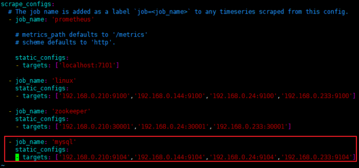
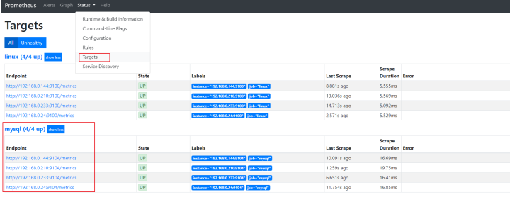
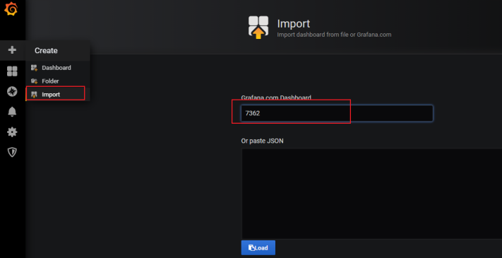
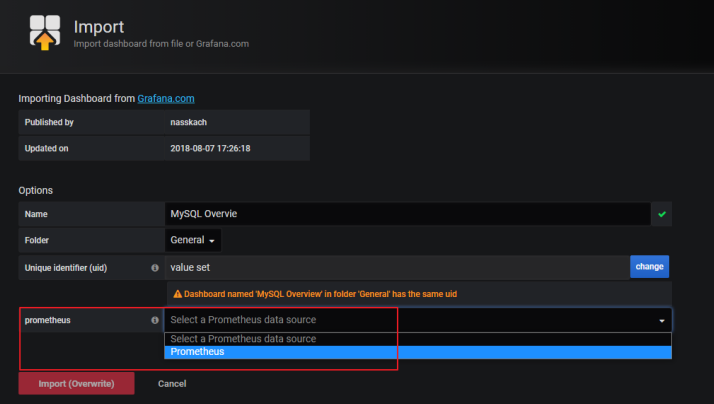
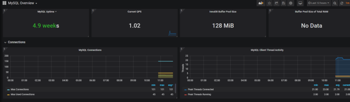

#   安装mysqld_exporter采集mysql运行数据到prometheus

---

#   使用ansible安装
去仓库翻

#   手动安装
##  下载mysqld exporter
1.  下载

```
wget https://github.com/prometheus/mysqld_exporter/releases/download/v0.12.1/mysqld_exporter-0.12.1.linux-amd64.tar.gz
```

2.  解压

```
tar -zvxf mysqld_exporter-0.12.1.linux-amd64.tar.gz -C /opt/module
```

3.  创建软链接

```
cd /opt/module
ln -s mysqld_exporter-0.12.1.linux-amd64 mysqld_exporter
```

##  创建mysqld_exporter的配置文件

```
vim /opt/module/mysqld_exporter/.my.cnf
```

```
[client]
user=exporter
password=y9tzuU_xHry
port=3306
```

##  在mysql中创建对应的用户名和密码
1.  创建数据库用户

```
CREATE USER 'exporter'@'localhost' IDENTIFIED BY 'y9tzuU_xHry';
```

2.  可查看主从运行情况查看线程，及所有数据库。

```
GRANT PROCESS, REPLICATION CLIENT, SELECT ON *.* TO 'exporter'@'localhost';
```

##  添加到systemd中

```
vim /usr/lib/systemd/system/mysqld_exporter.service
```

```
[Unit]
Description=mysqld_exporter
Documentation=https://prometheus.io/
After=network.target
[Service]
Type=simple
User=prometheus
ExecStart=/opt/module/mysqld_exporter/mysqld_exporter --config.my-cnf=/opt/module/mysqld_exporter/.my.cnf
Restart=on-failure
[Install]
WantedBy=multi-user.target
```

```
systemctl daemon-reload
systemctl start mysqld_exporter.service
```

#   配置Prometheus，收集node exporter的数据
```
vim /opt/module/prometheus/prometheus.yml
```



然后重启prometheus，打开prometheus页面查看是不是有对应的数据了



#   导入grafana模板，数据展示
在导入界面，我们输入模板的编号，这里我使用的是`7362`号模板，如要使用其他的模板，请到grafana的官网去查找 https://grafana.com/dashboards



选择数据源，然后点击导入



然后你就可以看到下面一个这么形象具体好看的界面了



#   参考
https://www.cnblogs.com/xiangsikai/p/11289675.html
