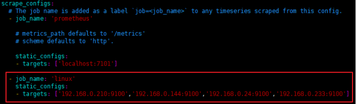
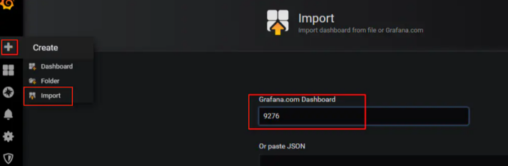

#   安装node_exporter采集主机运行数据到prometheus

---

##  使用ansible安装
去仓库翻

##  手动安装
### 下载node exporter
1.  下载

```
wget https://github.com/prometheus/node_exporter/releases/download/v0.18.1/node_exporter-0.18.1.linux-amd64.tar.gz
```

2.  解压

```
tar -zvxf node_exporter-0.18.1.linux-amd64.tar.gz -C /opt/module
```

3.  创建软链接

```
cd /opt/module
ln -s node_exporter-0.18.1.linux-amd64/ node_exporter
```

### 添加到systemd中

```
vim /usr/lib/systemd/system/node_exporter.service
```

```
[Unit]
Description=node_exporter
Documentation=https://prometheus.io/
After=network.target
[Service]
Type=simple
User=prometheus
ExecStart=/opt/module/node_exporter/node_exporter
Restart=on-failure
[Install]
WantedBy=multi-user.target
```

### 配置Prometheus，收集node exporter的数据
```
vim /opt/module/prometheus/prometheus.yml
```



然后`重启prometheus`，打开prometheus页面查看是不是有对应的数据了


### 导入grafana模板，数据展示
在导入界面，我们输入模板的编号，这里我使用的是9276号模板，如要使用其他的模板，请到grafana的官网去查找 https://grafana.com/dashboards



选择数据源，然后点击导入


然后你就可以看到下面一个这么形象具体好看的界面了


##  参考
https://www.jianshu.com/p/967cb76cd5ca
