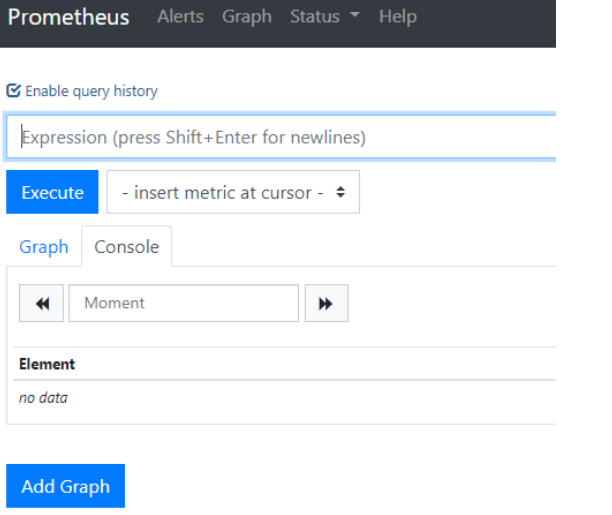

# 安装prometheus和grafana

---

# 安装prometheus
##  下载并解压二进制安装包
通过prometheus的官网，我们下载最新版本的prometheus，目前看到的最新版本是 2.13.0，这是在2019-10-04日的版本。

1.  下载

```
wget https://github.com/prometheus/prometheus/releases/download/v2.13.0/prometheus-2.13.0.linux-amd64.tar.gz
```

2.  解压

```
tar -zxvf prometheus-2.13.0.linux-amd64.tar.gz -C /opt/module
```

3.  创建软链接

```
ln -s /opt/module/prometheus-2.13.0.linux-amd64 /opt/module/prometheus
```

##  配置说明
依据实际情况看是否修改端口

```
vim /opt/module/prometheus/prometheus.yml
```

配置文件说明

```
# 全局配置
global:
  scrape_interval:     15s # 设置抓取间隔，默认为1分钟
  evaluation_interval: 15s #估算规则的默认周期，每15秒计算一次规则。默认1分钟
  # scrape_timeout  #默认抓取超时，默认为10s

# Alertmanager相关配置
alerting:
  alertmanagers:
  - static_configs:
    - targets:
      # - alertmanager:9093

# 规则文件列表，使用'evaluation_interval' 参数去抓取
rule_files:
  # - "first_rules.yml"
  # - "second_rules.yml"

#  抓取配置列表
scrape_configs:
  - job_name: 'prometheus'
    static_configs:
    - targets: ['localhost:7101']   #依据实际情况修改
```

##  创建prometheus的用户及数据存储目录
1.  创建用户

```
useradd  -s /sbin/nologin -M prometheus 
```

2.  创建数据存储目录

```
mkdir /var/module/prometheus -p
```

3.  赋予权限

```
chown -R prometheus:prometheus /opt/module/prometheus-2.13.0.linux-amd64
chown -R prometheus:prometheus /opt/module/prometheus
chown -R prometheus:prometheus /var/module/prometheus
```

##  创建Systemd服务启动prometheus

```
vim /usr/lib/systemd/system/prometheus.service
```

文件中添加如下内容

```
[Unit]
Description=Prometheus
Documentation=https://prometheus.io/
After=network.target
[Service]
Type=simple
User=prometheus
ExecStart=/opt/module/prometheus/prometheus --config.file=/opt/module/prometheus/prometheus.yml --storage.tsdb.path=/var/module/prometheus --web.listen-address=:7101 #要跟前面保持一致
Restart=on-failure
[Install]
WantedBy=multi-user.target
```

启动

```
systemctl start prometheus
```

查看状态

```
systemctl status prometheus
```

加入开机启动

```
systemctl enable prometheus
```

##  打开prometheus的web页面

http://ip:7101/graph



##  增加访问web页面需要用户名密码

[官网](https://prometheus.io/docs/guides/basic-auth/)说了,prometheus本身是没有用户名密码的配置的,但可以通过nginx反向代理进行实现

实现如下

1.  使用htpasswd工具创建.htpasswd文件

```
mkdir -p /etc/nginx
htpasswd -c /etc/nginx/.htpasswd admin
```

2.  配置nginx配置文件

```
http {
    server {
        listen 12321;

        location /prometheus/ {
            auth_basic           "Prometheus";
            auth_basic_user_file /etc/nginx/.htpasswd;
            # 反向代理地址指向prometheus的访问地址
            proxy_pass           http://localhost:9090/;
        }
    }
}

events {}
```
记得重启nginx

3.  prometheus启动语句变成如下内容

```
// http://localhost:12321/prometheus => 这个我们在nginx里配置的地址,用以跳转到prometheus的地址
// 这个地址要能访问外网
prometheus \
  --config.file=/path/to/prometheus.yml \
  --web.external-url=http://localhost:12321/prometheus \
  --web.route-prefix="/"
```
记得重启prometheus

# 安装grafana

##  下载并解压二进制包
这里使用的Grafana的版本为6.4.2，要下载其他的版本可以到Grafana的官网进行下载

1.  下载

```
wget https://dl.grafana.com/oss/release/grafana-6.4.2.linux-amd64.tar.gz
```

2.  解压

```
tar -zxvf grafana-6.4.2.linux-amd64.tar.gz -C /opt/module
```

3.  创建软链接

```
ln -s /opt/module/grafana-6.4.2 /opt/module/grafana
```

##  创建grafana用户及数据存放目录

```
useradd -s /sbin/nologin -M grafana
mkdir /var/module/grafana
chown -R grafana:grafana /opt/module/grafana-6.4.2
chown -R grafana:grafana /opt/module/grafana
chown -R grafana:grafana  /var/module/grafana
```

##  修改配置文件

```
vim /opt/module/grafana/conf/defaults.ini
```

```
# 修改目录
data = /var/module/grafana/data
logs = /var/module/grafana/log
plugins = /var/module/grafana/plugins
provisioning = /var/module/grafana/conf/provisioning

# 修改监听端口
http_port = 7102
```

##  把grafana-server添加到systemd中

```
vim /usr/lib/systemd/system/grafana-server.service
```

```
[Unit]
Description=Grafana
After=network.target

[Service]
User=grafana
Group=grafana
Type=notify
ExecStart=/opt/module/grafana/bin/grafana-server -homepath /opt/module/grafana
Restart=on-failure

[Install]
WantedBy=multi-user.target
```

##  启停并设置开机启动

```
systemctl start  grafana-server
systemctl status  grafana-server
systemctl enable  grafana-server
```

##  配置grafana的web页面
打开:http://ip:7102/

第一次启动,输入默认用户名密码 admin admin
然后需要改密码

grafana虽然已经安装好了，但是这个时候还没有数据，没办法作图。下面我们把grafana和prometheus关联起来，也就是在grafana中添加添加数据源。在配置页面点击添加数据源，然后选择prometheus，输入prometheus服务的参数即可

# 参考
https://www.jianshu.com/p/967cb76cd5ca

