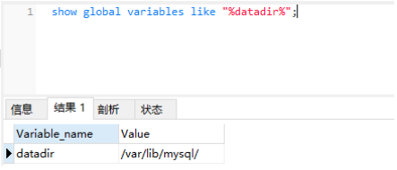
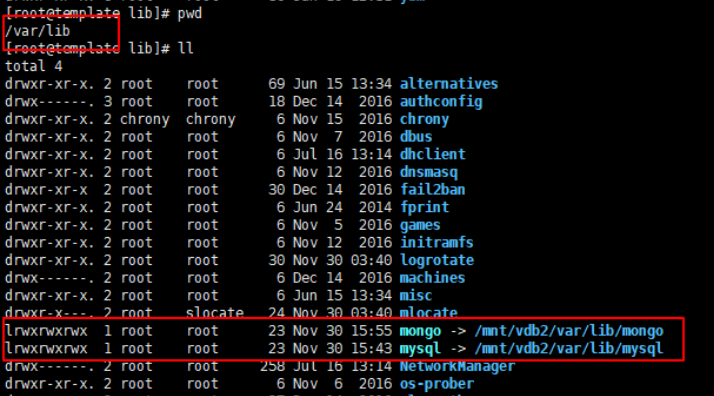
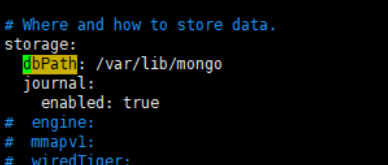
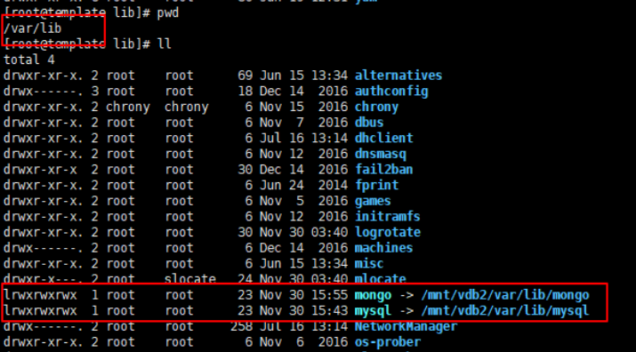
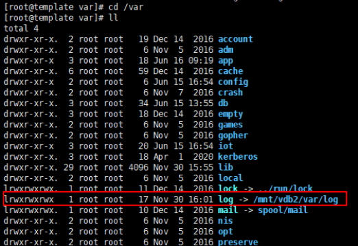

#   移动数据库文件和日志文件到数据盘

---

##  移动Mysql数据库文件
### Step1:查看原来的数据文件路径

```
mysql> show global variables like "%datadir%";
```



### Step2:在数据盘创建如下目录

```
mkdir -p /mnt/vdb2/var/lib
```

### Step3:停止MySQL服务
```
service mysqld stop
```

### Step4:移动Mysql数据库文件

```
mv /var/lib/mysql /mnt/vdb2/var/lib/
```

### Step5:创建软链到原位置

```
ln -s /mnt/vdb2/var/lib/mysql /var/lib/mysql
```



### Step6:启动Mysql数据库
```
service mysqld start
```


##  移动Mongo数据库文件
查看Mongo的数据库文件存储位置
```
vim /etc/mongod.conf
```



### 停止MongoDB服务

```
systemctl stop mongod.service
```

### 移动Mongo数据库文件

```
mv /var/lib/mongo/ /mnt/vdb2/var/lib/
```

### 创建软链

```
ln -s /mnt/vdb2/var/lib/mongo /var/lib/mongo
```



### 启动MongoDB服务

```
systemctl start mongod.service
```

##  移动日志文件
### 移动日志文件

```
mv /var/log /mnt/vdb2/var/
```

### 创建软链

```
ln -s /mnt/vdb2/var/log /var/log
```

