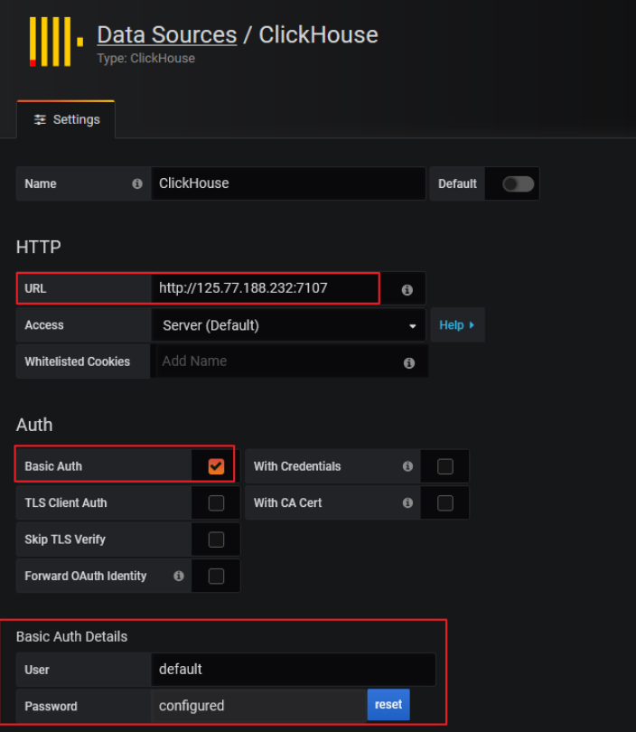
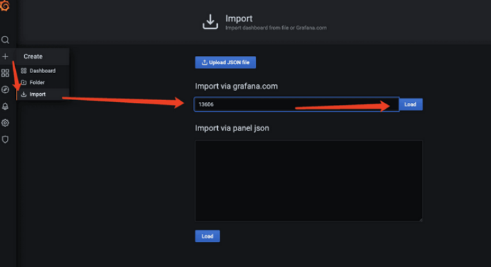

#   grafana监控clickhouse

---

##  给grafana安装上clickhouse的数据源插件

1.  下载安装vertamedia-clickhouse-datasource
2.  把下载好的安装包解压好，然后放到grafana的plugins目录下： /usr/local/grafana/data/plugins/
3.  重启grafana
4.  点击设置再点击add data source按钮添加clickhouse的数据源

##  配置dashboard
点击 ➕ ==> Import ==> 填写模板号13606 ==> 点击load

##  参数不懂可以看下面这些文档
https://blog.csdn.net/qq_40341628/article/details/108974611

##  参考
https://www.jianshu.com/p/34a0a5280bc8
