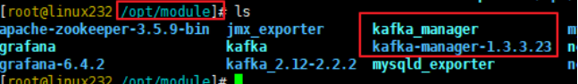
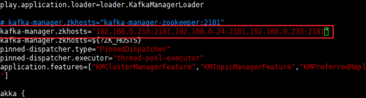
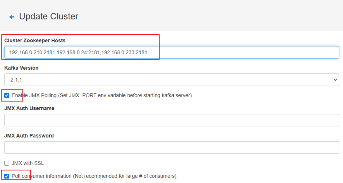

#   安装kafka-manager

---

##  下载
1.  编译
包已经编译好了,去仓库找

2.  解压到指定位置



##  配置zookeeper地址

```
vim /opt/module/kafka_manager/conf/application.conf
```



```
kafka-manager.zkhosts="192.168.0.210:2181,192.168.0.24:2181,192.168.0.233:2181"
```

##  配置用户名和密码

```
# 启用用户名和密码
basicAuthentication.enabled=true
# 用户名
basicAuthentication.username="admin"
# 密码
basicAuthentication.password="password"
```

##  配置systemd
```
[Unit]
Description=Kafka Manager
After=network.target

[Service]
Type=simple
Environment=JAVA_HOME=/opt/jdk
ExecStart=/opt/module/kafka_manager/bin/kafka-manager -Dhttp.port=7103
Restart=always

[Install]
WantedBy=multi-user.target
```

##  配置界面

打开地址http://125.77.188.232:7103/



其他默认不管,保存
