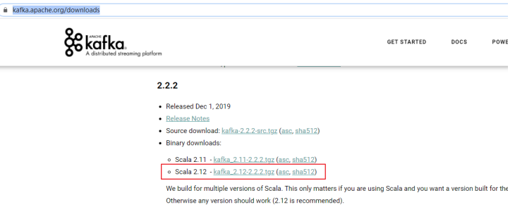

#   安装kafka

----

#   使用用ansible安装
去仓库翻

#   手动安装kafka
##  下载并解压二进制安装包
https://kafka.apache.org/downloads



1.  解压

```
tar -xf kafka_2.12-2.2.2.tgz -C /opt/module
```

2.  创建软链接

```
ln -s /opt/module/kafka_2.12-2.2.2 /opt/module/kafka
```

##  创建kafka用户

```
useradd  -s /sbin/nologin -M kafka
```

##  配置说明
1.  创建日志目录

```
mkdir /var/module/kafka/kafka-logs
```

2.  修改配置文件

```
vim /opt/module/kafka/config/server.properties
```

配置内容如下

```
#broker的全局唯一编号，不能重复
broker.id=0
#使能够删除topic, 否则只是标记删除
delete.topic.enable=true
#处理网络请求的线程数量
num.network.threads=3
#用来处理磁盘IO的线程数量
num.io.threads=8
#发送套接字的缓冲区大小
socket.send.buffer.bytes=102400
#接收套接字的缓冲区大小
socket.receive.buffer.bytes=102400
#请求套接字的缓冲区大小
socket.request.max.bytes=104857600
#kafka运行日志存放的路径
log.dirs=/var/module/kafka/kafka-logs
#topic在当前broker上的分区个数
num.partitions=1
#用来恢复和清理data下数据的线程数量
num.recovery.threads.per.data.dir=1
#segment文件保留的最长时间，超时将被删除
log.retention.hours=168
#配置连接Zookeeper集群地址
zookeeper.connect=192.168.0.210:2181, 192.168.0.24:2181, 192.168.0.233:2181
```

##  配置环境变量

```
vim /etc/profile.d/kafka.sh
```

内容如下

```
#!/bin/bash
export KAFKA_HOME=/opt/module/kafka
export PATH=$PATH:$KAFKA_HOME/bin
```

立即生效

```
source /etc/profile
```

##  配置systemd

```
[Unit]
Description=Apache Kafka server (broker)
Documentation=http://kafka.apache.org/documentation.html
Requires=zookeeper.service

[Service]
Type=simple
Environment=JAVA_HOME=/opt/jdk
ExecStart=/opt/module/kafka/bin/kafka-server-start.sh /opt/module/kafka/config/server.properties
ExecStop=/opt/module/kafka/bin/kafka-server-stop.sh

[Install]
WantedBy=multi-user.target
```
