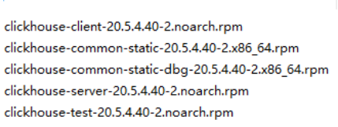

#   离线安装clickhouse

----

##  安装

1.  上传clickhouse包

+   包可以去这里下载https://repo.clickhouse.tech/tgz/stable/
+   我已经下载好了



2.  使用yum安装本地rpm包

```
yum  localinstall  /opt/soft/jdk-8u45-linux-x64.rpm  -y
```

##  配置clickhouse

### 配置外网可以访问和外网port

```
vim /etc/clickhouse-server/config.xml
```

1.  配置外网可访问
把注释掉的`<listen_host>::</listen_host>`取消注释,如下

```xml
<!-- Listen specified host. use :: (wildcard IPv6 address), if you want to accept connections both with IPv4 and IPv6 from everywhere. -->
    <!--<listen_host>::</listen_host>       -->
    <!-- Same for hosts with disabled ipv6: -->
<!-- <listen_host>0.0.0.0</listen_host> -->
<listen_host>0.0.0.0</listen_host>      <!-- 改这里 -->

    <!-- Default values - try listen localhost on ipv4 and ipv6: -->
    <!--
    <listen_host>::1</listen_host>
    <listen_host>127.0.0.1</listen_host>
    -->
    <!-- Don't exit if ipv6 or ipv4 unavailable, but listen_host with this protocol specified -->
<!-- <listen_try>0</listen_try> -->
```

2.  配置port

```xml
<!--display_name>production</display_name--> <!-- It is the name that will be shown in the client -->
    <http_port>7107</http_port>      <!-- 改这里 -->
    <tcp_port>9000</tcp_port>
    <mysql_port>9004</mysql_port>
    <!-- For HTTPS and SSL over native protocol. -->
    <!--
    <https_port>8443</https_port>
    <tcp_port_secure>9440</tcp_port_secure>
    -->
```

### 配置用户名密码

1.  生成密码

```
PASSWORD=$(base64 < /dev/urandom | head -c8); echo "$PASSWORD"; 
echo -n "$PASSWORD" | sha256sum | tr -d '-'
```

2.  将生成的密码写入配置文件

```
vim /etc/clickhouse-server/users.xml
```

```xml
<!-- Users and ACL. -->
    <users>
        <!-- If user name was not specified, 'default' user is used. -->
        <default>
            <!-- Password could be specified in plaintext or in SHA256 (in hex format).

                 If you want to specify password in plaintext (not recommended), place it in 'password' element.
                 Example: <password>qwerty</password>.
                 Password could be empty.

                 If you want to specify SHA256, place it in 'password_sha256_hex' element.
                 Example: <password_sha256_hex>65e84be33532fb784c48129675f9eff3a682b27168c0ea744b2cf58ee02337c5</password_sha256_hex>
                 Restrictions of SHA256: impossibility to connect to ClickHouse using MySQL JS client (as of July 2019).

                 If you want to specify double SHA1, place it in 'password_double_sha1_hex' element.
                 Example: <password_double_sha1_hex>e395796d6546b1b65db9d665cd43f0e858dd4303</password_double_sha1_hex>

                 How to generate decent password:
                 Execute: PASSWORD=$(base64 < /dev/urandom | head -c8); echo "$PASSWORD"; echo -n "$PASSWORD" | sha256sum | tr -d '-'
                 In first line will be password and in second - corresponding SHA256.

                 How to generate double SHA1:
                 Execute: PASSWORD=$(base64 < /dev/urandom | head -c8); echo "$PASSWORD"; echo -n "$PASSWORD" | sha1sum | tr -d '-' | xxd -r -p | sha1sum | tr -d '-'
                 In first line will be password and in second - corresponding double SHA1.
            -->
            <!--
            <password>123456</password>
            -->
            <password_sha256_hex>8d969eef6ecad3c29a3a629280e686cf0c3f5d5a86aff3ca12020c923adc6c92</password_sha256_hex>
```
