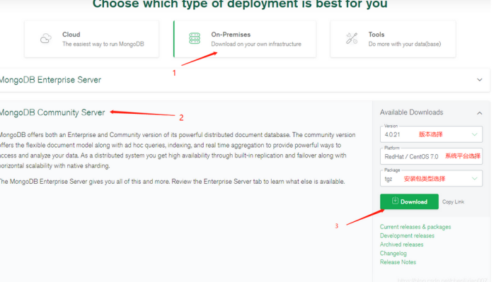
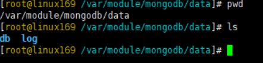
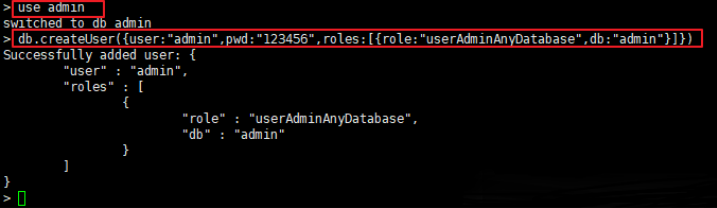
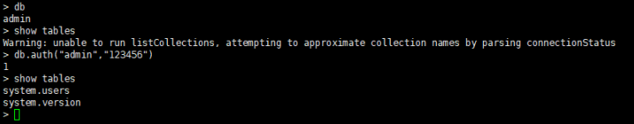

# 离线安装mongodb

---

## 安装
1.  上传mongodb包

+   包可以去这里下载 https://www.mongodb.com/try/download/community



+   我已经下载好了:mongodb-linux-x86_64-enterprise-rhel70-4.0.23.tgz

2.  解压

```bash
tar -zxvf mongodb-linux-x86_64-rhel70-4.0.21.tgz
```

3.  将解压后的文件移动到/opt/module下

```bash
mv mongodb-linux-x86_64-enterprise-rhel70-4.0.23 /opt/module/
```

4.  创建软连接

```bash
ln -s /opt/module/mongodb-linux-x86_64-enterprise-rhel70-4.0.23 /opt/module/mongodb
```

5.  进入目录

```bash
cd /opt/module/mongodb
```

6.  创建日志目录

```bash
mkdir -p /var/module/mongodb/data/db
mkdir -p /var/module/mongodb/data/log
```



7.  创建配置文件

```bash
vim mongodb.conf 
```

键入如下内容

```bash
# 数据库数据存放目录
dbpath=/var/module/mongodb/data/db
# 日志文件存放目录
logpath=/var/module/mongodb/data/log/mongodb.log
# 日志追加方式
logappend=true
# 端口(这里使用7103端口,如果有防火墙需要打开)
port=7103
# 是否认证(默认是false,当为true需要设置用户名密码)
auth=true
# 以守护进程方式在后台运行
fork=true
# 远程连接要指定ip，否则无法连接；0.0.0.0代表不限制ip访问
bind_ip=0.0.0.0
```

## 配置环境变量

```bash
vim /etc/profile.d/mongo.sh
```

键入如下内容

```bash
#!/bin/bash
export MONGODB_HOME=/opt/module/mongodb
export PATH=$PATH:$MONGODB_HOME/bin
```

## 配置systemctl进行管理

```bash
vim /usr/lib/systemd/system/mongodb.service
```

键入如下内容

```bash
[Unit]
Description=mongodb
After=network.target

[Service]
Type=forking
Environment=JAVA_HOME=/opt/jdk
ExecStart=/opt/module/mongodb/bin/mongod -f /opt/module/mongodb/mongodb.conf
ExecReload=/bin/kill -s HUP $MAINPID
ExecStop=/opt/module/mongodb/bin/mongod --shutdown -f /opt/module/mongodb/mongodb.conf
PrivateTmp=true

[Install]
WantedBy=multi-user.target
```

## 进行管理

```bash
# 启动mongodb
systemctl start mongodb.service
# 查看服务状态
systemctl status mongodb.service
# 开机自启动
systemctl enable mongodb.service
# 修改mongodb.service文件，需要重新加载文件
systemctl daemon-reload
```

## 设置用户和密码
因为我们启动mongodb的配置文件中，`指定了auth=true`，即开启认证。默认情况下，mongod也是没有管理员账户的。

因此需要在admin数据库中使用db.createUser()命令添加管理员帐号或其他角色。

### mongodb内置角色

|                    分类                    |                                     角色                                     |                                                                      简要说明                                                                      |
|--------------------------------------------|------------------------------------------------------------------------------|----------------------------------------------------------------------------------------------------------------------------------------------------|
| 数据库用户角色(DB User Roles)              | read readWrite                                                               | 为某个数据库创建一个用户, 分配该数据库的读写权力                                                                                                   |
| 数据库管理员角色(DB Admin Roles)           | dbAdmin dbOwner userAdmin                                                    | 拥有创建数据库, 和创建用户的权力                                                                                                                   |
| 集群管理角色(Culster Administration Roles) | clusterAdmin clusterManager clusterMonitor hostManager                       | 管理员组, 针对整个系统进行管理                                                                                                                     |
| 备份还原角色(Backup and Restoration Roles) | backup restore                                                               | 备份数据库, 还原数据库                                                                                                                             |
| 所有数据库角色(All-Database Roles)         | readAnyDatabase readWriteAnyDatabase userAdminAnyDatabase dbAdminAnyDatabase | 拥有对admin操作的权限                                                                                                                              |
| Superuser Roles(超级管理员)                | root                                                                         | dbOwner userAdmin userAdminAnyDatabase这几个角色角色提供了任何数据任何用户的任何权限的能力，拥有这个角色的用户可以在任何数据库上定义它们自己的权限 |


### 创建管理员账号
首先, 我们需要切换到admin数据库, 为什么呢? 因为我们的root角色用户是创建在admin数据的, 必须要到admin数据库去完成授权

```bash
> use admin
>
> db.createUser({user:"admin",pwd:"123456",roles:[{role:"userAdminAnyDatabase",db:"admin"}]})
>
```



+ 验证
使用mongo命令进入mongo命令模式，如果不进行db.auth("用户名","密码")进行用户验证的话，是执行不了任务命令的，只有通过认证才可以




### 演示对单个数据库创建用户和密码

完成授权之后, 我们要携带root身份, 切换到我们对应的数据库, 那么先看看我们有哪些数据库再切换

```bash
> show dbs     //展示所有数据库
admin   0.000GB
local   0.000GB
test    0.000GB   //这个是我新建的
> use testDB    // 切换到数据库
switched to db testDB
>
```

切换数据库之后, 我们为test创建一个用户
```bash
> db.createUser({user:'test',pwd:'test',roles:[{role:'readWrite',db:'test'}]})
Successfully added user: {
    "user" : "test",
    "roles" : [
        {
            "role" : "readWrite",
            "db" : "testDB"
        }
    ]
}
>

```

然后我们再切换到admin库, 看一下我们创建的用户, 这里先说一下, 为什么要到这个切换到testDB上创建用户, 因为只有在这里创建的用户才是这个数据库的用户, 才能在这里完成授权, 但是创建用户的信息存放在admin库中

```bash
> use admin
switched to db admin
> db.system.users.find({user:'test'})
{ "_id" : "testDB.test", "user" : "test", "db" : "test", "credentials" : { "SCRAM-SHA-1" : { "iterationCount" : 10000, "salt" : "CW0nvUZjVvlEqQPVbUAKpw==", "storedKey" : "zAPux5oBIOCb3PSZdMPDmFl1WkE=", "serverKey" : "aRFnK5cD1FQAkQeTU8eYvaZ0lQE=" } }, "roles" : [ { "role" : "readWrite", "db" : "testDB" } ] }
>
```

可以看到_id说明我们的用户test是属于testDB数据库的. 并且分配的数据库也是testDB
那我们来测试一下test用户的读写吧!
为了避免之前授权root用户的影响, 我们先退出客户端 ,再登陆授权

```bash
> use test
switched to db test
>
> db.auth('test','test')  # 进行test用户授权
2017-03-08T00:03:40.572+0800 I ACCESS   [conn3] Successfully authenticated as principal test on testDB
1   # 授权成功   # 下面提示没有在admin执行命令的权限 (不理会, 因为我们本来就没有权限)
2017-03-08T00:03:40.573+0800 I ACCESS   [conn3] Unauthorized: not authorized on admin to execute command { replSetGetStatus: 1.0, forShell: 1.0 }
>
> db.Hello.insert({name:'World'})
WriteResult({ "nInserted" : 1 })  # 可以看到我插入了一条数据
>
> db.Hello.find()  # 并且将其查出来了.
{ "_id" : ObjectId("58beda12ff72a6c747135225"), "name" : "World" }
```

那么简单创建角色并且分配数据库等方法就说完了

总结一下:

+	一定要切换到对应的数据库去创建用户, 否则在进行认证的时候, 会提示找不到用户
+	一定要到对应的数据库上去认证用户, 否则会认证授权失败
+	不是所有人都能操作admin数据库, 分配给用户权限的时候,一定要谨慎

### 演示对单个数据库更新删除用户
下面说说修改用户角色, 其实角色弄清楚了, 创建用户清楚了, 剩下都是命令简单介绍. 因为都一样
更新用户信息

```bash
> db.updateUser([用户名],{与创建时一样})  //其实后面还有一个可选参数, 一般不写. 需要自行百度writeConcern
```

那么这里简要说一下, 创建用户时和更新用户时,需要属性user pwd roles
成功修改后没有任何提示. 如下:

```bash
> use test
# 修改密码 并且 修改角色为只读
> db.updateUser('test',{pwd:'newpassword',roles:[{role:'read',db:'test'}]})
>
```

以上需要注意的就是, roles数组里的对象数据role db两个都需要给出, 否则会出现错误

剩下就没什么好说的了


删除用户

```bash
> use test
switched to db test
> db.dropUser('test')
true
>
```

注意哦, `修改用户和删除用户等等, 都和创建用户一样,需要切换到数据库管理员的身份`, 也就是需要先切换到admin库, 完成认证, 才能进行后面的操作. 同样需要到对应数据库去操作用户. 因为用户是跟着库走的.


## 参考
+	https://blog.csdn.net/chenlixiao007/article/details/110206062
+	https://www.jianshu.com/p/f5afc6488f9e
