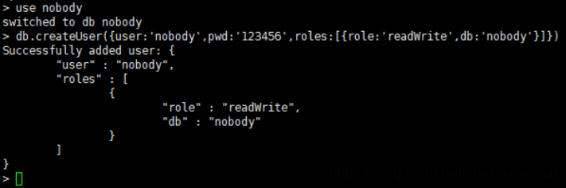

#   离线安装mongodb

---

##  安装
1.  上传mongodb包

+   包可以去这里下载 https://www.mongodb.com/try/download/community


+   我已经下载好了:mongodb-linux-x86_64-enterprise-rhel70-4.0.23.tgz

2.  解压

```
tar -zxvf mongodb-linux-x86_64-rhel70-4.0.21.tgz
```

3.  将解压后的文件移动到/opt/module下

```
mv mongodb-linux-x86_64-enterprise-rhel70-4.0.23 /opt/module/
```

4.  创建软连接

```
ln -s /opt/module/mongodb-linux-x86_64-enterprise-rhel70-4.0.23 /opt/module/mongodb
```

5.  进入目录

```
cd /opt/module/mongodb
```

6.  创建日志目录

```
mkdir -p /var/module/mongodb/data/db
mkdir -p /var/module/mongodb/data/log
```


7.  创建配置文件

```
vim mongodb.conf 
```

键入如下内容

```
# 数据库数据存放目录
dbpath=/var/module/mongodb/data/db
# 日志文件存放目录
logpath=/var/module/mongodb/data/log/mongodb.log
# 日志追加方式
logappend=true
# 端口(这里使用7103端口,如果有防火墙需要打开)
port=7103
# 是否认证(默认是false,当为true需要设置用户名密码)
auth=true
# 以守护进程方式在后台运行
fork=true
# 远程连接要指定ip，否则无法连接；0.0.0.0代表不限制ip访问
bind_ip=0.0.0.0
```

##  配置环境变量

```
vim /etc/profile.d/mongo.sh
```

键入如下内容

```
#!/bin/bash
export MONGODB_HOME=/opt/module/mongodb
export PATH=$PATH:$MONGODB_HOME/bin
```

##  配置systemctl进行管理

```
vim /usr/lib/systemd/system/mongodb.service
```

键入如下内容

```
[Unit]
Description=mongodb
After=network.target

[Service]
Type=forking
Environment=JAVA_HOME=/opt/jdk
ExecStart=/opt/module/mongodb/bin/mongod -f /opt/module/mongodb/mongodb.conf
ExecReload=/bin/kill -s HUP $MAINPID
ExecStop=/opt/module/mongodb/bin/mongod --shutdown -f /opt/module/mongodb/mongodb.conf
PrivateTmp=true

[Install]
WantedBy=multi-user.target
```

##  进行管理

```
# 启动mongodb
systemctl start mongodb.service
# 查看服务状态
systemctl status mongodb.service
# 开机自启动
systemctl enable mongodb.service
# 修改mongodb.service文件，需要重新加载文件
systemctl daemon-reload
```

##  设置用户和密码
因为我们启动mongodb的配置文件中，`指定了auth=true`，即开启认证。默认情况下，mongod也是没有管理员账户的。

因此需要在admin数据库中使用db.createUser()命令添加管理员帐号或其他角色。

### mongodb内置角色

+ 数据库用户角色：read、readWrite
+ 数据库管理角色：dbAdmin、dbOwner、userAdmin
+ 集群管理角色：clusterAdmin、clusterManager、clusterMonitor、hostManager
+ 备份恢复角色：backup、restore
+ 所有数据库角色：readAnyDatabase、readWriteAnyDatabase、userAdminAnyDatabase、dbAdminAnyDatabase
+ 超级用户角色：root
+ 内部角色：__system

### 创建管理员账号
切换到admin数据库，使用以下命令创建管理账号，拥有操作所有数据库权限。

```
db.createUser({user:"admin",pwd:"123456",roles:[{role:"userAdminAnyDatabase",db:"admin"}]})
```


+ 验证
使用mongo命令进入mongo命令模式，如果不进行db.auth("用户名","密码")进行用户验证的话，是执行不了任务命令的，只有通过认证才可以


### 演示对单个数据库创建用户和密码

平常开发中，我们会创建新的数据库，而且需要用新的用户进行操作数据库，那就需要创建新的用户和密码，并设置对此数据库的操作权限。
例如，以下演示创建nobody用户，密码为123456，并设置对nobody数据库用读写的权限。
```
db.createUser({user:'nobody',pwd:'123456',roles:[{role:'readWrite',db:'nobody'}]})
```



##  参考
https://blog.csdn.net/chenlixiao007/article/details/110206062
