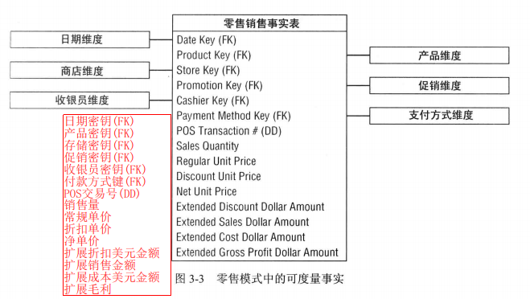

#   维度建模指南之零售业务

----

##  维度模型设计的4步过程
1.  选择业务过程       
2.  申明粒度 -- 设备运行时数据采用一行表示       
3.  确定维度                
    +   谁,什么,何处,何时,为何,如何        
    +   合理的产品维度表可包含大约50个左右的描述性属性        
4.  确定事实                
    +   获得事实 -- 就是可以从其他事实计算后获得      
    +   不可加事实 -- 一般不存储(看情况)     
    +   事物事实 -- 就是流水账       
    +   碰到数字时,不知道改放到事实表还是维度表        
        -   可以计算的数字大概率属于事实表
        -   可以过滤/分组的数字大概率属于维度表
        -   如果两者都可以,则事实表和维度表都需要存储

##  事实表雏形
经过4个步骤,得到事实表雏形

除了上面明明白白得事实以外,还有如下三类事实

1. 获得事实,就是可以从其他事实计算后获得 ==> 一般有进行存储
2. 不可加事实,就是进行计算后得数据没有意义,比如单价相加,比如利润率相加 ==> 一般不存储(看情况)
3. 事务事实,就是流水账 ==> 和具体业务实际挂钩

## 日期维度
日期维度是一种特殊的维度，因为它几乎出现在所有的维度模型中

##  产品维度
合理的产品维度表可包含大约50个左右的描述性属性

单个SKU < 品牌 < 类别 < 部门
按照关系型数据库来说,将这几个放到同一张表不满足原子性,但这边都属于产品维度,可以放一张表

具有内嵌含义的属性,既可以完整保存在维度表也可以分解到不同的组成部件上

碰到数字值,不懂该放到事实表还是维度表

1. 可以计算的数字大概率属于事实表
2. 可以过滤/分组的数字大概率是维度表
3. 如果两者都可以,则事实表和维度表都需要存储

##  商店维度
商店维度描述零售连锁店的每个门店

商店维度是本案例中主要的地理维度

##  促销维度
促销维度通常被认为是一种因果维度,因为它描述了认为可能导致产品销售发生改变的因素。

##  空外键,空属性和空事实怎么处理
1.  维度属性空值 -- 用描述性字符串替换那些空值,比如Unknown,Not Applicable等
2.  事实表出现空值 -- 通过聚集函数处理,因为如果使用空值,会产生数据倾斜

##  如何判断一个单一值是否为一个维度
1.  我们确定了事实
2.  那么事实有对应的度量事件
3.  在度量事件里,有描述表示单一值得描述性属性
4.  那么,这个单一值得描述性属性就是一个维度
5.  当然,这个维度是否和某个事实表关联看情况要看事实表声明粒度

##  退化维度放入事实表
零售事实表的每个列表项行都包含POS事务号码,事务号码的退化维度
